---
## Author
author:
  name: [Ваше Имя и Фамилия]
  degrees: 
  orcid: 
  email: [Ваш email]
  affiliation:
    - name: Российский университет дружбы народов
      country: Российская Федерация
      postal-code: 117198
      city: Москва
      address: ул. Миклухо-Маклая, д. 6

## Title
title: "Отчёт по лабораторной работе"
subtitle: "Установка и конфигурирование Fedora 41 в WSL"
license: "CC BY"
---

# Цель работы

Целью данной работы является получение навыков установки и первоначальной настройки дистрибутива Fedora 41 в среде WSL (Windows Subsystem for Linux), а также знакомство с основными командами для управления пакетами и системой.

# Задание

1. Импортировать дистрибутив Fedora 41 в WSL.
2. Запустить импортированную систему и выполнить её обновление.
3. Создать непривилегированного пользователя.
4. Подготовить корневую файловую систему Fedora для последующего использования (например, для создания собственного дистрибутива WSL).
5. Установить дополнительное программное обеспечение.
6. Изучить сообщения системы, связанные с нехваткой места и версией ядра.

# Теоретическое введение

WSL (Windows Subsystem for Linux) — это среда совместимости, разработанная Microsoft, которая позволяет запускать двоичные исполняемые файлы Linux (в формате ELF) непосредственно в Windows. Это достигается за счёт реализации системных вызовов Linux в ядре Windows. WSL 2, использованный в работе, использует настоящую виртуальную машину с облегчённым ядром Linux для обеспечения полной совместимости.

Для управления дистрибутивами WSL используется команда `wsl.exe`. Основные команды, использованные в работе:
*   `wsl --import <DistributionName> <InstallLocation> <FileName>` — импорт дистрибутива из tar-файла.
*   `wsl -l -v` — просмотр списка установленных дистрибутивов и их версий WSL.
*   `wsl -d <DistributionName>` — запуск конкретного дистрибутива.

Внутри гостевой системы Fedora используется пакетный менеджер `dnf` для управления программным обеспечением, а также команды `useradd` и `passwd` для создания пользователей.

# Выполнение лабораторной работы

Импорт дистрибутива Fedora 41 в WSL был выполнен с помощью команды `wsl --import`. Для этого предварительно был подготовлен архив `fedora-wsl.tar.gz`. Процесс импорта и проверка статуса дистрибутива отображены на скриншоте (рис. [-@fig:010]).

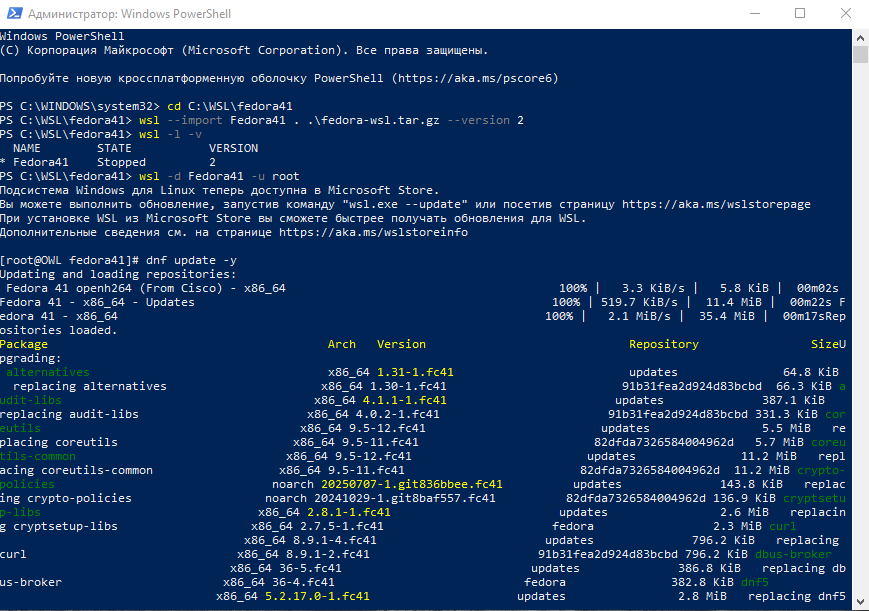{#fig:010 width=70%}

После успешного импорта дистрибутив был запущен от имени суперпользователя (`root`). Первым делом была выполнена команда обновления системы `dnf update -y`, в процессе которой загружались и устанавливались актуальные версии пакетов (рис. [-@fig:011]).

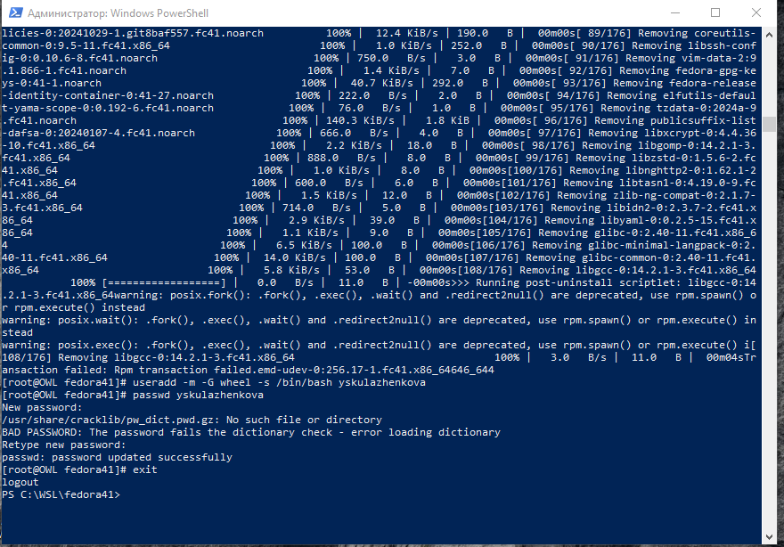{#fig:011 width=70%}

В рамках первоначальной настройки системы был создан новый непривилегированный пользователь `yskulazhenkova` с домашним каталогом, добавлением в группу `wheel` (для получения прав администратора) и установленной оболочкой `/bin/bash`. Затем для него была задана команда `passwd` (рис. [-@fig:012]). На этом этапе появилось предупреждение о проверке пароля, связанное с отсутствием словаря, однако пароль был успешно установлен.

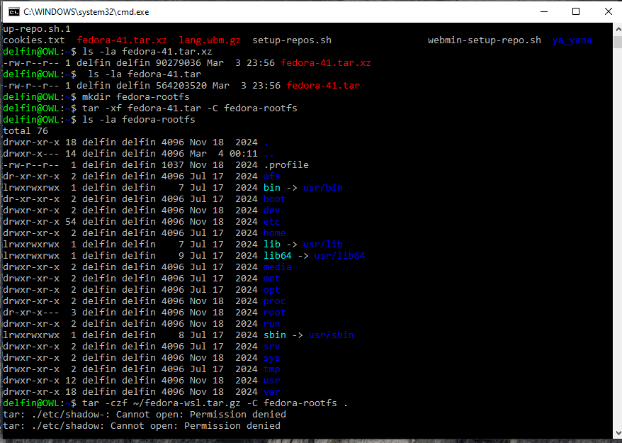{#fig:012 width=70%}

Далее производилась подготовка корневой файловой системы Fedora, распакованной из архива `fedora-41.tar` в каталог `fedora-rootfs`. При попытке создать сжатый архив `fedora-wsl.tar.gz` из этой файловой системы обычным пользователем возникла ошибка прав доступа к файлам `/etc/shadow` и `/etc/gshadow` (рис. [-@fig:013]).

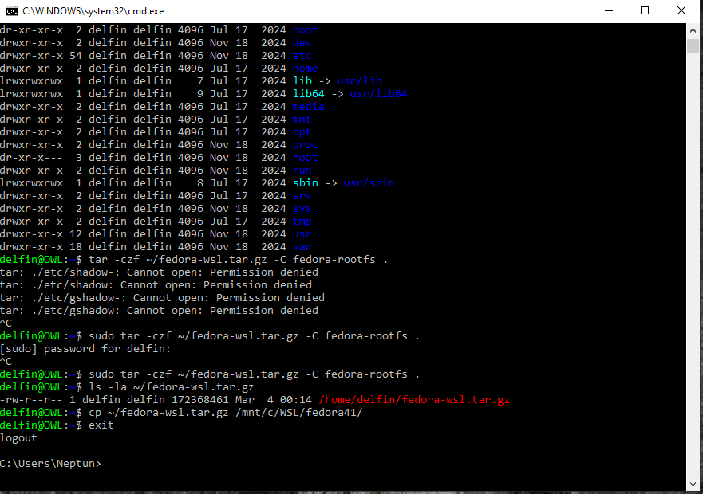{#fig:013 width=70%}

Для решения проблемы с правами доступа создание архива было выполнено с использованием `sudo`. Это позволило успешно создать архив `fedora-wsl.tar.gz`, который затем был скопирован в целевой каталог Windows для использования в WSL (рис. [-@fig:014]).

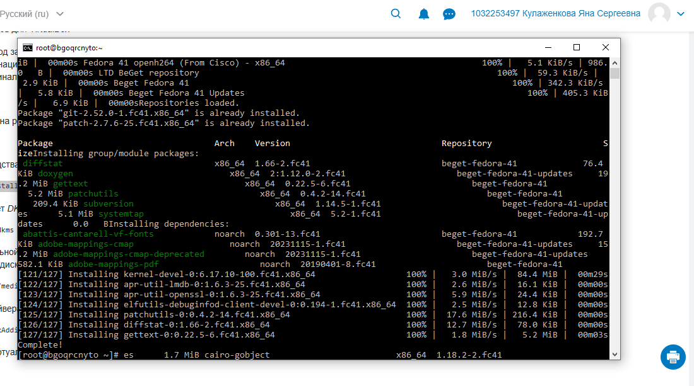{#fig:014 width=70%}

В процессе дальнейшей работы в системе (предположительно, на удалённом сервере) устанавливались различные пакеты. На скриншотах зафиксированы процессы установки пакетов `dkms` (рис. [-@fig:016]) и `mc` (Midnight Commander) (рис. [-@fig:017]), а также процесс установки объёмного пакета `pandoc` (рис. [-@fig:022]).

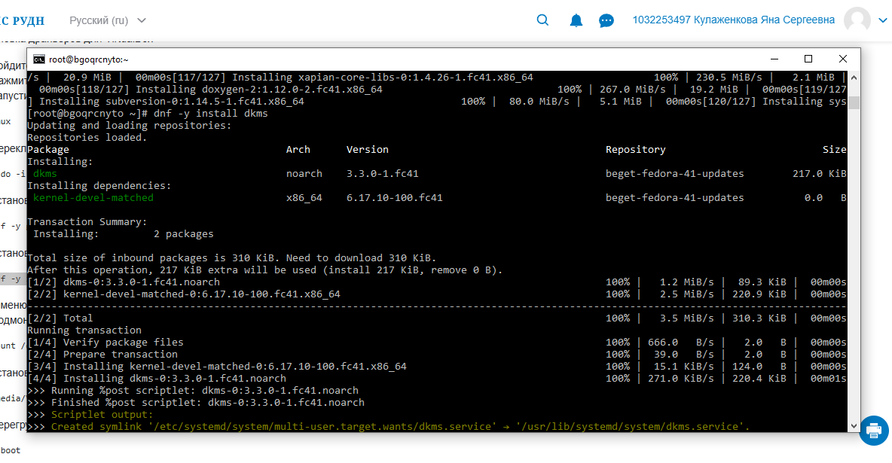{#fig:016 width=70%}

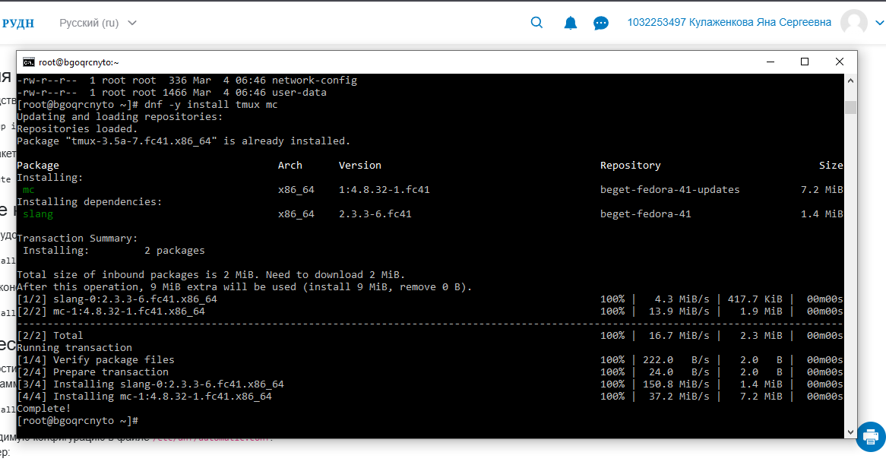{#fig:017 width=70%}

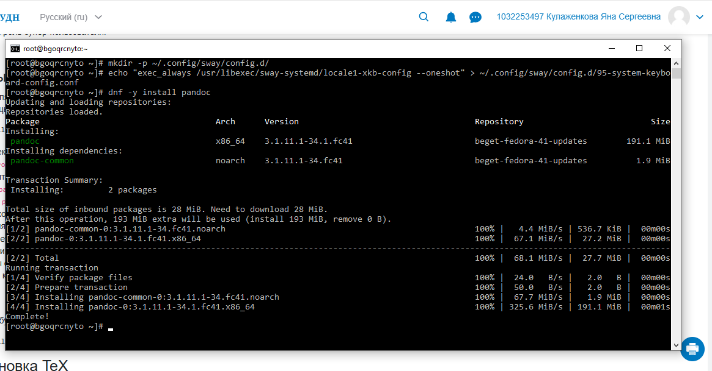{#fig:022 width=70%}

В ходе работы также была предпринята попытка установки пакетов, для которых потребовалось дополнительное место на диске. Система выдала серию сообщений об ошибках с указанием необходимого объёма свободного пространства (до 3.3 ГБ), что свидетельствует о недостаточном размере корневого раздела для устанавливаемого набора программ (рис. [-@fig:023]).

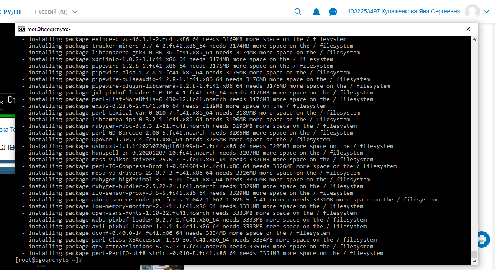{#fig:023 width=70%}

Кроме того, была сделана попытка определить версию ядра Linux. Информация о версии ядра (`6.17.10-100.fc41.x86_64`) была найдена с помощью команды `dmesg | grep -i "linux version"` (рис. [-@fig:025]). В последующих командах (рис. [-@fig:026]) видны попытки использования команд `dpkg`, характерных для Debian-подобных систем, что указывает на возможное смешение контекстов или работу в разных окружениях.

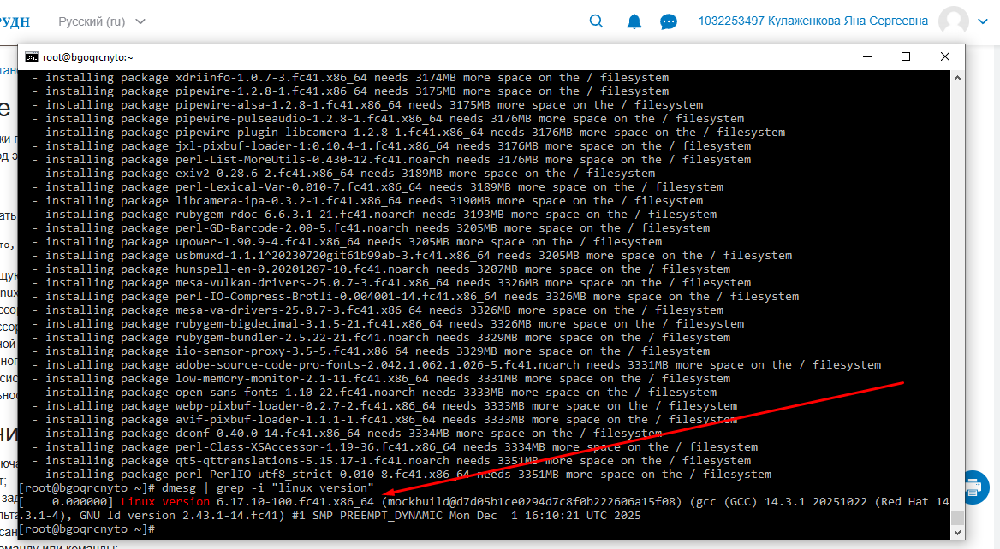{#fig:025 width=70%}

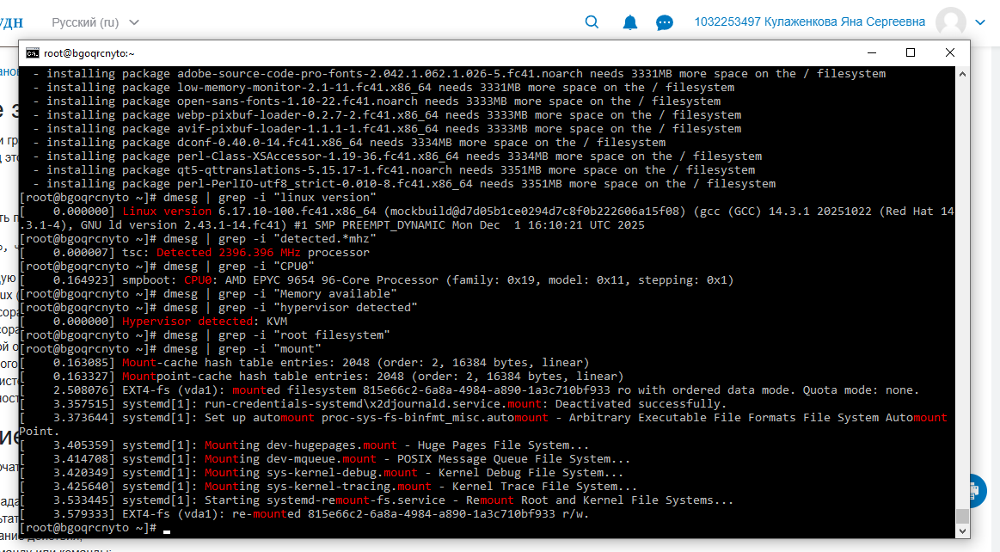{#fig:026 width=70%}

# Выводы

В ходе выполнения лабораторной работы были успешно импортированы и настроены дистрибутивы Fedora 41 в среде WSL. Были освоены базовые команды для управления WSL (`wsl --import`, `wsl -l -v`), выполнена настройка системы (создание пользователя, обновление), а также установка дополнительного программного обеспечения с помощью пакетного менеджера `dnf`. В процессе работы возникли и были проанализированы типичные ситуации: ошибка прав доступа при работе с системными файлами и нехватка дискового пространства для установки крупных пакетов. Полученные навыки являются основой для дальнейшего администрирования Linux-систем.

# Список литературы{.unnumbered}

::: {#refs}
1. Официальная документация Microsoft по WSL. URL: https://learn.microsoft.com/ru-ru/windows/wsl/
2. Документация пакетного менеджера DNF. URL: https://dnf.readthedocs.io/en/latest/
:::
