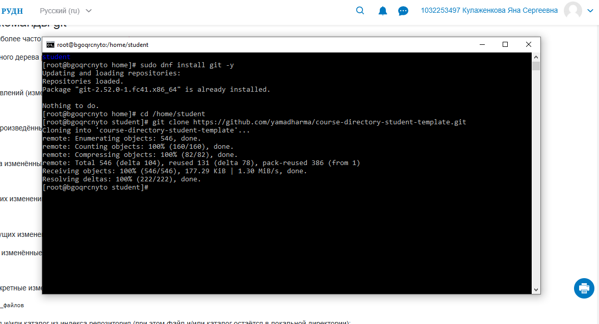
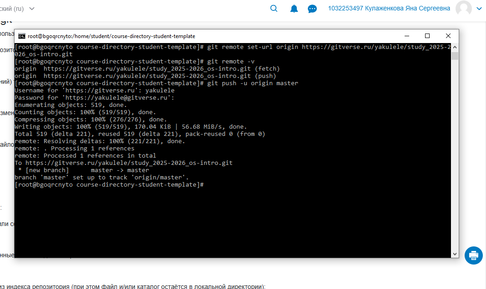
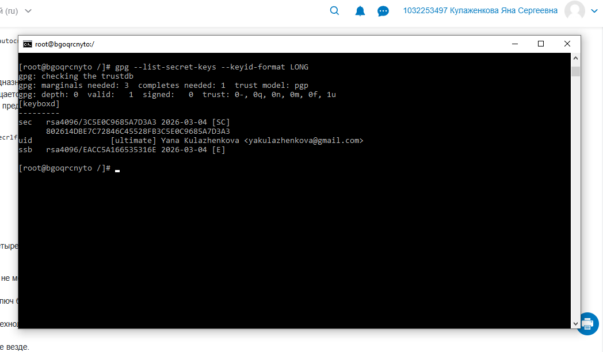
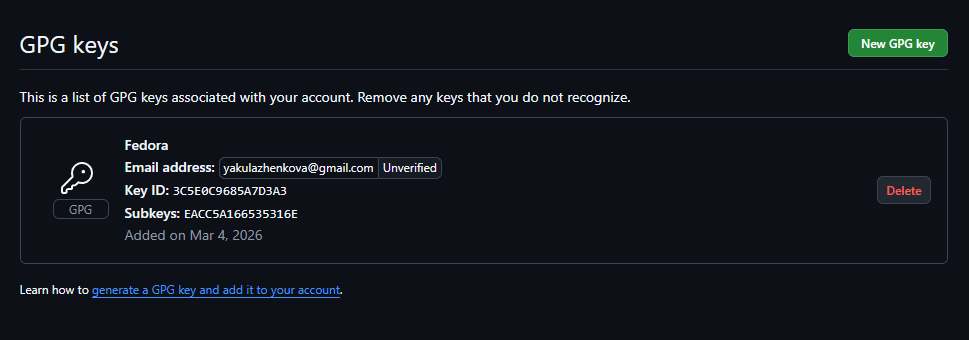
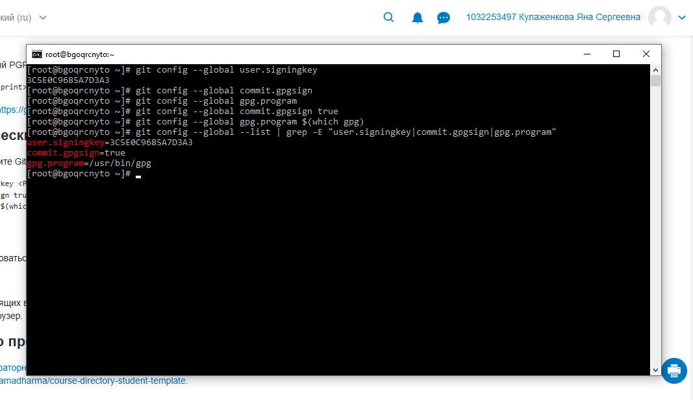
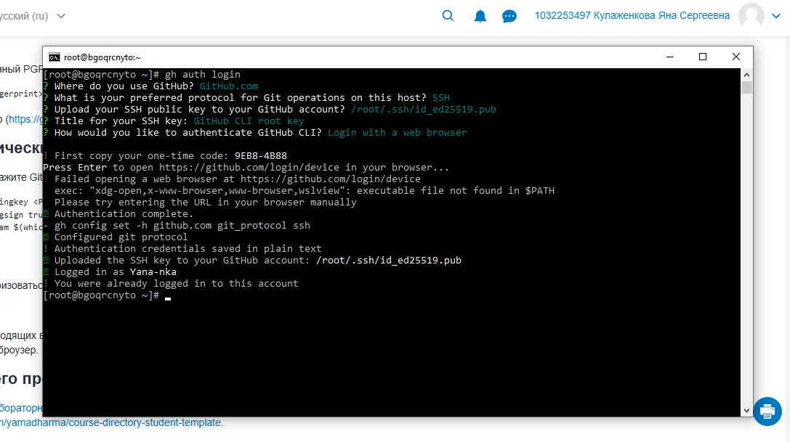
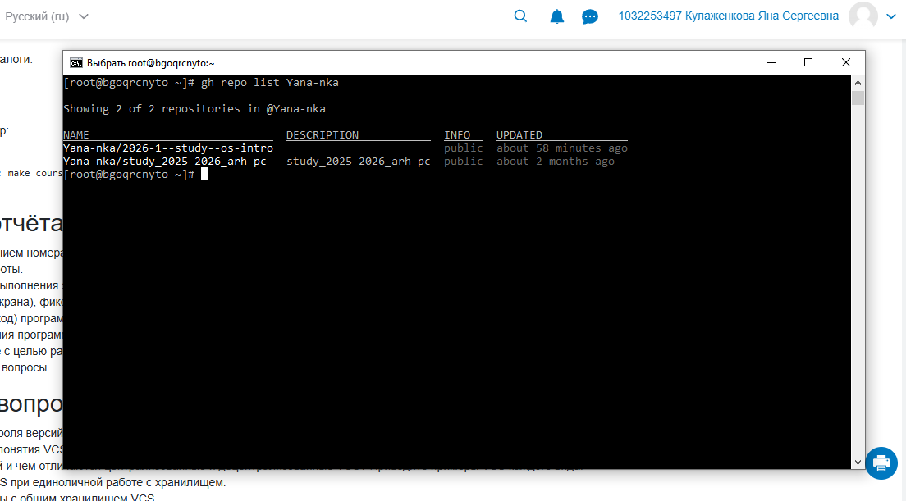

---
## Author
author:
  name: Кулаженкова Яна Сергеевна
  degrees: DSc
  orcid: 0000-0002-0877-7063
  email: kulyabov-ds@rudn.ru
  affiliation:
    - name: Российский университет дружбы народов
      country: Российская Федерация
      postal-code: 117198
      city: Москва
      address: ул. Миклухо-Маклая, д. 6
## Title
title: Система контроля версий Git и работа с GitHub
subtitle: Лабораторная работа
license: CC BY
date: today
date-format: "YYYY-MM-DD"

---

# Вводная часть

## Актуальность

- Системы контроля версий (VCS) являются неотъемлемым инструментом современной разработки программного обеспечения
- Git — наиболее популярная распределённая система контроля версий, используемая как в открытых, так и в коммерческих проектах
- Интеграция с платформами (GitHub, GitLab, GitVerse) обеспечивает эффективную командную работу и совместное развитие проектов
- Верификация коммитов с помощью GPG-подписей гарантирует подлинность авторства и защищает от подделки изменений

## Объект и предмет исследования

- **Объект:** Система контроля версий Git и платформа для совместной разработки GitHub
- **Предмет:** Процесс настройки окружения для работы с Git, включая конфигурацию, создание GPG-ключей для подписи коммитов и аутентификацию на GitHub

## Цели и задачи

- Клонировать шаблонный репозиторий для выполнения лабораторных работ
- Настроить глобальную конфигурацию Git (имя пользователя, email, параметры)
- Сгенерировать и настроить GPG-ключ для подписывания коммитов
- Добавить публичный GPG-ключ в аккаунт на GitHub
- Настроить автоматическое подписывание коммитов
- Установить и настроить GitHub CLI для аутентификации
- Освоить базовые операции с удалёнными репозиториями

## Материалы и методы

- **Программное обеспечение:**
    - Git (версия 2.52.0)
    - GnuPG (GPG) для создания цифровых подписей
    - GitHub CLI (`gh`)
    - Пакетный менеджер `dnf` (Fedora 41)
- **Платформы:**
    - GitHub (удалённый репозиторий)
    - GitVerse (альтернативная платформа)

# Ход работы

## Клонирование шаблонного репозитория

- Выполнен переход в домашнюю директорию пользователя `student`
- С помощью команды `git clone` скопирован шаблонный репозиторий:
  `https://github.com/yamadharma/course-directory-student-template.git`
- Репозиторий успешно загружен (546 объектов, 177 КБ)

{#fig:001 width=70%}

## Настройка удалённого репозитория

- Изменён URL удалённого репозитория на личный репозиторий на GitVerse:
  ```bash
  git remote set-url origin https://gitverse.ru/yakulele/study_2025-2026_os-intro.git
  ```
- Выполнена проверка настроенных удалённых репозиториев (`git remote -v`)
- Произведён первый `push` в удалённый репозиторий с установкой upstream-ветки

{#fig:002 width=70%}

## Проверка версий установленного ПО

- Выполнена проверка версии Git: `git --version` (2.52.0)
- Проверена версия компилятора G++ (2.79.0)
- Просмотрено содержимое директории `.ssh/` для проверки наличия SSH-ключей

{#fig:003 width=70%}

## Настройка глобальной конфигурации Git

Установлены следующие глобальные параметры Git:
- `user.name` — "yskulazhenkova"
- `user.email` — "yakulazhenkova@gmail.com"
- `core.quotepath` — false (корректное отображение не-ASCII символов)
- `init.defaultBranch` — master
- `core.autocrlf` — input (обработка окончаний строк)
- `core.safecrlf` — warn

{#fig:004 width=70%}

## Создание и проверка GPG-ключа

- Сгенерирован GPG-ключ для подписывания коммитов
- Выполнен просмотр созданных секретных ключей:
  ```bash
  gpg --list-secret-keys --keyid-format LONG
  ```
- Ключ имеет идентификатор `EACCA166535316E` и ассоциирован с email `yakulazhenkova@gmail.com`

{#fig:005 width=70%}

## Настройка подписывания коммитов

- В Git указан идентификатор ключа для подписывания:
  ```bash
  git config --global user.signingkey 3C5E0C9685A7D3A3
  ```
- Для удобства работы установлен пакет `xclip` (копирование в буфер обмена)
- Установлены зависимости: `libXmu`

{#fig:006 width=70%}

## Добавление GPG-ключа на GitHub

- Публичный GPG-ключ добавлен в настройках аккаунта GitHub
- В интерфейсе GitHub отображается информация о ключе:
  - Key ID: `3C5E0C9685A7D3A3`
  - Subkeys: `EACC5A166535316E`
  - Email: `yakulazhenkova@gmail.com`
  - Статус: Unverified (ожидает подтверждения)

{#fig:007 width=70%}

## Включение автоматического подписывания

Настроено автоматическое подписывание всех коммитов:
- `commit.gpgsign true` — включение подписи коммитов
- `gpg.program $(which gpg)` — указание пути к программе GPG
- Проверка настроек выполнена с помощью `git config --global --list | grep -E "user.signingkey|commit.gpgsign|gpg.program"`

{#fig:008 width=70%}

## Аутентификация через GitHub CLI

- Запущен процесс аутентификации: `gh auth login`
- Выбраны параметры:
  - Хост: GitHub.com
  - Протокол: SSH
  - Загрузка SSH-ключа: `/root/.ssh/id_ed25519.pub`
  - Способ аутентификации: через веб-браузер
- Сгенерирован одноразовый код: `9EB8-4888`
- Выполнен вход в аккаунт `Yana-nka`

{#fig:009 width=70%}

## Просмотр списка репозиториев

- После успешной аутентификации выполнена команда `gh repo list Yana-nka`
- Отображены репозитории пользователя:
  - `Yana-nka/2026-1--study--os-intro` (обновлён 58 минут назад)
  - `Yana-nka/study_2025-2026_arh-pc` (обновлён 2 месяца назад)
- Результат подтверждает корректность выполненных настроек

{#fig:010 width=70%}

# Результаты

## Основные результаты работы

| Задача | Результат |
|--------|-----------|
| Клонирование шаблона | Репозиторий успешно склонирован |
| Настройка Git | Сконфигурированы глобальные параметры |
| Создание GPG-ключа | Сгенерирован ключ RSA 4096 |
| Добавление ключа на GitHub | Ключ загружен в аккаунт |
| Автоподписывание | Включено для всех коммитов |
| GitHub CLI | Выполнена аутентификация |
| Проверка доступа | Получен список репозиториев |

## Итоговый слайд

- В ходе лабораторной работы освоены основные приёмы работы с Git:
  - Клонирование и настройка удалённых репозиториев
  - Конфигурирование пользовательских параметров
- Реализована система верификации коммитов с помощью GPG-подписей
- Освоена работа с GitHub CLI для эффективного взаимодействия с платформой
- Полученные навыки являются фундаментом для дальнейшей работы в курсе и профессиональной деятельности

# Список литературы

1. Официальная документация Git. URL: https://git-scm.com/doc
2. Документация GitHub по работе с GPG-ключами. URL: https://docs.github.com/ru/authentication/managing-commit-signature-verification
3. Документация GitHub CLI. URL: https://cli.github.com/manual/
4. Pro Git Book. URL: https://git-scm.com/book/ru/v2
```
