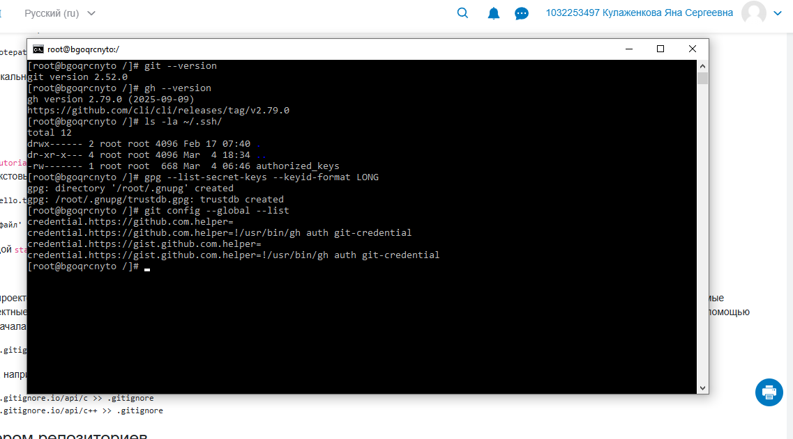
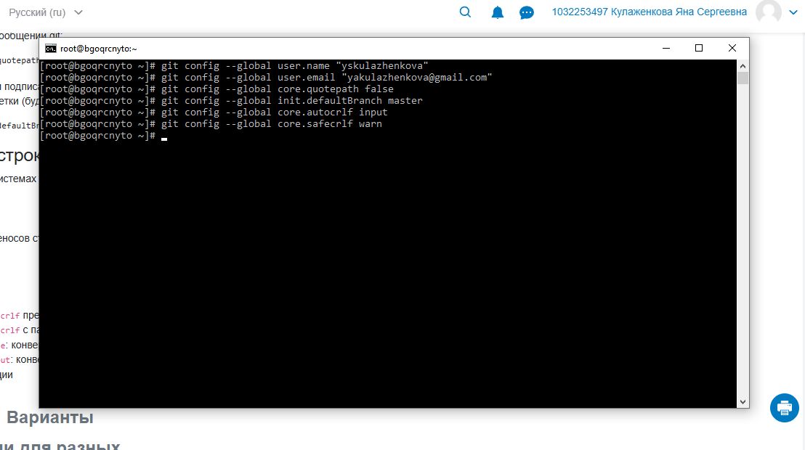
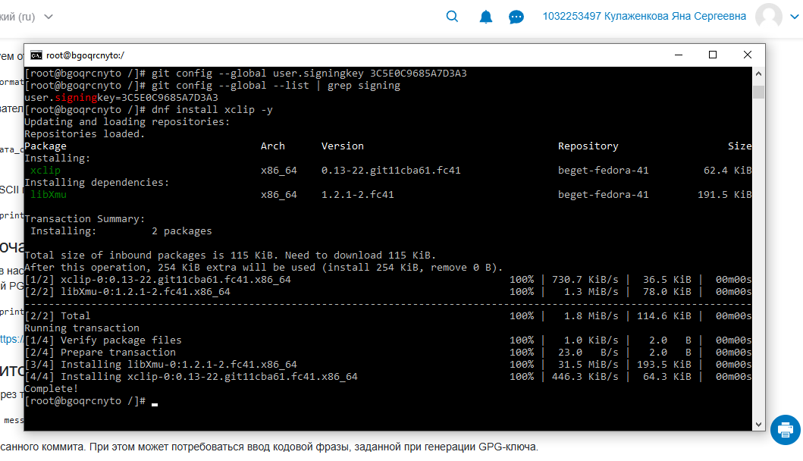

---
author:
  name: Кулаженкова Яна Сергеевна
  email: 1032253497@rudn.ru
  affiliation:
    - name: Российский университет дружбы народов
      city: Москва
title: "Отчёт по лабораторной работе №2"
subtitle: "Система контроля версий Git и работа с GitHub"
---

# Цель работы

Целью данной работы является изучение системы контроля версий Git, получение навыков работы с репозиториями, настройка GPG-подписей для верификации коммитов, а также освоение базовых операций с удалёнными репозиториями на платформе GitHub.

# Задание

1. Клонировать шаблон репозитория для выполнения лабораторных работ.
2. Настроить глобальную конфигурацию Git (имя пользователя, email).
3. Сгенерировать и настроить GPG-ключ для подписи коммитов.
4. Добавить публичный GPG-ключ в аккаунт на GitHub.
5. Настроить автоматическое подписывание коммитов.
6. Установить и настроить GitHub CLI (`gh`) для аутентификации.
7. Выполнить базовые операции с репозиторием.

# Теоретическое введение

**Git** — распределённая система контроля версий, которая позволяет отслеживать изменения в файлах и координировать работу над проектами нескольких разработчиков.

**GPG (GNU Privacy Guard)** — инструмент для шифрования и создания цифровых подписей. В контексте Git используется для подписывания коммитов и тегов, подтверждая их авторство.

**GitHub CLI (`gh`)** — официальный инструмент командной строки для взаимодействия с GitHub, позволяющий управлять репозиториями, issues, pull request'ами и выполнять аутентификацию.

Основные команды Git, использованные в работе:
- `git clone` — клонирование удалённого репозитория
- `git config` — настройка параметров Git
- `git remote` — управление удалёнными репозиториями
- `git push` — отправка изменений в удалённый репозиторий
- `gpg` — управление GPG-ключами

# Выполнение лабораторной работы

## Клонирование шаблона репозитория

Первым шагом было клонирование шаблонного репозитория, необходимого для выполнения лабораторных работ. Перейдя в домашнюю директорию пользователя `student`, я выполнила команду `git clone`:

{#fig:001 width=70%}

## Настройка удалённого репозитория

После клонирования была произведена смена URL удалённого репозитория на личный репозиторий на платформе GitVerse. Команда `git remote set-url` изменила адрес origin, после чего с помощью `git push` изменения были отправлены в удалённый репозиторий:

{#fig:002 width=70%}

## Проверка версий установленного ПО

Далее была выполнена проверка версий Git и компилятора G++, установленных в системе:

{#fig:003 width=70%}

## Настройка глобальной конфигурации Git

Для корректной работы с Git была настроена глобальная конфигурация: указаны имя пользователя и email, а также параметры, отвечающие за корректное отображение и обработку файлов:

{#fig:004 width=70%}

## Создание и проверка GPG-ключа

В системе был сгенерирован GPG-ключ для подписывания коммитов. Команда `gpg --list-secret-keys` отобразила информацию о созданном ключе с идентификатором `EACCA166535316E`:

{#fig:005 width=70%}

## Настройка подписывания коммитов

Была произведена настройка Git для использования GPG-ключа при подписывании коммитов. Для удобства работы также был установлен пакет `xclip`, необходимый для копирования содержимого буфера обмена:

{#fig:006 width=70%}

## Добавление GPG-ключа на GitHub

Публичный GPG-ключ был добавлен в настройках аккаунта GitHub. На скриншоте отображён интерфейс GitHub с информацией о добавленном ключе:

{#fig:007 width=70%}

## Включение автоматического подписывания коммитов

Для автоматического подписывания всех коммитов были настроены соответствующие параметры Git: `commit.gpgsign` установлен в `true`, указан путь к программе GPG:

{#fig:008 width=70%}

## Аутентификация через GitHub CLI

С помощью утилиты `gh auth login` была выполнена аутентификация в GitHub. Был выбран протокол SSH, загружен публичный SSH-ключ, и выполнена веб-аутентификация с использованием одноразового кода:

{#fig:009 width=70%}

## Просмотр списка репозиториев

После успешной аутентификации с помощью команды `gh repo list` был получен список репозиториев, принадлежащих пользователю, что подтверждает корректность выполненных настроек:

{#fig:010 width=70%}

# Выводы

В ходе выполнения лабораторной работы были получены практические навыки работы с системой контроля версий Git. Была выполнена настройка глобальной конфигурации Git, сгенерирован GPG-ключ для подписывания коммитов, добавлен публичный ключ в аккаунт GitHub, настроено автоматическое подписывание коммитов. Также была освоена работа с GitHub CLI для аутентификации и управления репозиториями. Полученные навыки являются основой для дальнейшей работы с системами контроля версий при выполнении лабораторных работ и курсовых проектов.

# Список литературы

1. Официальная документация Git. URL: https://git-scm.com/doc
2. Документация GitHub по работе с GPG-ключами. URL: https://docs.github.com/ru/authentication/managing-commit-signature-verification
3. Документация GitHub CLI. URL: https://cli.github.com/manual/
