---
## Author
author:
  name: Кулаженкова Яна Сергеевна
  degrees: DSc
  orcid: 0000-0002-0877-7063
  email: kulyabov-ds@rudn.ru
  affiliation:
    - name: Российский университет дружбы народов
      country: Российская Федерация
      postal-code: 117198
      city: Москва
      address: ул. Миклухо-Маклая, д. 6
## Title
title: Инструменты разработчика и автоматизация работы с Git
subtitle: Лабораторная работа №4
license: CC BY
date: today
date-format: "YYYY-MM-DD"

---

# Вводная часть

## Актуальность

- Современная разработка программного обеспечения требует использования стандартизированных подходов к управлению версиями
- Инструменты автоматизации (Commitizen, standard-changelog) позволяют поддерживать качественную документацию проекта
- Git Flow обеспечивает структурированный подход к управлению ветками и релизами
- Пакетные менеджеры нового поколения (pnpm) повышают эффективность работы с зависимостями

## Объект и предмет исследования

- **Объект:** Процесс разработки программного проекта с использованием современных инструментов
- **Предмет:** Методология Git Flow, инструменты структурирования коммитов (Commitizen), генерации changelog (standard-changelog) и работа с GitHub CLI

## Цели и задачи

- Установить и настроить инструменты разработчика в среде Fedora 41
- Освоить работу с репозиторием COPR для установки gitflow
- Настроить pnpm и установить глобальные пакеты commitizen и standard-changelog
- Создать Git-репозиторий с поддержкой Git Flow
- Научиться создавать структурированные коммиты с помощью commitizen
- Освоить генерацию CHANGELOG и создание релизов на GitHub

## Материалы и методы

- **Платформа:** WSL2 с дистрибутивом Fedora 41
- **Инструменты:**
    - Пакетный менеджер: `dnf`, репозиторий COPR
    - Система контроля версий: `git`, `git-flow`
    - JavaScript-инструменты: `nodejs`, `pnpm`
    - Инструменты автоматизации: `commitizen`, `standard-changelog`
    - Взаимодействие с GitHub: `gh` (GitHub CLI)

# Ход работы

## Установка gitflow из репозитория COPR

- COPR (Cool Other Packages Repo) — система сборки пакетов для Fedora
- Подключение репозитория `elegans/gitflow` выполнено командой `sudo dnf copr enable`
- Установка пакета `gitflow` произведена через `dnf install`

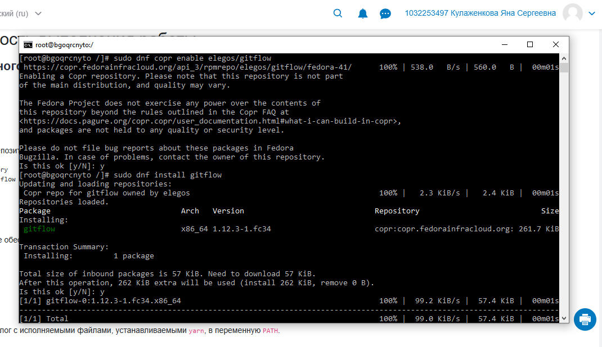{#fig:001 width=70%}

## Импорт GPG-ключа

- При установке пакетов из сторонних репозиториев выполняется импорт GPG-ключа для верификации пакетов
- Ключ успешно импортирован, установка продолжена

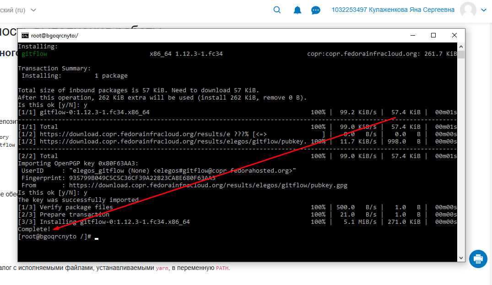{#fig:002 width=70%}

## Установка nodejs и pnpm

- Установлены пакеты `nodejs` и `pnpm` из официальных репозиториев Fedora
- Автоматически установлены зависимости: `nodejs-libs`, `nodejs-docs`, `nodejs-full-i18n`, `nodejs-npm`
- Общий размер устанавливаемых пакетов: 231 МБ

```bash
[root@bgoqrcnyto /]# sudo dnf install nodejs pnpm
Transaction Summary:
  Installing:    6 packages
After this operation, 231 MiB extra will be used
```

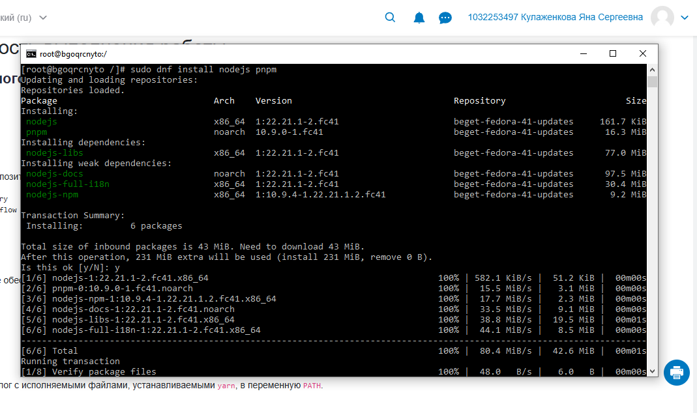{#fig:003 width=70%}

## Настройка pnpm

- После установки pnpm выполнена первоначальная настройка: `pnpm setup`
- Команда добавила переменные окружения в `.bashrc`
- Изменения применены через `source ~/.bashrc`

```bash
[root@bgoqrcnyto /]# pnpm setup
Appended new lines to /root/.bashrc

Next configuration changes were made:
export PNPM_HOME="/root/.local/share/pnpm"
export PATH="${PNPM_HOME}:$PATH"
```

{#fig:004 width=70%}

## Установка глобальных пакетов

- Установлен `commitizen` — инструмент для создания структурированных коммитов
- Установлен `standard-changelog` — генератор CHANGELOG.md на основе коммитов

```bash
[root@bgoqrcnyto /]# pnpm add -g commitizen
[root@bgoqrcnyto /]# pnpm add -g standard-changelog
```

{#fig:005 width=70%}

{#fig:006 width=70%}

## Создание Git-репозитория

- Создан каталог `~/projects/git-extended` для нового проекта
- Инициализирован Git-репозиторий
- Создан файл `README.md` и выполнен первый коммит

```bash
[root@bgoqrcnyto /]# mkdir -p ~/projects/git-extended
[root@bgoqrcnyto /]# cd ~/projects/git-extended
[root@bgoqrcnyto git-extended]# git init
[root@bgoqrcnyto git-extended]# echo "# git-extended" > README.md
[root@bgoqrcnyto git-extended]# git add README.md
[root@bgoqrcnyto git-extended]# git commit -m "first commit"
```

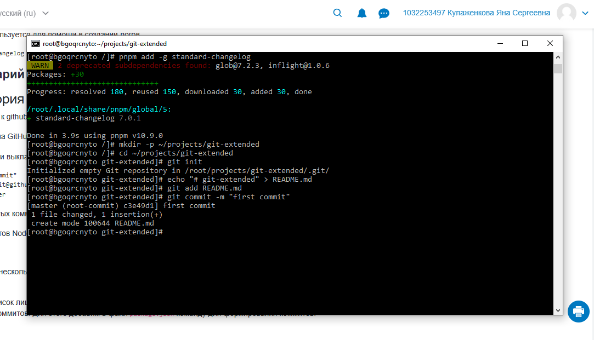{#fig:007 width=70%}

## Подключение удалённого репозитория

- Добавлен удалённый репозиторий на GitHub
- Выполнена отправка изменений
- При первом подключении подтверждена подлинность хоста GitHub

```bash
[root@bgoqrcnyto git-extended]# git remote add origin git@github.com:Yana-nka/git-extended.git
[root@bgoqrcnyto git-extended]# git push -u origin master
```

{#fig:008 width=70%}

## Создание package.json

- Создан файл `package.json` с базовой конфигурацией проекта
- Указан менеджер пакетов: `pnpm@10.9.0`
- Выполнен первый структурированный коммит через `git cz`

```json
{
  "name": "git-extended",
  "version": "1.0.0",
  "description": "",
  "main": "index.js",
  "packageManager": "pnpm@10.9.0"
}
```

{#fig:009 width=70%}

## Инициализация Git Flow

- Выполнена инициализация Git Flow с флагом принудительной перезаписи
- Настроены имена веток:
  - Production releases: `master`
  - Next release development: `develop`
  - Префиксы: `feature/`, `bugfix/`, `release/`, `hotfix/`
  - Префикс тегов: `v`

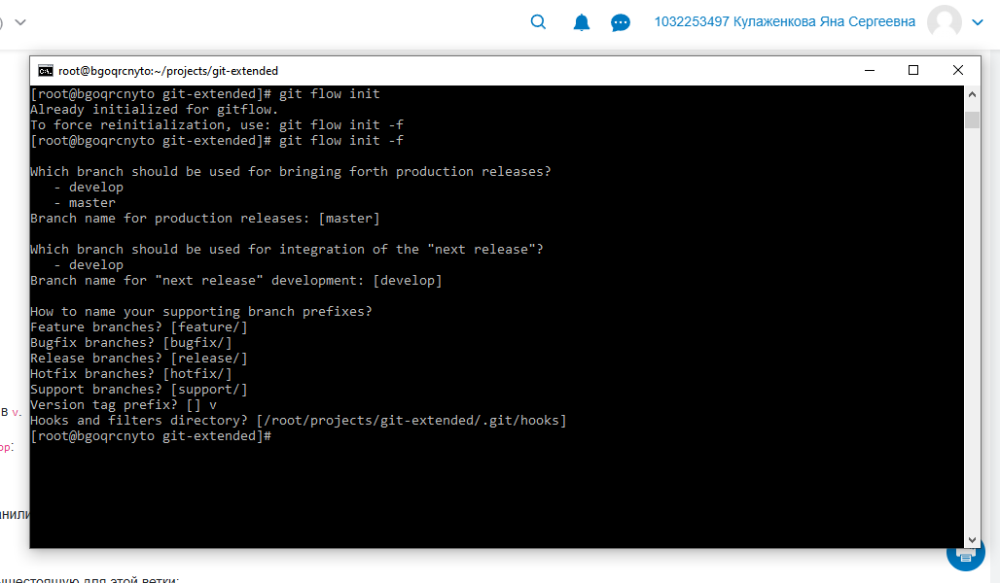{#fig:010 width=70%}

## Работа с ветками

- После инициализации в репозитории присутствуют ветки `master` и `develop`
- Обе ветки отправлены в удалённый репозиторий
- Для ветки `develop` настроено отслеживание удалённой ветки

```bash
[root@bgoqrcnyto git-extended]# git branch
* develop
  master
[root@bgoqrcnyto git-extended]# git push --all
```

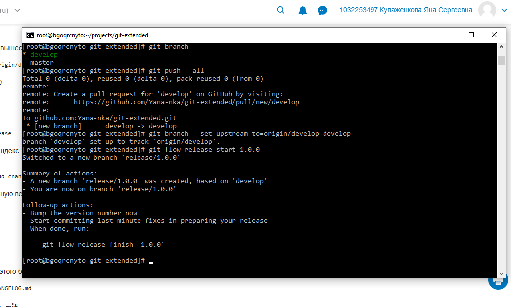{#fig:011 width=70%}

## Создание первого релиза

- Создана релизная ветка для версии 1.0.0: `git flow release start 1.0.0`
- Ветка создана на основе `develop`

```bash
[root@bgoqrcnyto git-extended]# git flow release start 1.0.0
Switched to a new branch 'release/1.0.0'
```

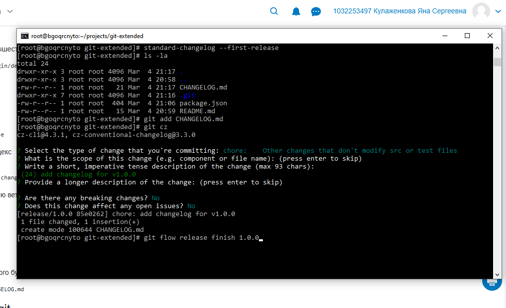{#fig:012 width=70%}

## Генерация CHANGELOG

- Сгенерирован файл `CHANGELOG.md` с помощью `standard-changelog --first-release`
- Изменения закоммичены с типом `chore`

```bash
[root@bgoqrcnyto git-extended]# standard-changelog --first-release
[root@bgoqrcnyto git-extended]# git add CHANGELOG.md
[root@bgoqrcnyto git-extended]# git cz
```

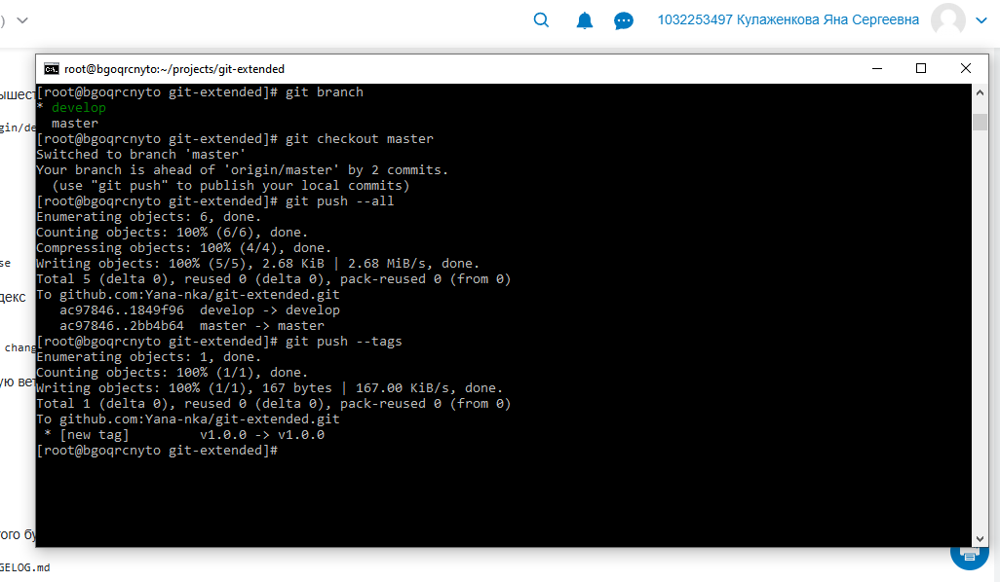{#fig:013 width=70%}

## Завершение первого релиза

- Выполнено завершение релиза: `git flow release finish 1.0.0`
- Изменения объединены в ветки `master` и `develop`
- Создан тег `v1.0.0`

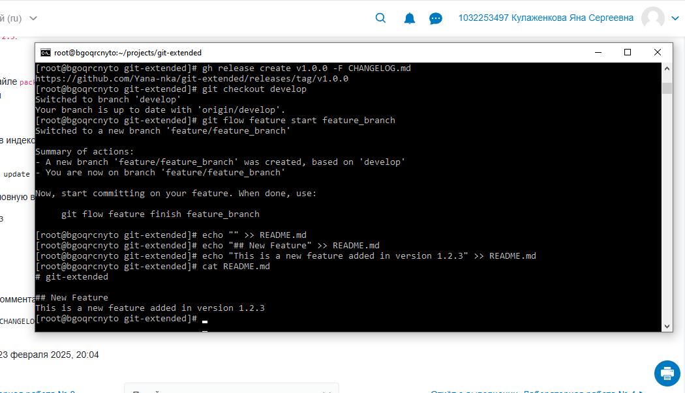{#fig:014 width=70%}

## Создание релиза на GitHub

- С помощью GitHub CLI создан релиз на основе тега `v1.0.0`
- Описание релиза взято из файла `CHANGELOG.md`

```bash
[root@bgoqrcnyto git-extended]# gh release create v1.0.0 -F CHANGELOG.md
https://github.com/Yana-nka/git-extended/releases/tag/v1.0.0
```

{#fig:015 width=70%}

## Работа с feature-веткой

- Создана feature-ветка: `git flow feature start feature_branch`
- В файл `README.md` добавлено описание новой функциональности
- Выполнен коммит с типом `feat` (новая функциональность)

```bash
[root@bgoqrcnyto git-extended]# git flow feature start feature_branch
[root@bgoqrcnyto git-extended]# echo "## New Feature" >> README.md
[root@bgoqrcnyto git-extended]# git cz
```

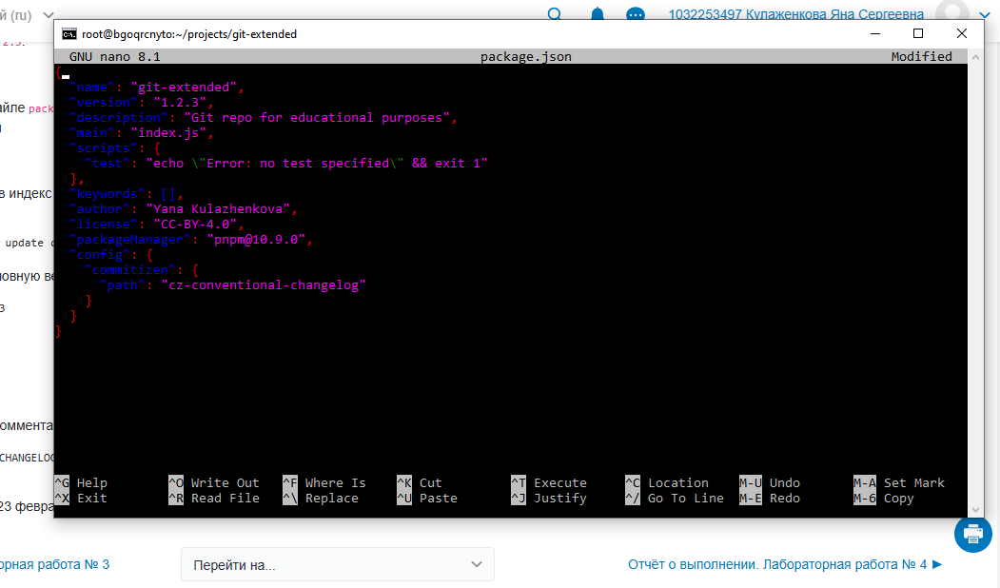{#fig:016 width=70%}

## Завершение работы с feature-веткой

- Feature-ветка объединена в `develop` с помощью `git flow feature finish`
- Ветка автоматически удалена после объединения

```bash
[root@bgoqrcnyto git-extended]# git flow feature finish feature_branch
Switched to branch 'develop'
Updating 1849f96..5000156
Fast-forward
README.md | 3 +++
1 file changed, 3 insertions(+)
Deleted branch feature/feature_branch
```

{#fig:017 width=70%}

## Подготовка второго релиза

- Обновлена версия в `package.json` до `1.2.3`
- Изменены поля `author` и `license`
- Создана релизная ветка `release/1.2.3`

{#fig:018 width=70%}

## Завершение второго релиза

- Обновлён CHANGELOG.md
- Выполнен коммит изменений
- Завершён релиз `git flow release finish 1.2.3`

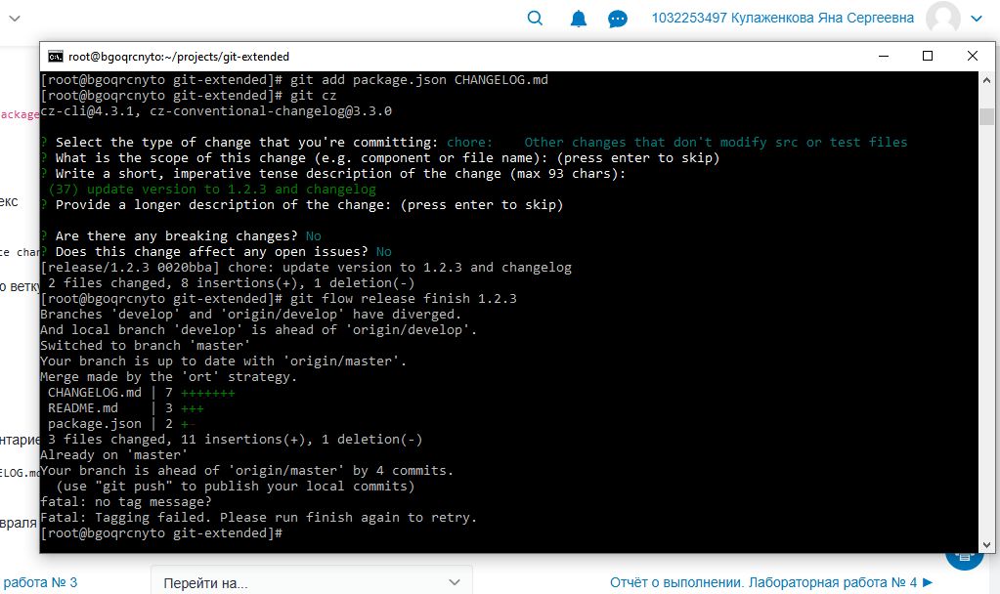{#fig:019 width=70%}

## Отправка второго релиза на GitHub

- Отправлены все ветки в удалённый репозиторий
- Отправлены теги
- Создан релиз на GitHub через GitHub CLI

```bash
[root@bgoqrcnyto git-extended]# git push --all
[root@bgoqrcnyto git-extended]# git push --tags
[root@bgoqrcnyto git-extended]# gh release create v1.2.3 -F CHANGELOG.md
```

{#fig:020 width=70%}

# Результаты

## Основные результаты работы

- **Настроено окружение разработчика:** Установлены и сконфигурированы nodejs, pnpm, gitflow
- **Автоматизация коммитов:** Освоена работа с commitizen для создания структурированных коммитов по стандарту Conventional Commits
- **Генерация документации:** Настроена автоматическая генерация CHANGELOG.md с помощью standard-changelog
- **Git Flow:** Освоена методология управления ветками: feature-ветки, релизные ветки, работа с тегами
- **Интеграция с GitHub:** Настроена работа с GitHub CLI для создания релизов

## Итоговый слайд

- В ходе работы был создан полноценный цикл разработки программного проекта с использованием современных инструментов
- Выполнено два полных цикла релизов (v1.0.0 и v1.2.3) с созданием соответствующих тегов и релизов на GitHub
- Полученные навыки являются основой для организации структурированной разработки в командных проектах
- Инструменты автоматизации значительно упрощают поддержание качества кода и документации
```
