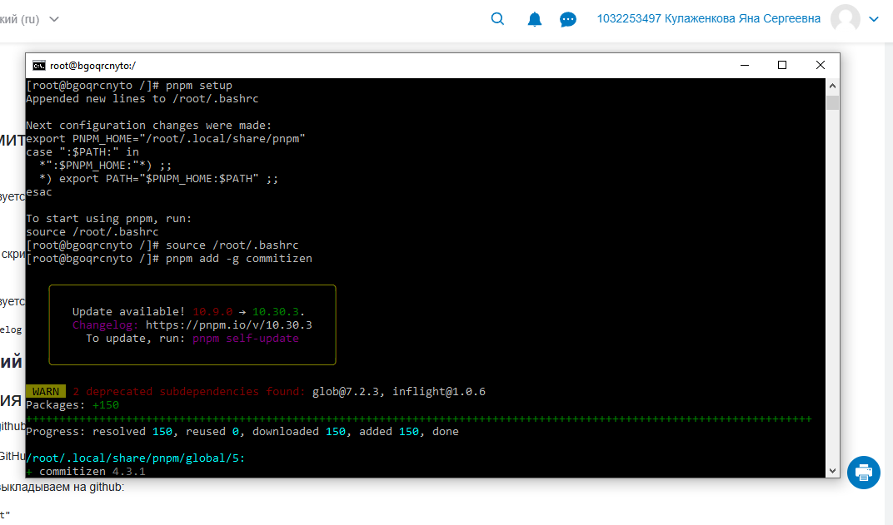
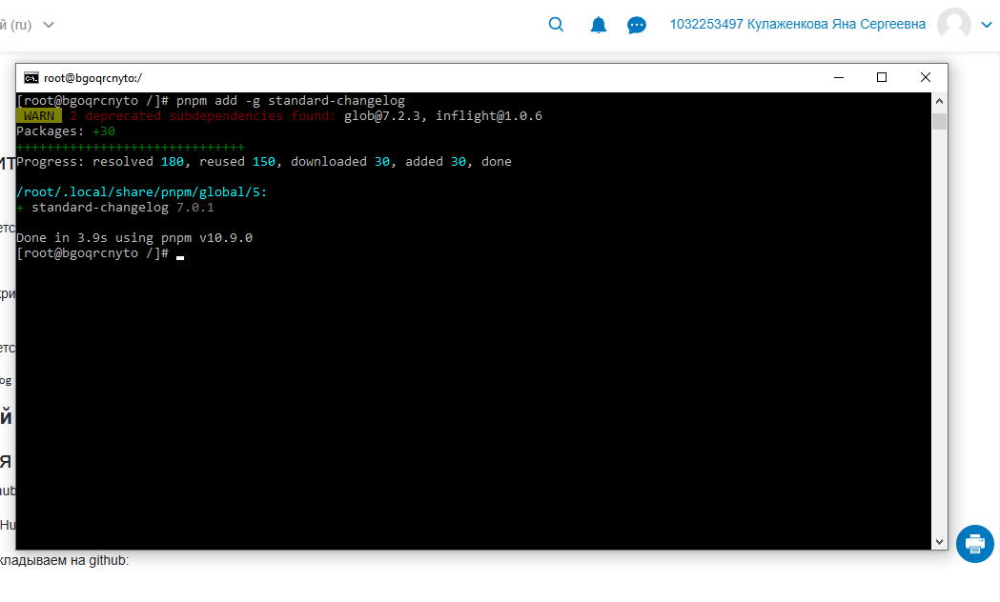
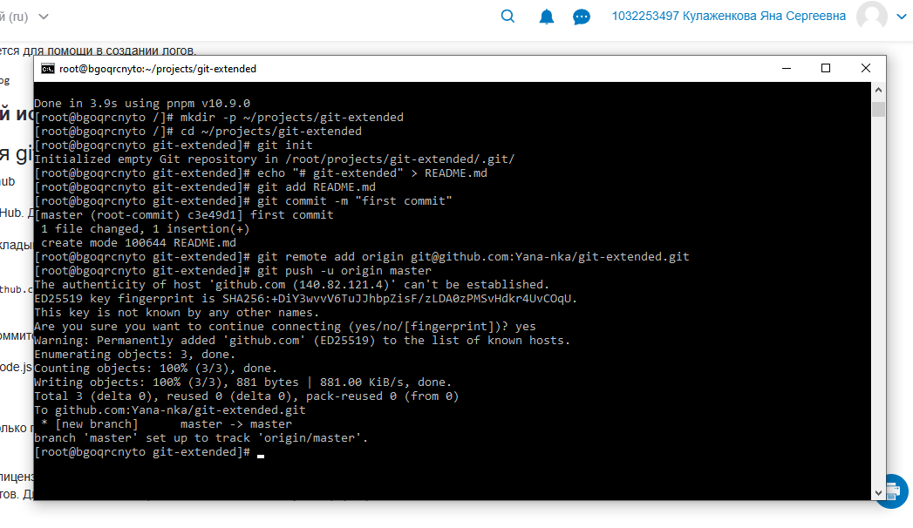
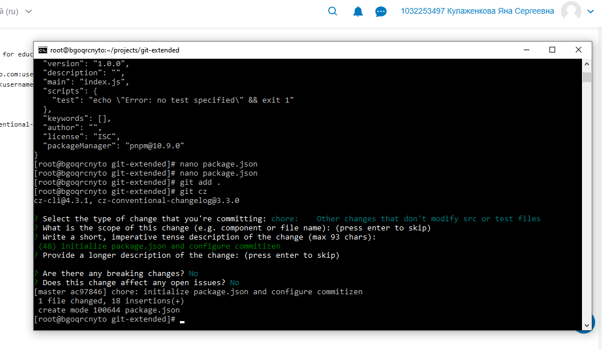
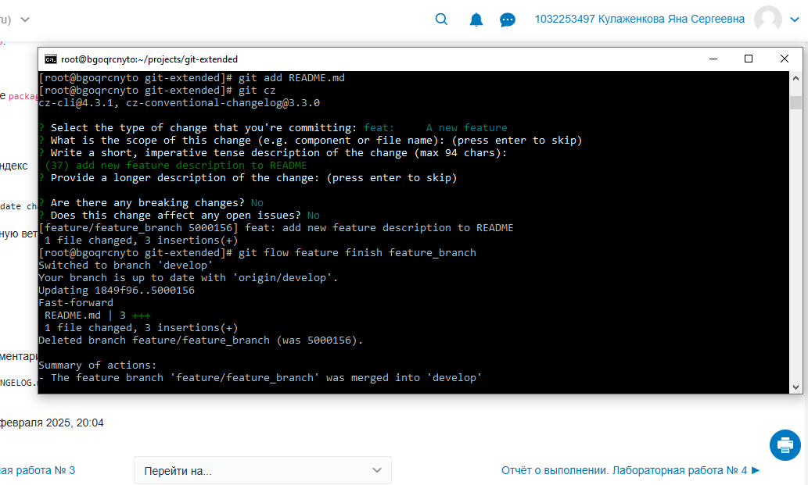
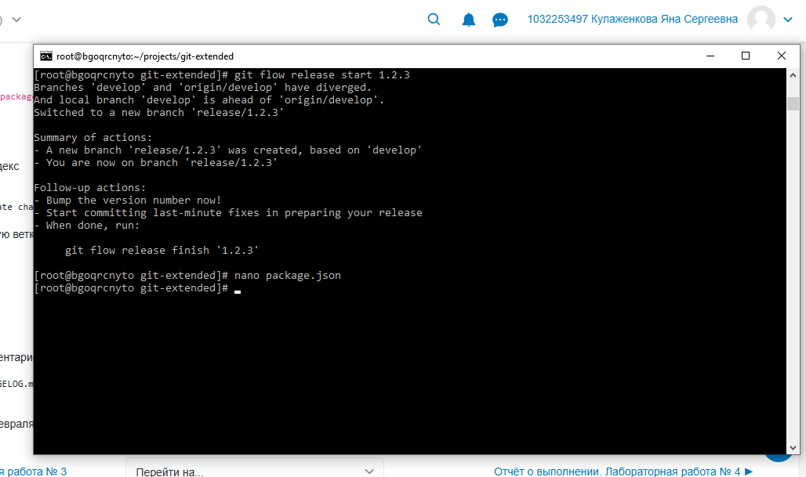
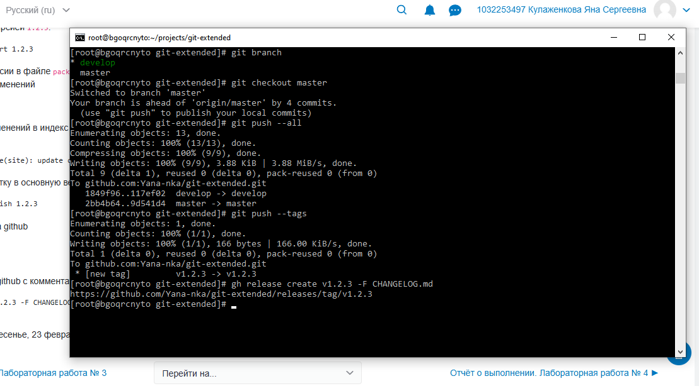

---
author:
  name: Кулаженкова Яна Сергеевна
  email: 1032253497@rudn.ru
  affiliation:
    - name: Российский университет дружбы народов
      city: Москва
      address: ул. Миклухо-Маклая, д. 6
title: "Отчёт по лабораторной работе №4"
subtitle: "Установка и конфигурирование дополнительного ПО и инструментов разработчика в Fedora 41"
license: "CC BY"
---

# Цель работы

Целью данной работы является получение навыков установки и настройки инструментов разработчика в среде Fedora 41, включая пакетный менеджер pnpm, инструменты для работы с Git (gitflow, commitizen, standard-changelog) и освоение работы с GitHub CLI.

# Задание

1. Установить и настроить репозиторий COPR для установки gitflow.
2. Установить инструменты разработчика: nodejs, pnpm, gitflow.
3. Настроить pnpm и установить глобальные пакеты commitizen и standard-changelog.
4. Создать и настроить Git-репозиторий с поддержкой Git Flow.
5. Настроить commitizen для создания структурированных коммитов.
6. Сгенерировать CHANGELOG с помощью standard-changelog.
7. Создать релизы на GitHub с использованием GitHub CLI.
8. Освоить работу с feature-ветками в Git Flow.

# Теоретическое введение

**COPR (Cool Other Packages Repo)** — система сборки пакетов для Fedora, позволяющая пользователям создавать и распространять пакеты, не входящие в официальные репозитории.

**pnpm** — быстрый и эффективный менеджер пакетов для JavaScript/Node.js, альтернатива npm и yarn.

**Git Flow** — набор расширений для Git, реализующих модель ветвления для управления релизами.

**Commitizen** — инструмент для создания стандартизированных сообщений коммитов в соответствии с Conventional Commits.

**standard-changelog** — утилита для автоматической генерации CHANGELOG.md на основе коммитов, следующих соглашению Conventional Commits.

**GitHub CLI** — официальный инструмент командной строки для взаимодействия с GitHub.

# Выполнение лабораторной работы

## Установка дополнительных репозиториев и пакетов

Первым этапом работы стала установка gitflow из репозитория COPR. Для этого был подключён репозиторий `elegans/gitflow` с помощью команды `sudo dnf copr enable elegans/gitflow`, после чего выполнена установка пакета `gitflow` (рис. [-@fig:004]).

{#fig:004 width=70%}

В процессе установки произошёл импорт GPG-ключа для подтверждения подлинности пакетов из подключённого репозитория (рис. [-@fig:041]).

{#fig:041 width=70%}

Далее была выполнена установка пакетов `nodejs` и `pnpm`. Вместе с ними были установлены зависимости: `nodejs-libs`, `nodejs-docs`, `nodejs-full-i18n` и `nodejs-npm`. Общий размер устанавливаемых пакетов составил 231 МБ (рис. [-@fig:042]).

{#fig:042 width=70%}

## Настройка pnpm и установка глобальных пакетов

После установки pnpm была выполнена его первоначальная настройка с помощью команды `pnpm setup`, которая добавила необходимые переменные окружения в файл `.bashrc`. После применения изменений через `source ~/.bashrc` были установлены глобальные пакеты `commitizen` (рис. [-@fig:043]) и `standard-changelog` (рис. [-@fig:044]).

{#fig:043 width=70%}

{#fig:044 width=70%}

## Создание и настройка Git-репозитория

Для выполнения дальнейших работ был создан каталог `~/projects/git-extended`, инициализирован Git-репозиторий и выполнен первый коммит с файлом README.md (рис. [-@fig:045]).

{#fig:045 width=70%}

Репозиторий был связан с удалённым репозиторием на GitHub (`git@github.com:Yana-nka/git-extended.git`), после чего выполнена отправка изменений. При первом подключении к GitHub было подтверждение подлинности хоста (рис. [-@fig:046]).

{#fig:046 width=70%}

## Конфигурация package.json и настройка commitizen

В корне репозитория был создан файл `package.json` с базовой конфигурацией проекта, включая указание менеджера пакетов `pnpm@10.9.0` (рис. [-@fig:047]).

{#fig:047 width=70%}

С помощью команды `git cz` был выполнен первый структурированный коммит, соответствующий стандарту Conventional Commits. Тип коммита выбран `chore`, описание — "initialize package.json and configure commitizen".

## Инициализация Git Flow

В репозитории была выполнена инициализация Git Flow. Поскольку репозиторий уже был инициализирован ранее, использована команда с флагом принудительной инициализации `git flow init -f`. В процессе были настроены названия веток:
- Ветка для релизов: `master`
- Ветка для разработки: `develop`
- Префиксы для вспомогательных веток: `feature/`, `bugfix/`, `release/`, `hotfix/`
- Префикс для тегов: `v`

{#fig:048 width=70%}

## Работа с ветками и создание первого релиза

После инициализации в репозитории присутствуют две основные ветки: `develop` и `master`. Обе ветки были отправлены в удалённый репозиторий, при этом для ветки `develop` настроено отслеживание удалённой ветки (рис. [-@fig:049]).

{#fig:049 width=70%}

Был создан первый релиз с помощью команды `git flow release start 1.0.0`, создана ветка `release/1.0.0` на основе ветки `develop` (рис. [-@fig:050]).

{#fig:050 width=70%}

## Генерация CHANGELOG и завершение релиза

С помощью утилиты `standard-changelog --first-release` был сгенерирован файл `CHANGELOG.md`. Сгенерированные изменения были закоммичены с помощью `git cz` с типом `chore` и описанием "add changelog for v1.0.0". После этого выполнено завершение релиза `git flow release finish 1.0.0` (рис. [-@fig:051]).

{#fig:051 width=70%}

После завершения релиза изменения были отправлены в удалённый репозиторий (ветки `master` и `develop`), а также создан тег `v1.0.0` (рис. [-@fig:052]).

{#fig:052 width=70%}

## Создание релиза на GitHub

С помощью GitHub CLI был создан релиз на основе тега `v1.0.0` с описанием из файла `CHANGELOG.md` (рис. [-@fig:053]).

{#fig:053 width=70%}

## Работа с feature-ветками

Для добавления новой функциональности была создана feature-ветка `feature/feature_branch`. В ней в файл `README.md` были добавлены строки с описанием новой функции. Изменения были закоммичены с типом `feat` (новая функциональность) и описанием "add new feature description to README" (рис. [-@fig:054]).

{#fig:054 width=70%}

После завершения работы feature-ветка была объединена с `develop` с помощью `git flow feature finish feature_branch`.

## Обновление версии и создание нового релиза

Для создания нового релиза была изменена версия в файле `package.json` на `1.2.3`, а также обновлены поля `author` и `license` (рис. [-@fig:055]).

{#fig:055 width=70%}

Был создан новый релиз `git flow release start 1.2.3`. После обновления версии и повторной генерации CHANGELOG изменения закоммичены с типом `chore` и завершён релиз (рис. [-@fig:056]).

{#fig:056 width=70%}

После завершения релиза все изменения отправлены в удалённый репозиторий, создан тег `v1.2.3` и соответствующий релиз на GitHub (рис. [-@fig:057]).

{#fig:057 width=70%}

# Выводы

В ходе выполнения лабораторной работы были успешно установлены и настроены инструменты разработчика в среде Fedora 41:

- Подключён репозиторий COPR и установлен gitflow.
- Установлены nodejs и pnpm, выполнена настройка окружения.
- Установлены и настроены commitizen и standard-changelog.
- Освоена работа с Git Flow: создание релизных и feature-веток.
- Настроена генерация CHANGELOG на основе структурированных коммитов.
- Освоена работа с GitHub CLI для создания релизов.
- Выполнено два полных цикла разработки с созданием релизов версий 1.0.0 и 1.2.3.

Полученные навыки являются основой для организации структурированной разработки программных проектов с использованием современных инструментов и методологий.

# Список литературы

1. Официальная документация Git Flow. URL: https://www.atlassian.com/git/tutorials/comparing-workflows/gitflow-workflow
2. Документация Commitizen. URL: https://commitizen-tools.github.io/commitizen/
3. Conventional Commits. URL: https://www.conventionalcommits.org/
4. Документация pnpm. URL: https://pnpm.io/ru/
5. GitHub CLI Manual. URL: https://cli.github.com/manual/
