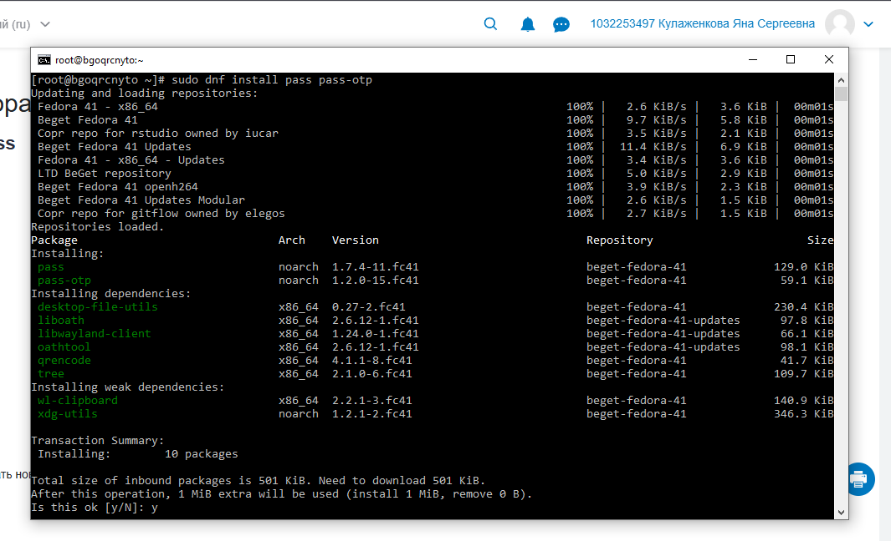
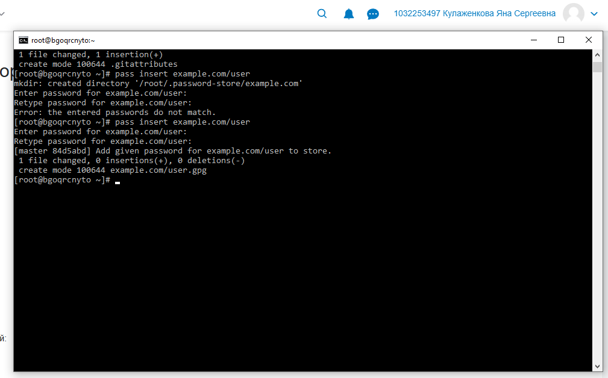
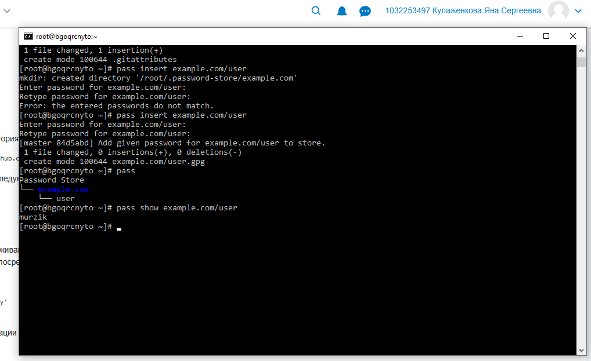
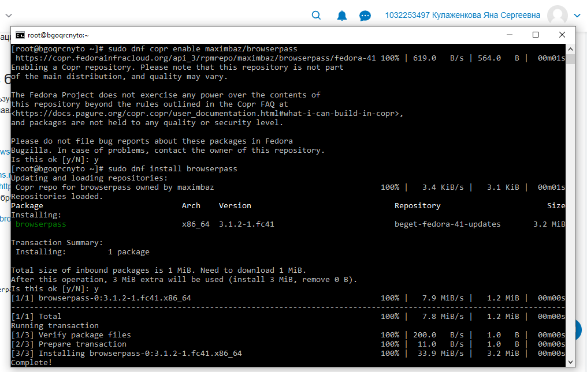
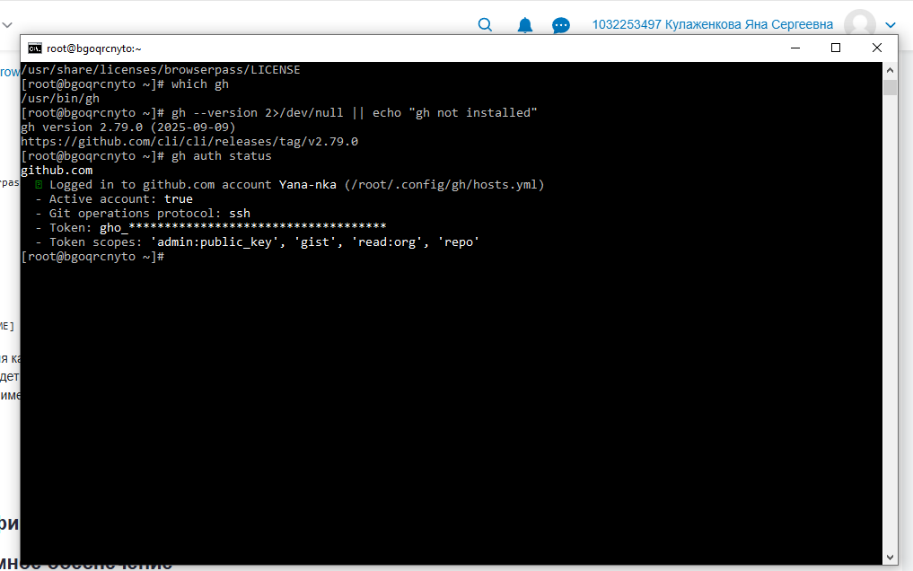
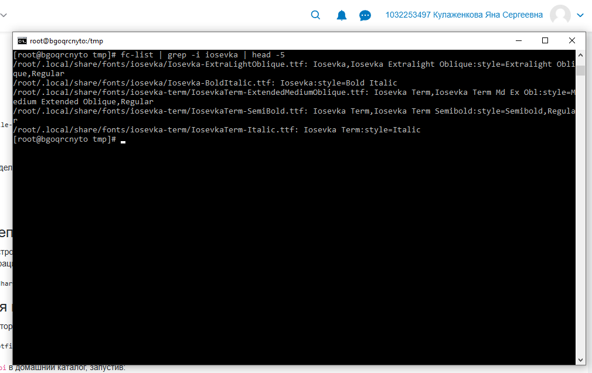

---
## Author
author:
  name: Кулаженкова Яна Сергеевна
  degrees: DSc
  orcid: 0000-0002-0877-7063
  email: kulyabov-ds@rudn.ru
  affiliation:
    - name: Российский университет дружбы народов
      country: Российская Федерация
      postal-code: 117198
      city: Москва
      address: ул. Миклухо-Маклая, д. 6
## Title
title: "Менеджер паролей pass и управление файлами конфигурации с chezmoi"
subtitle: Лабораторная работа №5
license: CC BY
date: today
date-format: "YYYY-MM-DD"

---

# Вводная часть

## Актуальность

- Безопасное хранение паролей — критически важная задача для любого пользователя
- Менеджер паролей `pass` реализует философию Unix: простота, прозрачность, использование существующих инструментов
- Управление файлами конфигурации (dotfiles) необходимо для синхронизации настроек между несколькими машинами
- Инструмент `chezmoi` позволяет автоматизировать这个过程 с использованием шаблонов

## Объект и предмет исследования

- **Объект:** Процесс безопасного хранения паролей и управления конфигурационными файлами в ОС Linux
- **Предмет:** Менеджер паролей `pass`, инструмент управления dotfiles `chezmoi`, интеграция с браузером через `browserpass`

## Цели и задачи

- Установить и настроить менеджер паролей `pass` в Fedora 41
- Изучить семантическую структуру базы паролей и освоить основные операции
- Настроить интеграцию с браузером через `browserpass`
- Создать удалённый репозиторий для синхронизации паролей на GitHub
- Установить и инициализировать инструмент `chezmoi`
- Установить дополнительное ПО и шрифты для рабочей среды

## Материалы и методы

- **Платформа:** Fedora 41
- **Инструменты:**
    - Менеджер паролей: `pass`, `pass-otp`
    - Пакетный менеджер: `dnf`, репозиторий COPR
    - Управление конфигурациями: `chezmoi`
    - Интеграция с браузером: `browserpass`
    - Взаимодействие с GitHub: `gh` (GitHub CLI)
    - Дополнительные утилиты: `grim`, `slurp`, `kitty`, `waybar` и др.

# Ход работы. Менеджер паролей pass

## Установка pass и pass-otp

- Менеджер паролей `pass` устанавливается из официальных репозиториев Fedora
- Дополнительно установлен пакет `pass-otp` для поддержки одноразовых паролей

```bash
[root@bgoqrcnyto ~]# sudo dnf install pass pass-otp
```

- Вместе с основными пакетами установлены зависимости:
    - `oathtool` — для работы с OTP
    - `qrencode` — для генерации QR-кодов
    - `tree` — для отображения структуры хранилища

{#fig:001 width=70%}

## Инициализация хранилища

- Для работы `pass` требуется GPG-ключ (создан ранее)
- Инициализация хранилища выполняется командой `pass init <gpg-id>`

```bash
[root@bgoqrcnyto ~]# pass init example.com/user
```

- Создаётся структура каталогов в `~/.password-store`

{#fig:003 width=70%}

## Добавление паролей

- Добавление пароля выполняется командой `pass insert <путь>`

```bash
[root@bgoqrcnyto ~]# pass insert example.com/user
Enter password for example.com/user:
Retype password for example.com/user:
[master 84d5abd] Add given password for example.com/user to store.
```

- При первом добавлении может потребоваться повтор ввода при ошибке

{#fig:004 width=70%}

## Просмотр паролей

- Просмотр структуры хранилища: `pass`
- Просмотр конкретного пароля: `pass show <путь>`

```bash
[root@bgoqrcnyto ~]# pass
Password Store
    └── example.com
        └── user

[root@bgoqrcnyto ~]# pass show example.com/user
murzik
```

{#fig:005 width=70%}

## Семантическая структура базы паролей

- В `pass` поддерживаются различные форматы имён файлов:

```bash
# Вариант с пользователем в каталоге
pass insert example.com/user

# Вариант с пользователем в имени файла (user@домен)
pass insert user@example.com

# Вариант с указанием порта
pass insert example.com:22

# Иерархическая структура
pass insert work/server/root@192.168.1.1
```

{#fig:006 width=70%}

## Результат добавления паролей

- После добавления всех записей хранилище принимает структурированный вид

```bash
[root@bgoqrcnyto ~]# pass
Password Store
    ├── example.com
    │   ├── user
    │   ├── admin
    │   └── example.com:22
    ├── user@example.com
    └── work
        └── server
            └── root@192.168.1.1
```

{#fig:007 width=70%}

## Генерация паролей

- `pass` умеет генерировать надёжные случайные пароли

```bash
[root@bgoqrcnyto ~]# pass generate example.com/admin 16
[master fe8227a] Add generated password for example.com/admin.
The generated password for example.com/admin is:
```

- Параметр `16` указывает длину пароля

{#fig:008 width=70%}

## Git-интеграция в pass

- `pass` автоматически инициализирует Git-репозиторий для отслеживания изменений

```bash
[root@bgoqrcnyto ~]# pass git status
On branch master
nothing to commit, working tree clean

[root@bgoqrcnyto ~]# pass git log --oneline
fe8227a Add generated password for example.com/admin.
513621b Add given password for work/server/root@192.168.1.1 to store.
8d938a7 Add given password for example.com:22 to store.
34e673e Add given password for user@example.com to store.
84d5abd Add given password for example.com/user to store.
```

{#fig:009 width=70%}

# Ход работы. Интеграция с браузером

## Установка browserpass

- Для интеграции с браузером требуется подключить репозиторий COPR

```bash
[root@bgoqrcnyto ~]# sudo dnf copr enable maximbaz/browserpass
```

- После подключения репозитория устанавливается пакет `browserpass`

```bash
[root@bgoqrcnyto ~]# sudo dnf install browserpass
```

{#fig:010 width=70%}

## Проверка установки browserpass

- Проверка наличия исполняемых файлов пакета

```bash
[root@bgoqrcnyto ~]# rpm -ql browserpass
/usr/bin/browserpass-native
/usr/share/doc/browserpass/README.md
/usr/share/licenses/browserpass/LICENSE
```

- Исполняемый файл `browserpass-native` обеспечивает взаимодействие с браузером через механизм native messaging

{#fig:011 width=70%}

# Ход работы. Создание удалённого репозитория

## Проверка GitHub CLI

- Для работы с GitHub используется утилита командной строки `gh`

```bash
[root@bgoqrcnyto ~]# which gh
/usr/bin/gh

[root@bgoqrcnyto ~]# gh --version
gh version 2.79.0 (2025-09-09)

[root@bgoqrcnyto ~]# gh auth status
Logged in to github.com account Yana-nka
- Token scopes: 'admin:public_key', 'gist', 'read:org', 'repo'
```

{#fig:012 width=70%}

## Создание репозитория для паролей

- Создание приватного репозитория для хранения базы паролей

```bash
[root@bgoqrcnyto ~]# gh repo create password-store --private \
  --description "My pass password store" --clone=false
```

- Репозиторий успешно создан: `https://github.com/Yana-nka/password-store`

## Создание репозитория для dotfiles

- Создание репозитория для файлов конфигурации на основе шаблона

```bash
[root@bgoqrcnyto ~]# gh repo create dotfiles \
  --template="yamadharma/dotfiles-template" --private
```

- Использование шаблона ускоряет начальную настройку структуры dotfiles

{#fig:013 width=70%}

## Подключение удалённого репозитория к pass

- Переход в каталог хранилища паролей

```bash
[root@bgoqrcnyto ~]# cd ~/.password-store
```

- Добавление удалённого репозитория

```bash
[root@bgoqrcnyto .password-store]# pass git remote add origin \
  git@github.com:Yana-nka/password-store.git
```

## Отправка изменений на GitHub

- Проверка добавленного remote

```bash
[root@bgoqrcnyto .password-store]# pass git remote -v
origin  git@github.com:Yana-nka/password-store.git (fetch)
origin  git@github.com:Yana-nka/password-store.git (push)
```

- Отправка всех коммитов в удалённый репозиторий

```bash
[root@bgoqrcnyto .password-store]# pass git push -u origin master
```

{#fig:014 width=70%}

# Ход работы. Управление файлами конфигурации

## Установка дополнительного ПО

- Для полноценной рабочей среды установлен ряд утилит

```bash
[root@bgoqrcnyto ~]# sudo dnf -y install \
  dunst fontawesome-fonts powerline-fonts light fuzzel \
  swaylock kitty waybar swaybg wl-clipboard mpv grim slurp
```

- Пакеты включают:
    - **dunst** — менеджер уведомлений
    - **kitty** — терминал
    - **waybar** — панель для Wayland
    - **grim/slurp** — создание скриншотов
    - **mpv** — медиаплеер

{#fig:015 width=70%}

## Установка chezmoi

- Установка инструмента управления dotfiles

```bash
[root@bgoqrcnyto ~]# sudo dnf install chezmoi
```

- Проверка версии после установки

```bash
[root@bgoqrcnyto ~]# chezmoi --version
chezmoi version v2.63.1
```

{#fig:016 width=70%}

## Инициализация chezmoi

- Просмотр доступных данных о системе

```bash
[root@bgoqrcnyto ~]# chezmoi data | head -20
```

- Инициализация chezmoi

```bash
[root@bgoqrcnyto ~]# chezmoi init
```

- Создание структуры каталогов

```bash
[root@bgoqrcnyto ~]# ls -la ~/.local/share/chezmoi/
drwxr-xr-x 3 root root 4096 Mar 12 23:53 .
drwxr-xr-x 6 root root 4096 Mar 12 23:53 ..
drwxr-xr-x 6 root root 4096 Mar 12 23:54 .git
```

{#fig:017 width=70%}

## Установка шрифтов Iosevka

- Проверка наличия шрифтов Iosevka в системе

```bash
[root@bgoqrcnyto tmp]# fc-list | grep -i iosevka | head -5
/root/.local/share/fonts/iosevka/Iosevka-ExtralightOblique.ttf
/root/.local/share/fonts/iosevka/Iosevka-BoldItalic.ttf
/root/.local/share/fonts/iosevka-term/IosevkaTerm-ExtendedMediumOblique.ttf
/root/.local/share/fonts/iosevka-term/IosevkaTerm-SemiBold.ttf
/root/.local/share/fonts/iosevka-term/IosevkaTerm-Italic.ttf
```

- Шрифты Iosevka обеспечивают качественное отображение в терминале и редакторах

{#fig:018 width=70%}

# Результаты

## Основные результаты работы

- **Менеджер паролей pass:**
    - Установлен и настроен менеджер паролей `pass`
    - Освоены основные операции: добавление, просмотр, генерация паролей
    - Изучена семантическая структура базы паролей
    - Настроена Git-синхронизация с удалённым репозиторием

- **Интеграция с браузером:**
    - Установлен `browserpass` для взаимодействия с браузерами
    - Проверена работоспособность native messaging

## Основные результаты работы (продолжение)

- **Управление конфигурациями:**
    - Установлен и инициализирован инструмент `chezmoi`
    - Создан репозиторий для dotfiles на GitHub с использованием шаблона

- **Дополнительное ПО:**
    - Установлен набор утилит для рабочей среды (терминал, панель, скриншоты)
    - Установлены и проверены шрифты Iosevka

## Итоговый слайд

- В ходе работы освоены современные инструменты для:
    - безопасного хранения паролей (`pass`)
    - интеграции с браузером (`browserpass`)
    - управления конфигурационными файлами (`chezmoi`)

- Все операции выполнены в среде Fedora 41 с использованием пакетного менеджера `dnf` и репозиториев COPR

- Полученные навыки позволяют организовать безопасную и воспроизводимую среду на нескольких машинах

# Спасибо за внимание!
