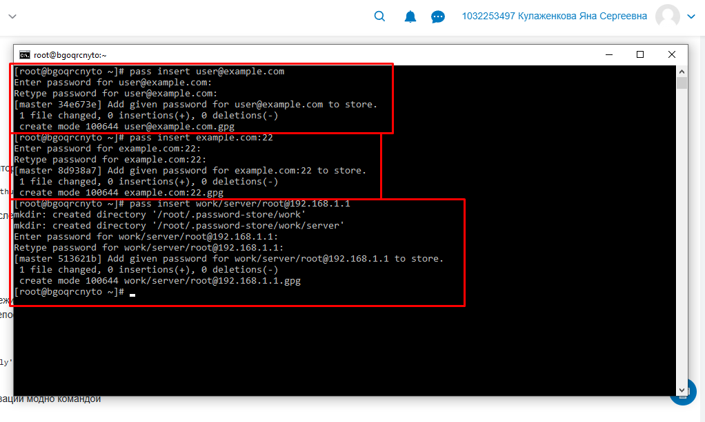
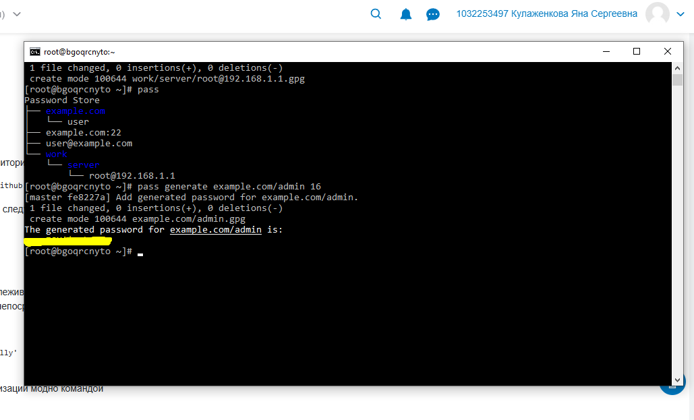
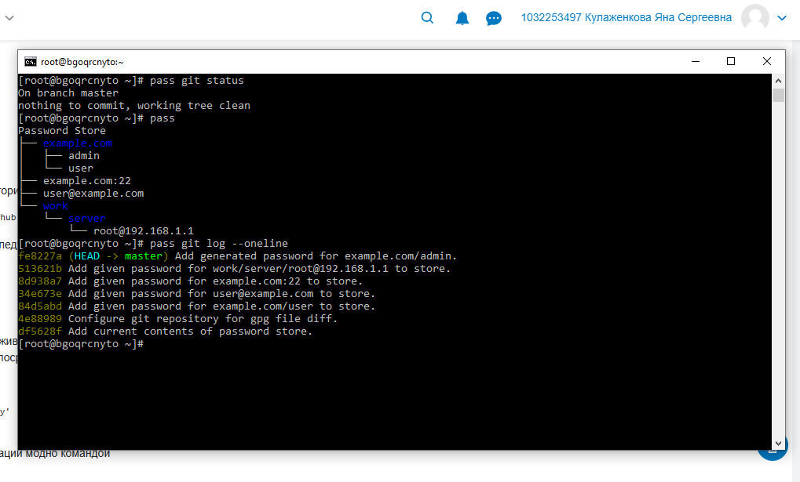
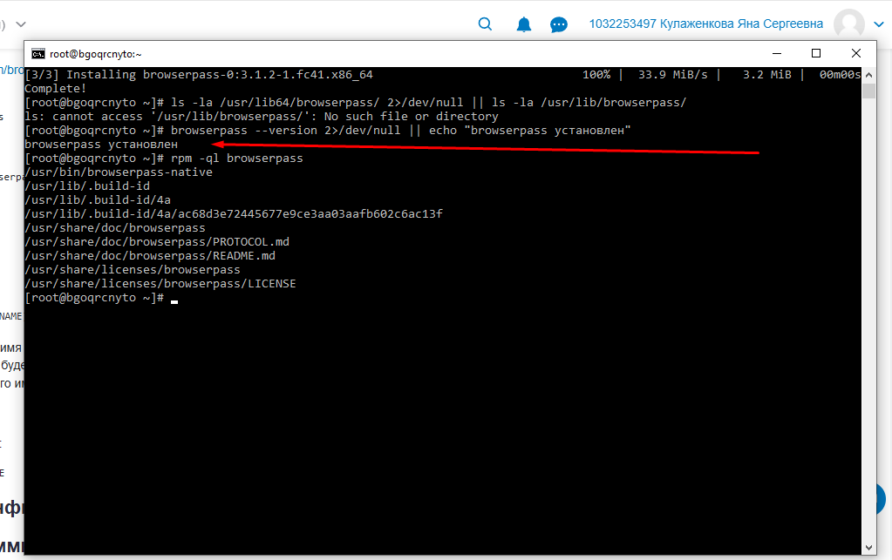
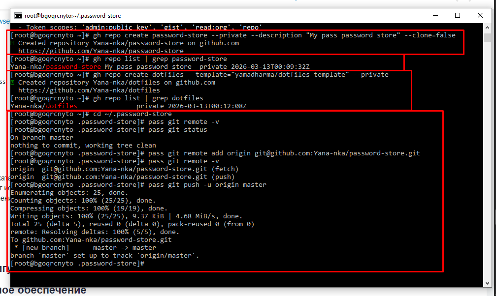
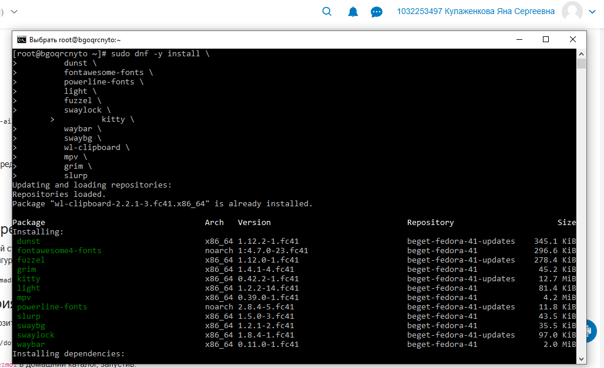
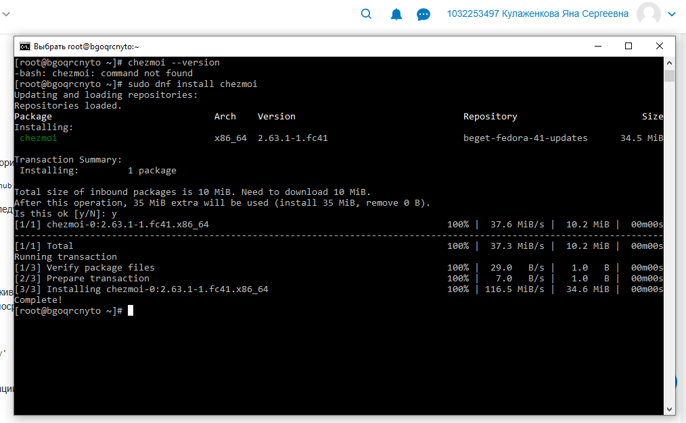
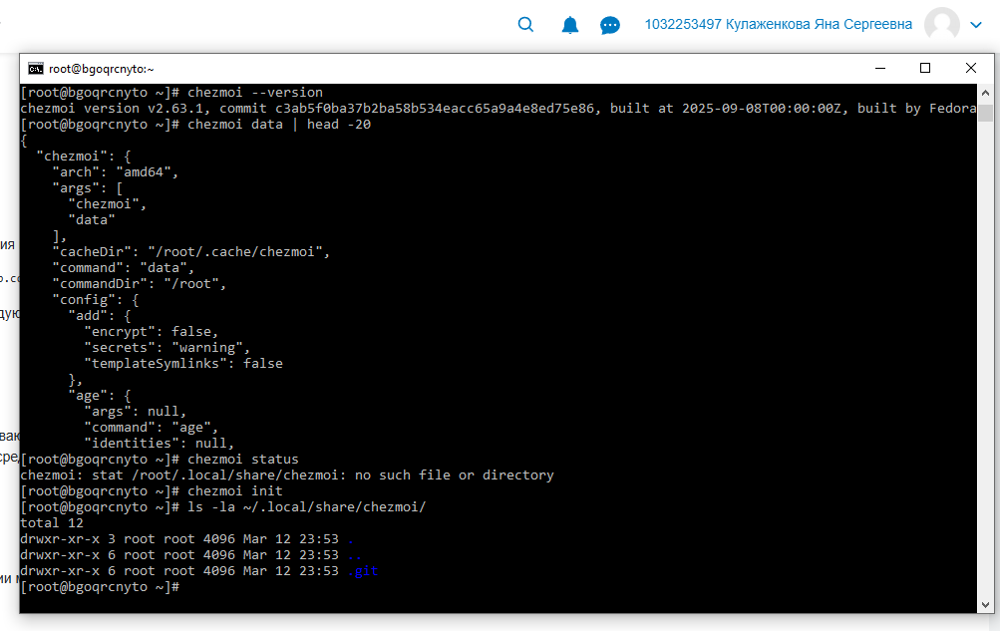

---
author:
  name: Кулаженкова Яна Сергеевна
  email: 1032253497@rudn.ru
  affiliation:
    - name: Российский университет дружбы народов
      city: Москва
      address: ул. Миклухо-Маклая, д. 6
title: "Отчёт по лабораторной работе №5"
subtitle: "Менеджер паролей pass и управление файлами конфигурации с chezmoi в Fedora 41"
license: "CC BY"
---

# Цель работы

Целью данной работы является получение навыков использования менеджера паролей `pass`, а также инструмента `chezmoi` для управления файлами конфигурации (dotfiles) в среде Fedora 41.

# Задание

1.  Установить и настроить менеджер паролей `pass`.
2.  Изучить структуру базы паролей и освоить основные операции с паролями.
3.  Настроить интерфейс для взаимодействия с браузером (`browserpass`).
4.  Создать и настроить удалённый репозиторий для синхронизации базы паролей с GitHub.
5.  Установить и настроить инструмент `chezmoi` для управления файлами конфигурации.
6.  Установить дополнительное программное обеспечение и шрифты для рабочей среды.

# Теоретическое введение

**pass** (The standard Unix password manager) — менеджер паролей, следующий философии Unix. Пароли хранятся в зашифрованном виде с помощью GPG-ключей в иерархии файловой системы, что обеспечивает простоту и гибкость [@pass_site].

**browserpass** — расширение для браузеров, позволяющее интегрировать `pass` для автоматического заполнения форм аутентификации на веб-сайтах. Оно работает через механизм native messaging [@browserpass_repo].

**chezmoi** — инструмент для управления персональными файлами конфигурации (dotfiles) на нескольких машинах. Он позволяет использовать шаблоны для учёта различий между системами и безопасно хранить конфиденциальные данные [@chezmoi_site].

**GitHub CLI (`gh`)** — официальная утилита командной строки для взаимодействия с сервисом GitHub, позволяющая создавать репозитории, управлять релизами и выполнять другие операции без использования веб-интерфейса.

# Выполнение лабораторной работы

## Менеджер паролей pass

### Установка и настройка

Первым этапом работы стала установка менеджера паролей `pass` и дополнительного пакета `pass-otp` для поддержки одноразовых паролей. Установка была выполнена с помощью менеджера пакетов `dnf` (рис. [-@fig:001]).

{#fig:001 width=70%}

Для инициализации хранилища паролей необходим GPG-ключ. Так как ключ уже был создан ранее, хранилище было инициализировано следующей командой. В процессе инициализации была создана структура каталогов для хранения паролей (рис. [-@fig:003]).

{#fig:003 width=70%}

### Основные операции с паролями

Для проверки работы были добавлены несколько записей с различной семантической структурой, как описано в теоретической части (рис. [-@fig:004], [-@fig:005]).

- `example.com/user` — пароль для пользователя `user` на домене `example.com`.
- `user@example.com` — альтернативный формат с указанием пользователя в имени файла.
- `example.com:22` — запись, ассоциированная с конкретным портом (22).
- `work/server/root@192.168.1.1` — более сложная иерархическая структура с вложенными каталогами.

{#fig:004 width=70%}

{#fig:005 width=70%}

После добавления записей была проверена структура хранилища с помощью команды `pass`, которая отобразила иерархию в виде дерева (рис. [-@fig:006]).

{#fig:006 width=70%}

Также был продемонстрирован функционал генерации надёжного пароля с помощью команды `pass generate example.com/admin 16` (рис. [-@fig:006]).

Поскольку `pass` инициализирует Git-репозиторий для отслеживания изменений, была проверена история коммитов командой `pass git log --oneline`, которая показала все выполненные операции добавления записей (рис. [-@fig:007]).

{#fig:007 width=70%}

### Настройка интерфейса с браузером (browserpass)

Для интеграции `pass` с браузером был подключён репозиторий COPR `maximbaz/browserpass` и установлен пакет `browserpass` (рис. [-@fig:010]).

{#fig:010 width=70%}

После установки была проверена структура файлов пакета с помощью команды `rpm -ql browserpass`, которая показала наличие исполняемого файла `browserpass-native`, необходимого для взаимодействия с браузером (рис. [-@fig:011]).

{#fig:011 width=70%}

### Создание удалённого репозитория на GitHub

Для синхронизации базы паролей между машинами был создан приватный репозиторий на GitHub с помощью утилиты GitHub CLI (`gh`). Предварительно была проверена версия утилиты и статус аутентификации (рис. [-@fig:012]).

{#fig:012 width=70%}

С помощью команды `gh repo create` был создан новый репозиторий с именем `password-store` с флагами `--private` (приватный) и `--description` (описание). Далее по аналогии был создан репозиторий `dotfiles` на основе шаблона `yamadharma/dotfiles-template` (рис. [-@fig:013]).

{#fig:013 width=70%}

Затем созданный репозиторий был привязан к локальному хранилищу `pass` в каталоге `~/.password-store` с помощью команд `pass git remote add origin ...` и `pass git push -u origin master`, что позволило выгрузить всю историю изменений в удалённый репозиторий (рис. [-@fig:013]).

## Управление файлами конфигурации с chezmoi

### Установка дополнительного ПО

Прежде чем приступить к настройке `chezmoi`, была выполнена установка ряда дополнительных пакетов, необходимых для рабочего окружения: утилиты для Wayland (`grim`, `slurp`, `swaybg`, `swaylock`, `wl-clipboard`), терминал `kitty`, панель `waybar`, менеджер уведомлений `dunst`, медиаплеер `mpv` и другие (рис. [-@fig:014]).

{#fig:014 width=70%}

### Установка и настройка chezmoi

Инструмент `chezmoi` был установлен из официального репозитория Fedora с помощью `dnf`. После установки была проверена версия и выполнена инициализация, создавшая локальный репозиторий для dotfiles в каталоге `~/.local/share/chezmoi` (рис. [-@fig:008], [-@fig:009]).

{#fig:008 width=70%}

{#fig:009 width=70%}

### Установка шрифтов

Для корректного отображения интерфейса были установлены шрифты семейства Iosevka. Проверка наличия шрифтов в системе была выполнена командой `fc-list | grep -i iosevka` (рис. [-@fig:015]).

{#fig:015 width=70%}

# Выводы

В ходе выполнения лабораторной работы были успешно освоены инструменты для безопасного хранения паролей и управления конфигурациями в среде Fedora 41:

- Установлен и настроен менеджер паролей `pass`, освоены основные операции добавления, просмотра и генерации паролей, изучена семантическая структура базы данных.
- Установлен и настроен `browserpass` для интеграции менеджера паролей с веб-браузером.
- Создан удалённый Git-репозиторий на GitHub с помощью утилиты `gh` и настроена синхронизация локального хранилища паролей.
- Установлен и инициализирован инструмент `chezmoi` для управления dotfiles.
- Установлено дополнительное программное обеспечение и шрифты, необходимые для рабочей среды.

Полученные навыки позволяют организовать надёжное хранение конфиденциальных данных и эффективное управление конфигурациями рабочего окружения на нескольких машинах.

# Список литературы

1.  The standard Unix password manager. URL: https://www.passwordstore.org/
2.  browserpass-native GitHub repository. URL: https://github.com/browserpass/browserpass-native
3.  chezmoi dotfile manager. URL: https://www.chezmoi.io/
4.  GitHub CLI. URL: https://cli.github.com/
