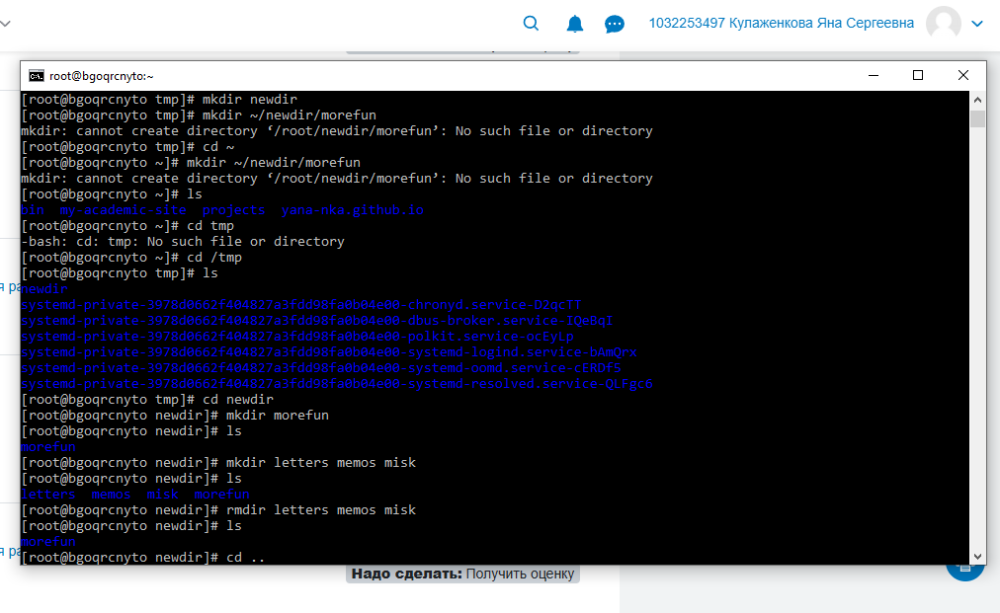
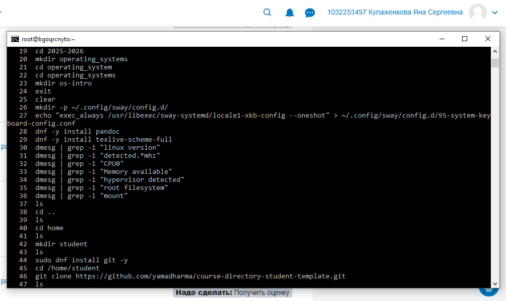

---
## Author
author:
  name: Кулаженкова Яна Сергеевна
  degrees: DSc
  orcid: 0000-0002-0877-7063
  email: kulyabov-ds@rudn.ru
  affiliation:
    - name: Российский университет дружбы народов
      country: Российская Федерация
      postal-code: 117198
      city: Москва
      address: ул. Миклухо-Маклая, д. 6
## Title
title:  Основы интерфейса взаимодействия пользователя с системой Unix на уровне командной строки
subtitle: Лабораторная работа №6
license: CC BY
date: today
date-format: "YYYY-MM-DD"

---

# Вводная часть

## Актуальность

- Командная строка является основным инструментом взаимодействия с Unix-подобными операционными системами
- Понимание принципов работы командной строки необходимо для эффективного администрирования и разработки
- Навыки навигации, управления файлами и каталогами составляют базу для дальнейшего изучения системного администрирования

## Объект и предмет исследования

- **Объект:** Процесс взаимодействия пользователя с операционной системой
- **Предмет:** Командная строка Unix, основные команды навигации и управления файлами

## Цели и задачи

- Приобрести практические навыки взаимодействия с системой через командную строку
- Освоить основные команды навигации: `cd`, `pwd`
- Научиться просматривать содержимое каталогов с различными опциями команды `ls`
- Освоить создание и удаление каталогов с помощью `mkdir`, `rmdir`, `rm`
- Изучить работу со справочной системой `man`
- Освоить работу с историей команд

## Материалы и методы

- **Платформа:** Fedora 41
- **Инструменты:**
  - Командный интерпретатор `bash`
  - Команды: `cd`, `ls`, `pwd`, `mkdir`, `rmdir`, `rm`, `man`, `history`

---

# Ход работы

## Определение полного имени домашнего каталога

- Для определения текущего каталога используется команда `pwd`
- После перехода в домашний каталог выполнен вывод его полного пути

```bash
[root@bgoqrcynto ~]# cd ~
[root@bgoqrcynto ~]# pwd
/root
```

{#fig:001 width=70%}

## Переход в каталог /tmp

- Выполнен переход в каталог `/tmp` командой `cd /tmp`

```bash
[root@bgoqrcynto ~]# cd /tmp
[root@bgoqrcynto tmp]# pwd
/tmp
```

## Просмотр содержимого каталога /tmp

### Команда ls без опций

- Отображает только имена файлов и каталогов

```bash
[root@bgoqrcynto tmp]# ls
systemd-private-3978d0662f404827a3fd98fa0b40e00-chronyd.service-D2qctT
systemd-private-3978d0662f404827a3fd98fa0b40e00-dbus-broker.service-IQeBqi
systemd-private-3978d0662f404827a3fd98fa0b40e00-polkit.service-ocEyLp
systemd-private-3978d0662f404827a3fd98fa0b40e00-systemd-logind.service-bAmQrx
```

{#fig:002 width=70%}

## Опции команды ls

### Опция -l (long format)

- Выводит подробную информацию о каждом файле:
  - тип файла и права доступа
  - число ссылок
  - владелец
  - размер
  - дата последнего изменения

```bash
[root@bgoqrcynto tmp]# ls -l
total 0
drwxr-x---  3 root root 60 Mar 19 21:52 systemd-private-...-chronyd.service-D2qctT
drwxr-x---  3 root root 60 Mar 19 21:52 systemd-private-...-dbus-broker.service-IQeBqi
```

{#fig:003 width=70%}

## Опции команды ls (продолжение)

### Опция -a (all)

- Отображает все файлы, включая скрытые (имена которых начинаются с точки)

```bash
[root@bgoqrcynto tmp]# ls -a
.
..
.font-unix
.ICE-unix
systemd-private-...-chronyd.service-D2qctT
...
```

{#fig:004 width=70%}

## Опции команды ls (продолжение)

### Опция -F (classify)

- Добавляет символ, указывающий тип файла:
  - `/` — каталог
  - `*` — исполняемый файл
  - `@` — символическая ссылка

```bash
[root@bgoqrcynto tmp]# ls -F
systemd-private-...-chronyd.service-D2qctT/
systemd-private-...-dbus-broker.service-IQeBqi/
...
```

{#fig:005 width=70%}

## Комбинированные опции

### Опция -alF

- Комбинация всех опций: все файлы (включая скрытые) в развёрнутом формате с указанием типов

```bash
[root@bgoqrcynto tmp]# ls -alF
total 4
drwxrwxrwt  12 root root   280 Mar 21 19:05 ./
drwxrwxr-x  20 root root  4096 Mar 21 19:53 ../
drwxrwxrwt   2 root root    40 Mar 21 19:52 .font-unix/
drwxrwxrwt   2 root root    40 Mar 21 19:51 .ICE-unix/
drwx------   3 root root    60 Mar 21 19:52 systemd-private-.../
```

{#fig:006 width=70%}

## Поиск подкаталога cron

- Проверка наличия подкаталога `cron` в каталоге `/var/spool`

```bash
[root@bgoqrcynto tmp]# ls /var/spool | grep cron
```

- Подкаталог `cron` отсутствует в системе

{#fig:007 width=70%}

## Содержимое домашнего каталога

- Возврат в домашний каталог и просмотр содержимого

```bash
[root@bgoqrcynto tmp]# cd ~
[root@bgoqrcynto ~]# ls -l
total 28
drwxr-xr-x 15 root root 4096 Mar  9 22:07 yana-nka.github.io
drwxr-xr-x  2 root root 4096 Mar  7 00:27 bin
drwxr-xr-x 10 root root 4096 Mar  5 20:26 my-academic-site
drwxr-xr-x  3 root root 4096 Mar  4 20:58 projects
```

- **Владелец всех файлов и каталогов:** `root`

{#fig:008 width=70%}

---

# Работа с каталогами

## Создание каталога newdir

- В каталоге `/tmp` создан каталог `newdir`

```bash
[root@bgoqrcynto tmp]# mkdir newdir
[root@bgoqrcynto tmp]# cd newdir
```

## Создание подкаталога morefun

- Внутри `newdir` создан подкаталог `morefun`

```bash
[root@bgoqrcynto newdir]# mkdir morefun
[root@bgoqrcynto newdir]# ls
morefun
```

{#fig:009 width=70%}

## Создание нескольких каталогов одной командой

- Созданы три каталога `letters`, `memos`, `mask` одной командой

```bash
[root@bgoqrcynto newdir]# mkdir letters memos mask
[root@bgoqrcynto newdir]# ls
letters  mask  memos  morefun
```

## Удаление нескольких каталогов одной командой

- Удалены созданные каталоги с помощью `rmdir`

```bash
[root@bgoqrcynto newdir]# rmdir letters memos mask
[root@bgoqrcynto newdir]# ls
morefun
```

{#fig:010 width=70%}

## Удаление каталога newdir командой rm

- Попытка удалить каталог без опций завершается ошибкой

```bash
[root@bgoqrcynto tmp]# rm newdir
rm: cannot remove 'newdir': Is a directory
```

- Для удаления каталога необходимо использовать опцию `-r` (рекурсивное удаление)

```bash
[root@bgoqrcynto tmp]# rm -r /tmp/newdir
rm: remove directory '/tmp/newdir'? yes
```

{#fig:011 width=70%}

## Проверка удаления каталога

```bash
[root@bgoqrcynto tmp]# ls
systemd-private-3978d0662f4a4827a3fd098fa0b04e00-chronyd.service-D2qctT
systemd-private-3978d0662f4a4827a3fd098fa0b04e00-dbus-broker.service-IQeBqi
...
```

- Каталог `newdir` успешно удалён

---

# Работа со справочной системой

## Команда man

- Команда `man` используется для просмотра руководств по командам

```bash
[root@bgoqrcynto ~]# man ls
```

### Опция для просмотра подкаталогов

- **`-R` (или `--recursive`)** — рекурсивный просмотр содержимого каталога и всех подкаталогов

{#fig:012 width=70%}

## Опции для сортировки по времени

- **`-lt`** — сортировка по времени последнего изменения в развёрнутом формате
  - `-l` — развёрнутый вывод
  - `-t` — сортировка по времени (от новых к старым)

```bash
[root@bgoqrcynto ~]# ls -lt
total 28
-rw-r--r--  1 root root 9597 Mar 21 19:18 'ls -lt'
drwxr-xr-x 15 root root 4096 Mar  9 22:07 yana-nka.github.io
drwxr-xr-x  2 root root 4096 Mar  7 00:27 bin
drwxr-xr-x 10 root root 4096 Mar  5 20:26 my-academic-site
drwxr-xr-x  3 root root 4096 Mar  4 20:58 projects
```

{#fig:013 width=70%}

## Основные опции изученных команд

| Команда | Основные опции | Назначение |
|---------|----------------|------------|
| `cd` | — | смена текущего каталога |
| `pwd` | — | вывод текущего каталога |
| `mkdir` | `-p`, `-m` | создание каталогов с родительскими, установка прав |
| `rmdir` | — | удаление пустых каталогов |
| `rm` | `-r`, `-f`, `-i` | рекурсивное/принудительное удаление, запрос подтверждения |

---

# Работа с историей команд

## Команда history

- Выводит список ранее выполненных команд

```bash
[root@bgoqrcynto ~]# history
   18  mkdir 2025-2026
   19  cd 2025-2026
   20  mkdir operating_systems
   21  cd operating_systems
   22  cd operating_systems
   23  mkdir os-intro
   24  exit
   25  clear
   26  mkdir -p ~/.config/sway/config.d/
   ...
```

{#fig:014 width=70%}

## Модификация команд из истории

- Формат модификации: `!<номер_команды>:s/<что_меняем>/<на_что_меняем>/`

### Пример

```bash
!3:s/a/F
```

- Заменяет в команде под номером 3 опцию `-a` на `-F`

{#fig:015 width=70%}

---

# Результаты

## Основные результаты работы

- **Освоены основные команды навигации:** `cd`, `pwd`
- **Изучены опции команды `ls`:** `-l`, `-a`, `-F`, `-R`, `-t`
- **Приобретены навыки создания и удаления каталогов:** `mkdir`, `rmdir`, `rm -r`
- **Освоена работа со справочной системой:** `man`
- **Изучена работа с историей команд:** `history`, модификация команд

## Итоговый слайд

- В ходе работы были приобретены фундаментальные навыки работы в командной строке Unix
- Полученные знания являются основой для:
  - Эффективного администрирования систем
  - Работы с Git и системами контроля версий
  - Написания скриптов автоматизации
  - Дальнейшего изучения операционных систем

---

# Список литературы

1. Лабораторная работа №4. Основы интерфейса взаимодействия пользователя с системой Unix на уровне командной строки
2. Linux man pages. URL: https://man7.org/linux/man-pages/
3. GNU Bash Manual. URL: https://www.gnu.org/software/bash/manual/
