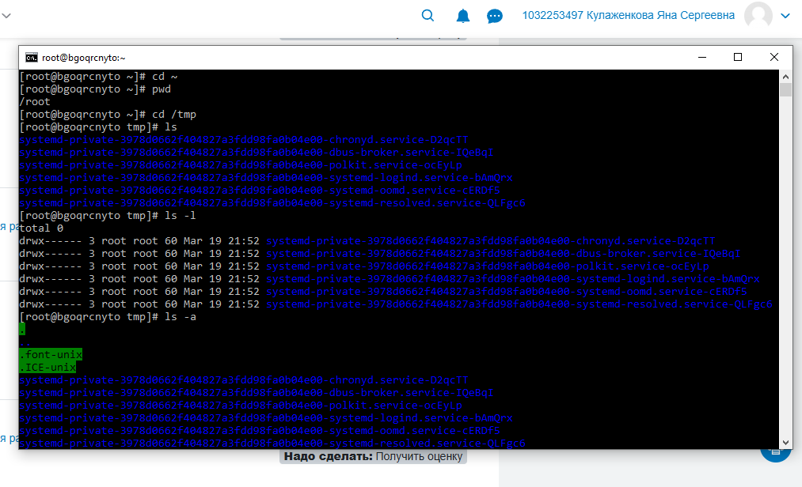
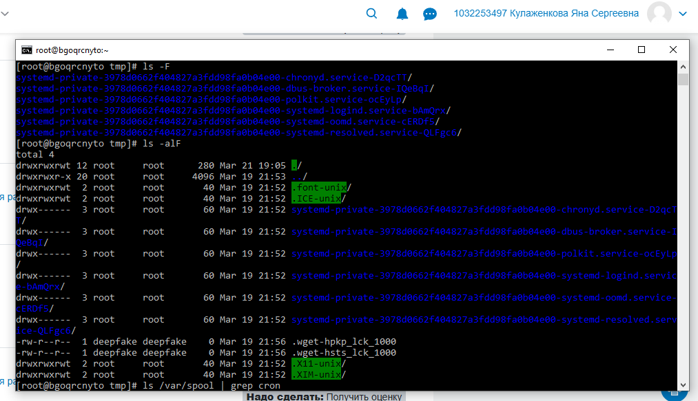
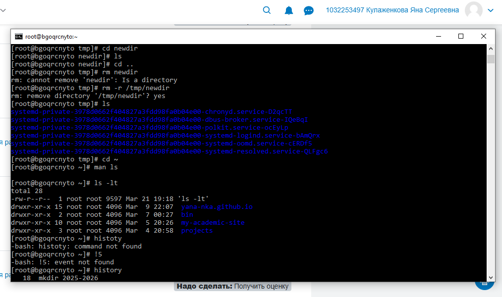

---
author:
  name: Кулаженкова Яна Сергеевна
  email: 1032253497@rudn.ru
  affiliation:
    - name: Российский университет дружбы народов
      city: Москва
      address: ул. Миклухо-Маклая, д. 6
title: "Отчёт по лабораторной работе №6"
subtitle: "Основы интерфейса взаимодействия пользователя с системой Unix на уровне командной строки"
license: "CC BY"
---

# Цель работы

Целью данной работы является приобретение практических навыков взаимодействия пользователя с системой посредством командной строки.

# Задание

1. Определить полное имя домашнего каталога.
2. Выполнить перемещение по файловой системе и просмотр содержимого каталогов с использованием команды `ls` с различными опциями.
3. Создать и удалить каталоги с помощью команд `mkdir` и `rm`/`rmdir`.
4. Изучить справочную информацию о командах с помощью `man`.
5. Освоить работу с историей команд и её модификацию.

# Теоретическое введение

**Командная строка** — это интерфейс взаимодействия пользователя с операционной системой, при котором команды вводятся в текстовом виде построчно.

**Формат команды**: `<имя_команды><разделитель><аргументы>`

**Основные команды:**
- `man` — просмотр руководства по командам;
- `cd` — перемещение по файловой системе;
- `ls` — просмотр содержимого каталога;
- `mkdir` — создание каталогов;
- `rm` — удаление файлов и каталогов;
- `history` — вывод истории выполненных команд.

Файловая система ОС типа Linux представляет собой иерархическую структуру, начинающуюся с корневого каталога `/`. Домашний каталог пользователя обычно находится в `/home/username/`.

# Выполнение лабораторной работы

## Определение полного имени домашнего каталога

Для определения полного имени домашнего каталога была использована команда `pwd` после перехода в домашний каталог:

{#fig:001 width=70%}

Полный путь к домашнему каталогу: `/root`.

## Работа с каталогом /tmp

### Переход в каталог /tmp и просмотр содержимого

Сначала был выполнен переход в каталог `/tmp` с помощью команды `cd /tmp`. Затем было выведено содержимое каталога с помощью команды `ls`:

{#fig:002 width=70%}

### Просмотр с различными опциями

Для более детального просмотра были использованы опции `-l`, `-a`, `-F` и их комбинации:

- **`ls -l`** — вывод в развёрнутом формате (права доступа, число ссылок, владелец, размер, дата изменения):

{#fig:003 width=70%}

- **`ls -a`** — отображение скрытых файлов (имена которых начинаются с точки):

{#fig:004 width=70%}

- **`ls -F`** — отображение с указанием типа файлов (каталоги помечаются символом `/`):

{#fig:005 width=70%}

- **`ls -alF`** — комбинированный вывод: все файлы (включая скрытые) в развёрнутом формате с указанием типов:

{#fig:006 width=70%}

### Проверка наличия подкаталога cron

Для проверки наличия в каталоге `/var/spool` подкаталога `cron` была использована команда `ls /var/spool` с последующим поиском через `grep`:

{#fig:007 width=70%}

В данном случае подкаталог `cron` отсутствует.

### Просмотр содержимого домашнего каталога

После возврата в домашний каталог была выполнена команда `ls -l` для просмотра содержимого с информацией о владельцах:

{#fig:008 width=70%}

Владельцем всех файлов и каталогов является `root`.

## Создание и удаление каталогов

### Создание каталога newdir и подкаталога morefun

В каталоге `/tmp` был создан каталог `newdir`, а внутри него — подкаталог `morefun`:

{#fig:009 width=70%}

### Создание и удаление нескольких каталогов одной командой

В каталоге `newdir` были созданы три каталога `letters`, `memos`, `mask` одной командой `mkdir`, а затем удалены одной командой `rmdir`:

{#fig:010 width=70%}

### Удаление каталога newdir

Попытка удалить каталог `newdir` командой `rm` без опций завершилась ошибкой, так как `rm` по умолчанию не удаляет каталоги. Для удаления каталога была использована команда `rm -r /tmp/newdir`:

{#fig:011 width=70%}

### Удаление подкаталога morefun из домашнего каталога

Каталог `morefun` был удалён с помощью команды `rmdir` (так как он был пуст):

{#fig:012 width=70%}

## Работа со справочной системой man

### Поиск опции ls для просмотра подкаталогов

С помощью команды `man ls` была найдена опция `-R` (или `--recursive`), которая позволяет рекурсивно выводить содержимое каталога и всех его подкаталогов:

{#fig:013 width=70%}

### Поиск опции ls для сортировки по времени

Для сортировки содержимого по времени последнего изменения в развёрнутом формате используются опции `-lt`. Опция `-l` обеспечивает развёрнутый вывод, а `-t` сортирует по времени изменения (от новых к старым):

{#fig:014 width=70%}

### Изучение основных опций команд

Были изучены основные опции команд с помощью `man`:

| Команда | Основные опции | Назначение |
|---------|----------------|------------|
| `cd` | без опций | изменение текущего каталога |
| `pwd` | без опций | вывод абсолютного пути текущего каталога |
| `mkdir` | `-p`, `-m` | создание каталогов с родительскими, установка прав доступа |
| `rmdir` | без опций | удаление пустых каталогов |
| `rm` | `-r`, `-f`, `-i` | рекурсивное удаление, принудительное удаление, запрос подтверждения |

## Работа с историей команд

### Вывод истории команд

С помощью команды `history` был выведен список ранее выполненных команд:

{#fig:015 width=70%}

### Модификация и выполнение команд из истории

Для модифицированного выполнения команд используется конструкция `!<номер_команды>:s/<что_меняем>/<на_что_меняем>/`. Например, команда `!3:s/a/F` заменит в команде под номером 3 опцию `-a` на `-F`.

В ходе работы были выполнены команды из истории:

{#fig:016 width=70%}

# Выводы

В ходе выполнения лабораторной работы были приобретены практические навыки взаимодействия с системой через командную строку:

- Освоены основные команды навигации (`cd`, `pwd`) и просмотра содержимого (`ls` с различными опциями).
- Изучены различия между опциями `-l`, `-a`, `-F` и их комбинациями.
- Приобретены навыки создания (`mkdir`) и удаления (`rm`, `rmdir`) каталогов.
- Освоена работа со справочной системой `man` для получения информации о командах.
- Изучена работа с историей команд и возможность её модификации.

Полученные навыки являются фундаментальными для эффективной работы в операционных системах семейства Linux.

# Список литературы

1. Лабораторная работа №4. Основы интерфейса взаимодействия пользователя с системой Unix на уровне командной строки.
2. Linux man pages. URL: https://man7.org/linux/man-pages/
