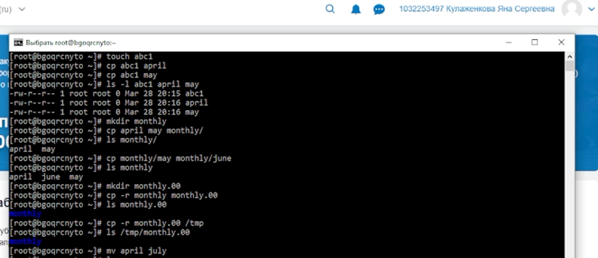
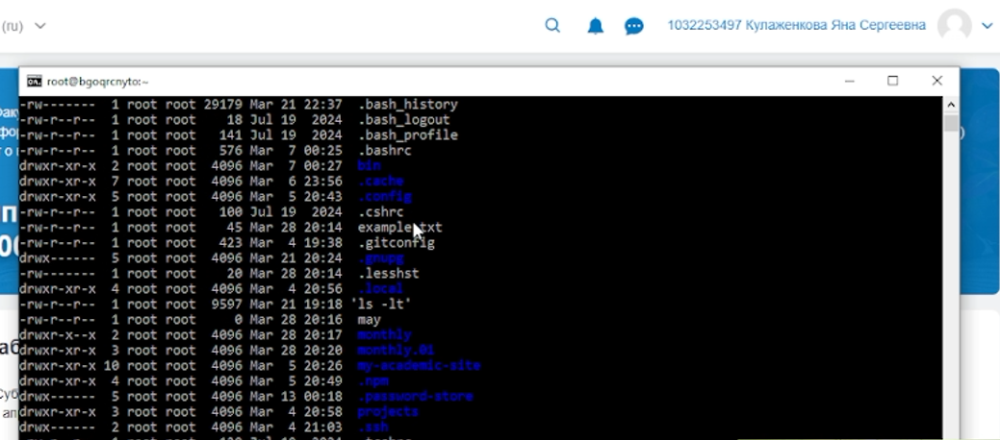

---
## Author
author:
  name: Кулаженкова Яна Сергеевна
  degrees: DSc
  orcid: 0000-0002-0877-7063
  email: kulyabov-ds@rudn.ru
  affiliation:
    - name: Российский университет дружбы народов
      country: Российская Федерация
      postal-code: 117198
      city: Москва
      address: ул. Миклухо-Маклая, д. 6
## Title
title: "Основы интерфейса взаимодействия пользователя с системой Unix на уровне командной строки"
subtitle: Лабораторная работа №7
license: CC BY
date: today
date-format: "YYYY-MM-DD"

---

# Вводная часть

## Актуальность

- Командная строка является основным инструментом администрирования и разработки в Unix-подобных системах
- Понимание принципов работы с файловой системой и правами доступа критически важно для безопасной работы
- Навыки работы с командами `cp`, `mv`, `chmod` необходимы для эффективного управления файлами и каталогами
- Знание команд анализа файловой системы (`mount`, `df`, `fsck`) позволяет диагностировать и решать проблемы с дисками

## Объект и предмет исследования

- **Объект:** Процесс взаимодействия пользователя с операционной системой Unix через командную строку
- **Предмет:** Команды для работы с файлами и каталогами (`touch`, `cat`, `less`, `cp`, `mv`), механизм прав доступа (`chmod`), инструменты анализа файловой системы (`mount`, `df`, `fsck`)

## Цели и задачи

- Освоить базовые команды для работы с файлами и каталогами в Linux
- Изучить механизм прав доступа к файлам и каталогам
- Научиться изменять права доступа с помощью команды `chmod`
- Освоить операции копирования, перемещения и переименования файлов и каталогов
- Изучить команды для анализа файловой системы и управления процессами

## Материалы и методы

- **Платформа:** WSL2 с дистрибутивом Fedora 41 (или аналогичная Unix-среда)
- **Инструменты:**
    - Команды работы с файлами: `touch`, `cat`, `less`, `head`, `tail`
    - Команды управления файлами: `cp`, `mv`
    - Команда управления правами доступа: `chmod`
    - Команды анализа файловой системы: `mount`, `df`, `fsck`
    - Команда управления процессами: `kill`

# Ход работы

## Базовые команды для работы с файлами

### Создание и копирование файлов

- Команда `touch` используется для создания пустых файлов
- Команда `cp` выполняет копирование файлов
- Создан файл `abcl`, затем скопирован в файлы `april` и `may`
- Создан каталог `monthly`, в него скопированы файлы `april` и `may`
- Внутри каталога `monthly` создана копия файла `may` с именем `june`

{#fig:001 width=70%}

## Работа с каталогами

### Копирование каталогов

- Создан каталог `monthly.00`
- Рекурсивное копирование каталога `monthly` в `monthly.00` выполнено с опцией `-r`
- Каталог `monthly.00` скопирован в `/tmp`

```bash
mkdir monthly.00
cp -r monthly monthly.00
cp -r monthly.00 /tmp
```

## Перемещение и переименование файлов

### Команда `mv`

- Файл `april` переименован в `july`
- Файл `july` перемещён в каталог `monthly.00`
- Каталог `monthly.00` переименован в `monthly.01`
- Проверка показала, что исходный файл `july` отсутствует в домашнем каталоге

{#fig:002 width=70%}

## Управление правами доступа

### Команда `chmod`

- Для файла `may` добавлено право на выполнение для владельца: `chmod u+x may`
- Права файла изменились с `-rw-r--r--` на `-rwxr--r--`
- Изменение прав подтверждено командой `ls -l`

```bash
-rw-r--r-- 1 root root 0 Mar 28 20:16 may
chmod u+x may
-rwxr--r-- 1 root root 0 Mar 28 20:16 may
```

## Копирование системных файлов

### Работа с каталогом `/usr/include/sys/`

- Проверено наличие файла `io.h` в каталоге `/usr/include/sys/`
- Файл успешно скопирован в домашний каталог с именем `equipment`

```bash
ls /usr/include/sys/io.h
cp /usr/include/sys/io.h ~/equipment
```

{#fig:003 width=70%}

## Структура домашнего каталога

### Просмотр содержимого

- Командой `ls` просмотрено содержимое домашнего каталога
- Отображены файлы и каталоги, включая созданные в ходе работы: `abc1`, `may`, `monthly`, `monthly.01`, `example.txt`
- Также присутствуют каталоги, созданные ранее: `my_second_csite`, `postgres-stats`, `stats`

{#fig:004 width=70%}

## Анализ файловой системы

### Команды `mount`, `df`, `fsck`

- `mount` — просмотр смонтированных файловых систем
- `df` — отображение свободного пространства на дисках
- `fsck` — проверка и восстановление целостности файловой системы

```bash
# Просмотр смонтированных ФС
mount

# Просмотр свободного места
df -h

# Проверка ФС (требует прав суперпользователя)
sudo fsck /dev/sda1
```

## Управление процессами

### Команда `kill`

- `kill` — отправка сигналов процессам
- По умолчанию отправляется сигнал `SIGTERM` (завершение)
- Сигнал `SIGKILL` (`-9`) используется для принудительного завершения

```bash
# Завершение процесса по PID
kill 1234

# Принудительное завершение
kill -9 1234

# Завершение всех процессов с именем
killall firefox
```

# Результаты

## Основные результаты работы

- **Освоены базовые команды:** `touch`, `cat`, `less`, `head`, `tail` для работы с файлами
- **Управление файлами:** Освоены операции копирования (`cp`), перемещения и переименования (`mv`) с использованием различных опций
- **Права доступа:** Изучен механизм прав доступа (`r`, `w`, `x`) для владельца, группы и остальных пользователей; освоена команда `chmod` для изменения прав
- **Анализ файловой системы:** Изучены команды `mount`, `df`, `fsck` для диагностики и обслуживания файловых систем
- **Управление процессами:** Освоена команда `kill` для управления процессами

## Итоговый слайд

- В ходе работы были освоены основные команды интерфейса командной строки Unix, необходимые для эффективного управления файлами и каталогами
- Создана структура каталогов, выполнены операции копирования, перемещения и переименования файлов
- Приобретены навыки изменения прав доступа к файлам и каталогам
- Изучены инструменты анализа файловой системы и управления процессами
- Полученные навыки являются фундаментом для дальнейшего изучения администрирования Unix-систем и разработки программного обеспечения в среде Linux

# Список литературы

1. Кулябов Д. С. и др. Операционные системы. Лабораторная работа №5. Анализ файловой системы Linux. Команды для работы с файлами и каталогами.
2. The Linux Command Line. URL: https://linuxcommand.org/
3. man-страницы команд: `touch`, `cp`, `mv`, `chmod`, `mount`, `df`, `fsck`, `kill`
