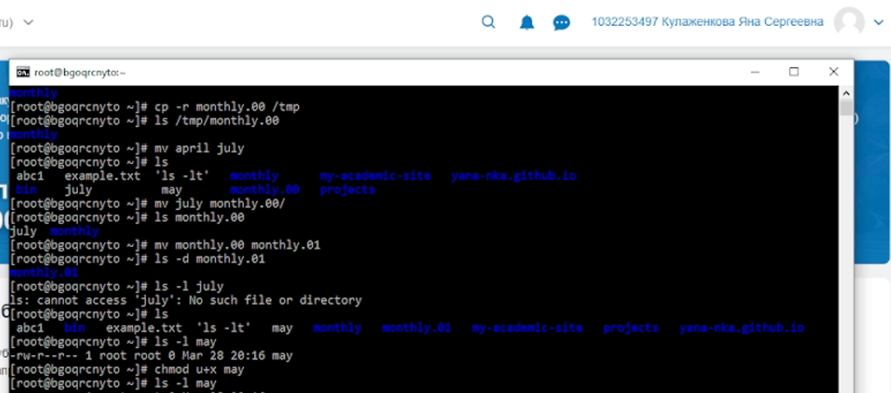
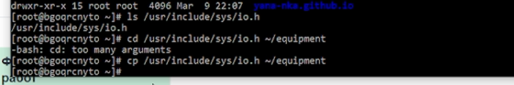

---
author:
  name: Кулаженкова Яна Сергеевна
  email: 1032253497@rudn.ru
  affiliation:
    - name: Российский университет дружбы народов
      city: Москва
      address: ул. Миклухо-Маклая, д. 6
title: "Отчёт по лабораторной работе №7"
subtitle: "Анализ файловой системы Linux. Команды для работы с файлами и каталогами"
license: "CC BY"
---

# Цель работы

Целью данной работы является ознакомление с файловой системой Linux, её структурой, именами и содержимым каталогов, а также приобретение практических навыков по применению команд для работы с файлами и каталогами, управлению процессами, проверке использования диска и обслуживанию файловой системы.

# Задание

1. Ознакомиться с командами для работы с файлами и каталогами: `touch`, `cat`, `less`, `head`, `tail`.
2. Изучить команды копирования (`cp`), перемещения и переименования (`mv`) файлов и каталогов.
3. Освоить механизм прав доступа к файлам и каталогам, научиться изменять права с помощью команды `chmod`.
4. Выполнить практические упражнения по работе с файлами и каталогами.
5. Изучить команды для анализа файловой системы: `mount`, `df`, `fsck`, а также команду `kill` для управления процессами.

# Теоретическое введение

## Команды для работы с файлами и каталогами

Для создания текстового файла используется команда `touch`. Для просмотра содержимого файлов применяются:
- `cat` — для файлов небольшого размера;
- `less` — для постраничного просмотра;
- `head` — для вывода первых строк (по умолчанию 10);
- `tail` — для вывода последних строк (по умолчанию 10).

## Копирование файлов и каталогов

Команда `cp` используется для копирования файлов и каталогов. Основные опции:
- `-i` — запрос подтверждения о перезаписи файла;
- `-r` — рекурсивное копирование каталогов.

## Перемещение и переименование

Команда `mv` используется для перемещения и переименования файлов и каталогов. Опция `-i` позволяет запросить подтверждение при перезаписи.

## Права доступа

Каждый файл или каталог имеет права доступа, которые определяют возможности чтения (`r`), записи (`w`) и выполнения (`x`) для трёх категорий пользователей: владельца (`u`), группы (`g`) и остальных (`o`). Изменение прав выполняется командой `chmod` с символьной или восьмеричной записью режима.

## Анализ файловой системы

Для просмотра смонтированных файловых систем используется команда `mount` без параметров. Файл `/etc/fstab` содержит информацию о точках монтирования. Команда `df` показывает свободное пространство на дисках, а `fsck` используется для проверки и восстановления целостности файловой системы.

# Выполнение лабораторной работы

## Команды для работы с файлами и каталогами

### Примеры с `touch`, `cp`, `mv`

Первым этапом работы было выполнение примеров, приведённых в описании лабораторной работы. Был создан файл `abcl` с помощью команды `touch`, затем выполнено его копирование в файлы `april` и `may`. После создания каталога `monthly` в него были скопированы файлы `april` и `may`, а затем создана копия файла `may` с именем `june` внутри того же каталога.

Далее был создан каталог `monthly.00`, в который рекурсивно скопировано содержимое каталога `monthly`, после чего каталог `monthly.00` был скопирован в `/tmp`.

{#fig:002 width=70%}

### Перемещение и переименование файлов и каталогов

После выполнения операций копирования был продемонстрирован функционал команды `mv`. Файл `april` был переименован в `july`, затем файл `july` перемещён в каталог `monthly.00`. Каталог `monthly.00` был переименован в `monthly.01`. Также была выполнена проверка, что исходный файл `july` больше не находится в домашнем каталоге.

{#fig:003 width=70%}

### Изменение прав доступа

Для демонстрации изменения прав доступа был создан файл `may`. Командой `chmod u+x may` владельцу файла было добавлено право на выполнение. После выполнения команды права файла изменились с `-rw-r--r--` на `-rwxr--r--`, что было подтверждено командой `ls -l`.

{#fig:004 width=70%}

## Выполнение практических заданий

### Задание 2. Работа с файлами и каталогами

#### 2.1. Копирование файла из `/usr/include/sys/` в домашний каталог

Для выполнения задания была проверена доступность файла `io.h` в каталоге `/usr/include/sys/`. Файл присутствовал, поэтому командой `cp /usr/include/sys/io.h ~/equipment` он был скопирован в домашний каталог с именем `equipment`.

{#fig:005 width=70%}

#### 2.2. Создание директории `~/ski.plases`

Командой `mkdir ~/ski.plases` был создан каталог `ski.plases` в домашнем каталоге.

#### 2.3. Перемещение файла `equipment` в каталог `~/ski.plases`

Файл `equipment` был перемещён в созданный каталог командой `mv ~/equipment ~/ski.plases/`.

#### 2.4. Переименование файла в `equiplist`

Внутри каталога `~/ski.plases` файл `equipment` был переименован в `equiplist` командой `mv ~/ski.plases/equipment ~/ski.plases/equiplist`.

#### 2.5. Создание файла `abc1` и копирование с переименованием

Командой `touch ~/abc1` был создан файл `abc1` в домашнем каталоге, затем он был скопирован в каталог `~/ski.plases` с именем `equiplist2` командой `cp ~/abc1 ~/ski.plases/equiplist2`.

#### 2.6. Создание каталога `equipment` в `~/ski.plases`

Внутри каталога `~/ski.plases` командой `mkdir` был создан подкаталог `equipment`.

#### 2.7. Перемещение файлов в каталог `equipment`

Файлы `equiplist` и `equiplist2` были перемещены в созданный подкаталог `equipment` командой `mv ~/ski.plases/equiplist ~/ski.plases/equiplist2 ~/ski.plases/equipment/`.

#### 2.8. Создание и перемещение каталога с переименованием

Командой `mkdir ~/newdir` был создан каталог `newdir` в домашнем каталоге, затем он был перемещён в каталог `~/ski.plases` и переименован в `plans` командой `mv ~/newdir ~/ski.plases/plans`.

### Задание 3. Определение опций `chmod`

Для задания прав доступа к файлам и каталогам были определены необходимые команды `chmod`:

1. Для каталога `australia` с правами `drwxr--r--`:
   ```bash
   mkdir australia
   chmod u=rwx,g=r,o=r australia
   ```

2. Для каталога `play` с правами `drwx--x--x`:
   ```bash
   mkdir play
   chmod u=rwx,g=x,o=x play
   ```

3. Для файла `my_os` с правами `-r-xr--r--`:
   ```bash
   touch my_os
   chmod u=rx,g=r,o=r my_os
   ```

4. Для файла `feathers` с правами `-rw-rw-r--`:
   ```bash
   touch feathers
   chmod u=rw,g=rw,o=r feathers
   ```

### Задание 4. Выполнение упражнений

#### 4.1. Просмотр содержимого `/etc/passwd`

Командой `cat /etc/passwd` было просмотрено содержимое файла, содержащего информацию о пользователях системы.

#### 4.2. Копирование `~/feathers` в `~/file.old`

Выполнена команда `cp ~/feathers ~/file.old`.

#### 4.3. Перемещение `~/file.old` в `~/play`

Выполнена команда `mv ~/file.old ~/play/`.

#### 4.4. Копирование каталога `~/play` в `~/fun`

Выполнена команда `cp -r ~/play ~/fun`.

#### 4.5. Перемещение `~/fun` в `~/play` с переименованием в `games`

Выполнена команда `mv ~/fun ~/play/games`.

#### 4.6. Лишение владельца права на чтение файла `~/feathers`

Выполнена команда `chmod u-r ~/feathers`. После этого права файла стали `--w-rw-r--`.

#### 4.7. Попытка просмотра файла `~/feathers` командой `cat`

При попытке выполнить `cat ~/feathers` система выдала сообщение об отказе в доступе: `Permission denied`, так как владелец не имеет права на чтение.

#### 4.8. Попытка копирования файла `~/feathers`

При попытке выполнить `cp ~/feathers ~/test_copy` также возникла ошибка `Permission denied`, поскольку для чтения исходного файла необходимо право на чтение.

#### 4.9. Восстановление права на чтение

Выполнена команда `chmod u+r ~/feathers`, после чего права файла вернулись к исходным `-rw-rw-r--`.

#### 4.10. Лишение владельца права на выполнение каталога `~/play`

Выполнена команда `chmod u-x ~/play`.

#### 4.11. Попытка перехода в каталог `~/play`

При попытке выполнить `cd ~/play` произошла ошибка `Permission denied`, так как для входа в каталог необходимо право на выполнение (`x`).

#### 4.12. Восстановление права на выполнение

Выполнена команда `chmod u+x ~/play`, после чего переход в каталог стал возможен.

### Задание 5. Изучение команд `mount`, `fsck`, `mkfs`, `kill`

#### Команда `mount`

**Назначение**: монтирование файловых систем.

**Пример использования**:
```bash
# Просмотр всех смонтированных файловых систем
mount

# Монтирование устройства /dev/sdb1 в точку /mnt/data
sudo mount /dev/sdb1 /mnt/data
```

#### Команда `fsck`

**Назначение**: проверка и восстановление целостности файловой системы.

**Пример использования**:
```bash
# Проверка файловой системы на устройстве /dev/sda1
sudo fsck /dev/sda1

# Автоматическое исправление ошибок
sudo fsck -y /dev/sda1
```

#### Команда `mkfs`

**Назначение**: создание файловой системы на устройстве.

**Пример использования**:
```bash
# Создание файловой системы ext4 на /dev/sdb1
sudo mkfs.ext4 /dev/sdb1

# Создание файловой системы FAT32
sudo mkfs.vfat /dev/sdc1
```

#### Команда `kill`

**Назначение**: отправка сигналов процессам (по умолчанию — завершение процесса).

**Пример использования**:
```bash
# Завершение процесса с PID 1234
kill 1234

# Принудительное завершение процесса
kill -9 1234

# Завершение всех процессов с указанным именем
killall firefox
```

# Выводы

В ходе выполнения лабораторной работы были успешно освоены основные команды для работы с файлами и каталогами в операционной системе Linux:

- Получены навыки создания файлов (`touch`), просмотра содержимого (`cat`, `less`, `head`, `tail`).
- Освоены операции копирования (`cp`) с использованием опций `-i` и `-r`, а также перемещения и переименования (`mv`).
- Изучена система прав доступа к файлам и каталогам, приобретены навыки изменения прав с помощью команды `chmod` как в символьном, так и в восьмеричном формате.
- Выполнены практические упражнения, демонстрирующие работу с файлами и каталогами в различных сценариях.
- Изучены команды для анализа файловой системы (`mount`, `df`, `fsck`) и управления процессами (`kill`).

Полученные навыки являются фундаментальными для работы в среде Linux и необходимы для дальнейшего изучения операционной системы и администрирования.

# Список литературы

1. Кулябов Д. С. и др. Операционные системы. Лабораторная работа №5. Анализ файловой системы Linux. Команды для работы с файлами и каталогами.
2. The Linux Command Line. URL: https://linuxcommand.org/
3. man-страницы команд: `touch`, `cp`, `mv`, `chmod`, `mount`, `fsck`, `mkfs`, `kill`
