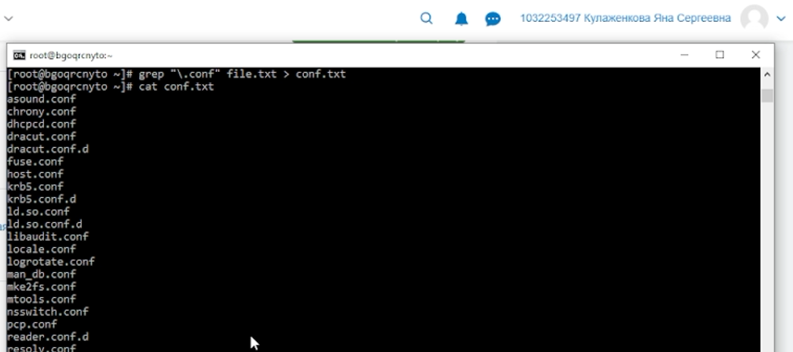
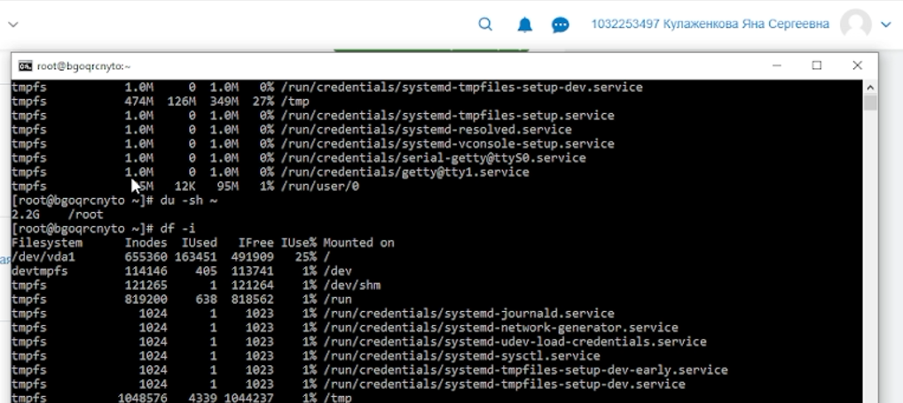

---
## Author
author:
  name: Кулаженкова Яна Сергеевна
  degrees: DSc
  orcid: 0000-0002-0877-7063
  email: 1032253497@rudn.ru
  affiliation:
    - name: Российский университет дружбы народов
      country: Российская Федерация
      postal-code: 117198
      city: Москва
      address: ул. Миклухо-Маклая, д. 6
## Title
title: Поиск файлов. Перенаправление ввода-вывода. Просмотр запущенных процессов
subtitle: Лабораторная работа №8
license: CC BY
date: today
date-format: "YYYY-MM-DD"
---

# Вводная часть

## Актуальность
- В работе с командной строкой Linux часто возникает необходимость поиска файлов по различным критериям
- Перенаправление потоков ввода-вывода позволяет эффективно обрабатывать и сохранять результаты работы команд
- Управление процессами и задачами необходимо для организации многозадачности в консольной среде
- Мониторинг использования дискового пространства помогает своевременно выявлять проблемы с переполнением

## Объект и предмет исследования

- **Объект:** Процесс работы с файловой системой и процессами в операционной системе Linux
- **Предмет:** Инструменты поиска файлов (`find`, `grep`), механизмы перенаправления ввода-вывода (`>`, `>>`, `|`), команды управления процессами (`ps`, `jobs`, `kill`) и мониторинга диска (`df`, `du`)

## Цели и задачи

- Освоить перенаправление стандартных потоков ввода-вывода (stdin, stdout, stderr)
- Научиться использовать конвейеры (`|`) для объединения команд
- Освоить команду `find` для поиска файлов по различным критериям
- Научиться фильтровать текстовые данные с помощью `grep`
- Получить навыки управления фоновыми процессами и задачами (`&`, `jobs`, `kill`)
- Освоить команды `df` и `du` для проверки использования диска

## Материалы и методы

- **Платформа:** ОС Linux (Fedora 41) в среде виртуальной машины или на физическом хосте
- **Инструменты:**
    - Командная оболочка: `bash`
    - Поиск файлов: `find`, `grep`
    - Управление процессами: `ps`, `jobs`, `kill`, `&`
    - Мониторинг диска: `df`, `du`
    - Справочная система: `man`

# Ход работы

## Шаг 1. Создание файла file.txt со списками файлов

- Выполнена запись списка файлов каталога `/etc` в файл `file.txt` с помощью `ls /etc > file.txt`
- Командой `ls >> file.txt` в этот же файл дописан список файлов домашнего каталога
- Содержимое проверено командой `cat file.txt`

{#fig:001 width=70%}

## Шаг 2. Поиск файлов с расширением .conf

- С помощью команды `grep` выполнена фильтрация строк, содержащих шаблон `".conf"`
- Вывод сначала направлен на экран, затем — в файл `conf.txt`

```bash
grep "\.conf" file.txt
grep "\.conf" file.txt > conf.txt
```

{#fig:002 width=70%}

{#fig:003 width=70%}

## Шаг 3. Поиск файлов, начинающихся с c

- Предложено несколько вариантов поиска файлов в домашнем каталоге, имена которых начинаются с символа `c`
- Вариант 1: `find ~ -name "c*" -print`
- Вариант 2: `ls ~ | grep "^c"`

{#fig:004 width=70%}

## Шаг 4. Постраничный вывод файлов, начинающихся с h

- Для вывода имён файлов из каталога `/etc`, начинающихся с `h`, использована команда:
```bash
ls /etc | grep "^h" | less
```
- `less` обеспечивает постраничный просмотр (выход — клавиша `q`)

{#fig:005 width=70%}

## Шаг 5. Запуск фонового процесса

- Запущен фоновый процесс для поиска файлов, начинающихся с `log`, с записью в `~/logfile`:
```bash
find / -name "log*" -print > ~/logfile 2>/dev/null &
```
- Сообщения об ошибках перенаправлены в `/dev/null`
- Система присвоила процессу идентификатор задачи `[1]` и PID `93823`
- Команда `jobs` подтвердила выполнение задачи

## Шаг 6. Удаление файла и попытка запуска gedit

- Файл `~/logfile` удалён командой `rm ~/logfile` с подтверждением
- Выполнена попытка запуска `gedit &`, завершившаяся ошибкой `command not found` (редактор не установлен)
- Команда `ps aux | grep gedit` нашла только процесс `grep`

{#fig:006 width=70%}

## Шаг 7. Выполнение команды df

- Изучена справка `man df`
- Выполнена команда `df -i` для просмотра использования inode на всех смонтированных разделах

```bash
[root@bgoqrcnyto ~]# df -i
Filesystem    Inodes  Used  IFree  IUse%  Mounted on
/dev/vda1    655360  163451 491909  25%   /
devtmpfs     114146  405    113741  1%    /dev
tmpfs        121265  1      121264  1%    /dev/shm
```

{#fig:007 width=70%}

## Шаг 8. Выполнение команды du и поиск директорий

- Изучена справка `man du`
- Команда `du -sh ~` позволяет определить общий размер домашнего каталога
- Для вывода всех директорий в домашнем каталоге используется:
```bash
find ~ -type d | less
```
- Опция `-type d` ограничивает поиск только каталогами

## Управление процессами (теоретическая часть)

- **Просмотр процессов:** `ps aux` — список всех процессов с подробной информацией
- **Запуск в фоновом режиме:** добавление символа `&` в конце команды
- **Управление задачами:** `jobs` — список фоновых задач, `kill %номер` — завершение задачи
- **Завершение процесса по PID:** `kill <PID>` (SIGTERM) или `kill -9 <PID>` (SIGKILL)
- **Альтернативные способы определения PID:** `pgrep gedit`, `pidof gedit`

# Результаты

## Основные результаты работы

- **Перенаправление потоков:** Освоены операторы `>` (перезапись) и `>>` (добавление) для перенаправления stdout, а также `2>` для stderr
- **Конвейеры:** На практике применён символ `|` для передачи вывода одной команды на ввод другой
- **Поиск файлов:** Освоена команда `find` с опциями `-name`, `-type`, `-exec`
- **Фильтрация текста:** Изучена работа `grep` для поиска строк по шаблону с использованием регулярных выражений
- **Управление процессами:** Получены навыки запуска фоновых процессов (`&`), просмотра задач (`jobs`) и завершения процессов (`kill`)
- **Мониторинг диска:** Освоены команды `df` (свободное место на разделах) и `du` (размер каталогов)

## Итоговый слайд

- В ходе работы были успешно освоены ключевые инструменты командной строки Linux для поиска файлов, фильтрации текста, перенаправления ввода-вывода и управления процессами
- Продемонстрирована работа с потоками stdout, stderr и их перенаправлением в файлы
- На практике применены конвейеры для объединения нескольких команд в цепочки
- Полученные навыки являются основой для автоматизации рутинных операций в консоли и эффективной работы с файловой системой
- Инструменты `find`, `grep`, `ps`, `kill`, `df`, `du` входят в стандартный набор любого системного администратора и разработчика.
