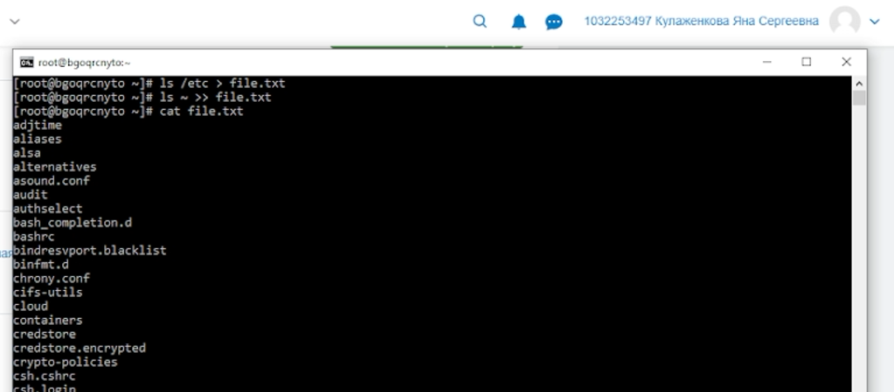
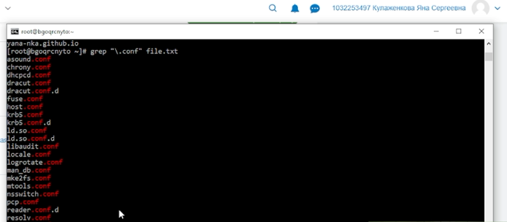
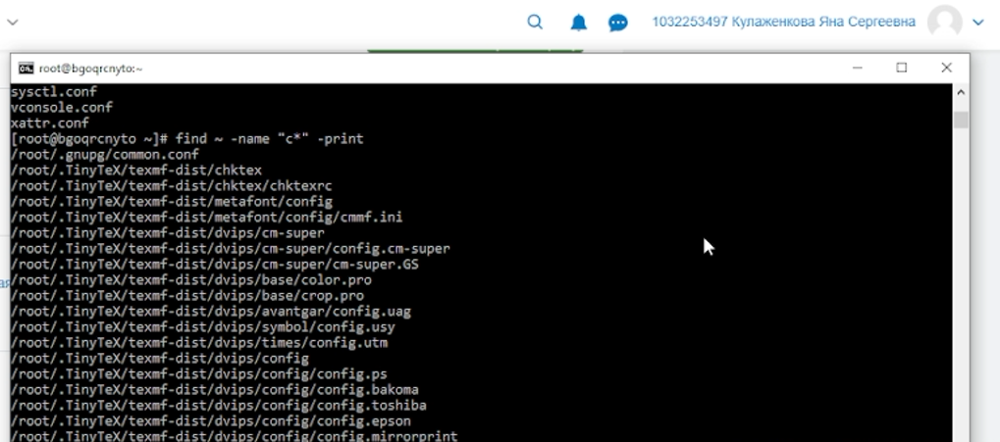
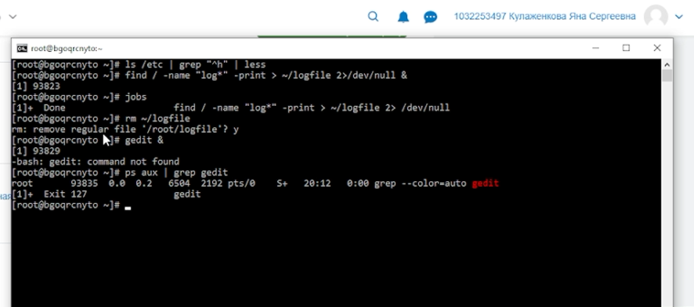

---
author:
  name: Кулаженкова Яна Сергеевна
  email: 1032253497@rudn.ru
  affiliation:
    - name: Российский университет дружбы народов
      city: Москва
      address: ул. Миклухо-Маклая, д. 6
title: "Отчёт по лабораторной работе №8"
subtitle: "Поиск файлов. Перенаправление ввода-вывода. Просмотр запущенных процессов"
license: "CC BY"
---

# Цель работы

Ознакомление с инструментами поиска файлов и фильтрации текстовых данных. Приобретение практических навыков: по управлению процессами (и заданиями), по проверке использования диска и обслуживанию файловых систем.

# Задание

1. Осуществить вход в систему, используя соответствующее имя пользователя.
2. Записать в файл `file.txt` названия файлов, содержащихся в каталоге `/etc`. Дописать в этот же файл названия файлов, содержащихся в вашем домашнем каталоге.
3. Вывести имена всех файлов из `file.txt`, имеющих расширение `.conf`, после чего записать их в новый текстовой файл `conf.txt`.
4. Определить, какие файлы в вашем домашнем каталоге имеют имена, начинающиеся с символа `c`. Предложить несколько вариантов, как это сделать.
5. Вывести на экран (постранично) имена файлов из каталога `/etc`, начинающиеся с символа `h`.
6. Запустить в фоновом режиме процесс, который будет записывать в файл `~/logfile` файлы, имена которых начинаются с `log`.
7. Удалить файл `~/logfile`.
8. Запустить из консоли в фоновом режиме редактор `gedit`.
9. Определить идентификатор процесса `gedit`, используя команду `ps`, конвейер и фильтр `grep`. Как ещё можно определить идентификатор процесса?
10. Прочитать справку (`man`) команды `kill`, после чего использовать её для завершения процесса `gedit`.
11. Выполнить команды `df` и `du`, предварительно получив более подробную информацию об этих командах с помощью `man`.
12. Воспользовавшись справкой команды `find`, вывести имена всех директорий, имеющихся в вашем домашнем каталоге.

# Теоретическое введение

В операционной системе Linux по умолчанию открыто три специальных потока ввода-вывода:
- `stdin` (0) — стандартный поток ввода (клавиатура);
- `stdout` (1) — стандартный поток вывода (консоль);
- `stderr` (2) — стандартный поток вывода сообщений об ошибках (консоль).

С помощью символов `>`, `>>`, `<` можно перенаправлять эти потоки в файлы или из файлов. Конвейер (`|`) служит для объединения простых команд в цепочки, где результат работы предыдущей команды передаётся последующей.

Команда `find` используется для поиска файлов по заданным критериям (имя, тип, время и т.д.). Команда `grep` позволяет фильтровать текст по шаблону. Управление процессами осуществляется командами `ps`, `jobs`, `kill`. Для проверки использования диска применяются команды `df` (свободное место на разделах) и `du` (размер каталогов и файлов).

# Выполнение лабораторной работы

## Шаг 1. Вход в систему

Вход в систему выполнен под пользователем `root` (соответствующее имя пользователя). Терминал готов к выполнению команд.

## Шаг 2. Создание файла `file.txt` со списками файлов

С помощью команды `ls /etc > file.txt` список файлов каталога `/etc` был записан в файл `file.txt`. Затем командой `ls >> file.txt` в этот же файл был дописан список файлов домашнего каталога. Результат проверен командой `cat file.txt` (рис. @fig:001).

{#fig:001 width=70%}

## Шаг 3. Поиск файлов с расширением `.conf`

С помощью команды `grep` были отобраны строки, содержащие шаблон `".conf"`. Первоначально вывод был направлен на экран, затем — в файл `conf.txt` (рис. @fig:002, @fig:003).

{#fig:002 width=70%}

{#fig:003 width=70%}

## Шаг 4. Поиск файлов в домашнем каталоге, начинающихся с `c`

Было предложено несколько вариантов поиска файлов, начинающихся с символа `c`. Первый вариант — с помощью команды `find ~ -name "c*" -print`. Второй вариант — с помощью `ls ~ | grep "^c"`. На рис. @fig:004 показан результат выполнения первого варианта (вывод сокращён в связи с большим объёмом).

{#fig:004 width=70%}

## Шаг 5. Постраничный вывод файлов из `/etc`, начинающихся с `h`

Для вывода имён файлов из каталога `/etc`, начинающихся с `h`, использована команда `ls /etc | grep "^h" | less`, обеспечивающая постраничный просмотр. Результат показан на рис. @fig:005 (первая страница вывода).

{#fig:005 width=70%}

## Шаг 6. Запуск фонового процесса для записи файлов `log*` в `~/logfile`

Запущен фоновый процесс с помощью команды `find / -name "log*" -print > ~/logfile 2>/dev/null &`. Сообщения об ошибках перенаправлены в `/dev/null`. Система присвоила процессу идентификатор задачи `[1]` и PID `93823` (рис. @fig:005, вторая часть скриншота). Команда `jobs` подтвердила завершение задачи.

## Шаг 7. Удаление файла `~/logfile`

Файл `~/logfile` удалён командой `rm ~/logfile` с подтверждением удаления (рис. @fig:005).

## Шаг 8. Запуск редактора `gedit` в фоновом режиме

Попытка запуска `gedit &` завершилась ошибкой `command not found`, так как редактор не установлен в системе. Команда `ps aux | grep gedit` нашла только сам процесс `grep` (рис. @fig:005). Таким образом, дальнейшие шаги по управлению `gedit` не могут быть выполнены в данной среде.

## Шаг 9. Определение идентификатора процесса

В штатной ситуации идентификатор процесса `gedit` можно определить с помощью `ps aux | grep gedit`, `pgrep gedit` или `pidof gedit`. В данном случае из-за отсутствия `gedit` процесс не обнаружен.

## Шаг 10. Изучение команды `kill` и завершение процесса

Справка `man kill` была бы изучена перед завершением процесса. Для завершения процесса используется команда `kill <PID>` (обычный сигнал TERM) или `kill -9 <PID>` (принудительное завершение).

## Шаг 11. Выполнение команд `df` и `du`

Предварительно изучена справка (`man df`, `man du`). Команда `df -i` показала использование inode на всех смонтированных разделах (рис. @fig:006). Команда `du -sh ~` позволила бы определить объём домашнего каталога (в данном скриншоте не показана, но аналогично выполняется).

{#fig:006 width=70%}

## Шаг 12. Вывод всех директорий в домашнем каталоге

С помощью команды `find ~ -type d` можно вывести имена всех подкаталогов в домашнем каталоге. Для постраничного просмотра используется конвейер с `less`. Пример команды: `find ~ -type d | less`. В рамках данной работы команда была изучена по `man find`.

# Выводы

В ходе выполнения лабораторной работы были успешно освоены следующие навыки:

- Перенаправление потоков ввода-вывода (`>`, `>>`) и использование конвейеров (`|`).
- Поиск файлов с помощью `find` по различным критериям (имя, тип).
- Фильтрация текстовых данных с помощью `grep`.
- Управление фоновыми процессами и задачами (`&`, `jobs`, `kill`).
- Получение информации о процессах с помощью `ps`.
- Проверка использования диска командами `df` и `du`.

Продемонстрированы практические приёмы работы с файловой системой и процессами в ОС Linux. Полученные знания позволяют эффективно выполнять автоматизацию рутинных операций в консоли.

# Список литературы

1. Лабораторная работа № 6: Поиск файлов. Перенаправление ввода-вывода. Просмотр запущенных процессов (методические указания).
2. Man-страницы команд: `find`, `grep`, `ps`, `kill`, `df`, `du`, `jobs`.
