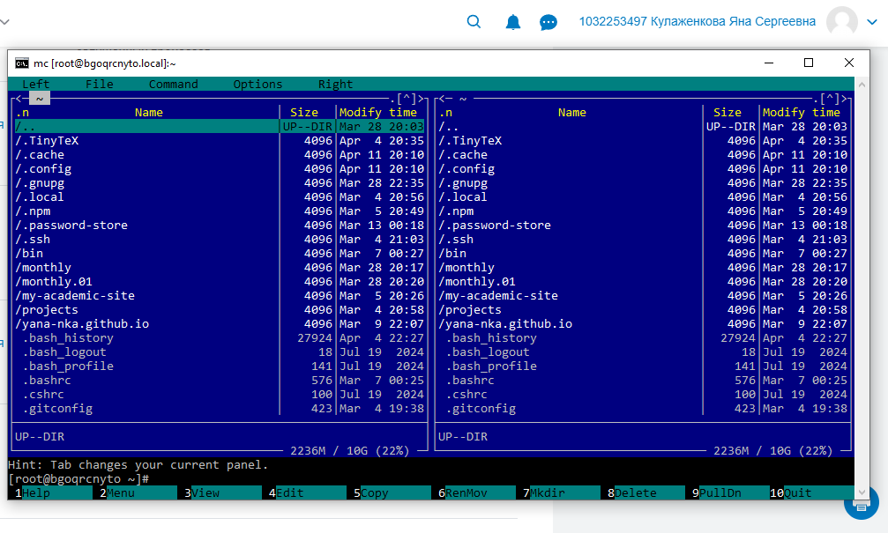

---
## Author
author:
  name: Кулаженкова Яна Сергеевна
  degrees: DSc
  orcid: 0000-0002-0877-7063
  email: 1032253497@rudn.ru
  affiliation:
    - name: Российский университет дружбы народов
      country: Российская Федерация
      postal-code: 117198
      city: Москва
      address: ул. Миклухо-Маклая, д. 6
## Title
title: Командная оболочка Midnight Commander
subtitle: Лабораторная работа №9
license: CC BY
date: today
date-format: "YYYY-MM-DD"
---

# Вводная часть

## Актуальность

- Midnight Commander (mc) — стандартный инструмент для управления файлами в UNIX/Linux системах
- Позволяет эффективно работать с файловой системой в терминале без графического интерфейса
- Псевдографический интерфейс обеспечивает работу по SSH на удалённых серверах
- Встроенный редактор и функциональные клавиши ускоряют повседневные задачи администратора и разработчика

## Объект и предмет исследования

- **Объект:** Процесс управления файлами и каталогами в операционной системе Linux
- **Предмет:** Командная оболочка Midnight Commander, её интерфейс, функциональные клавиши, меню и встроенный редактор

## Цели и задачи

- Освоить основные возможности командной оболочки Midnight Commander
- Научиться управлять панелями (смена местами, отключение, сравнение каталогов)
- Освоить режимы отображения панелей (список, информация, дерево)
- Выполнять основные операции с файлами и каталогами через mc
- Изучить меню `Команда` для поиска файлов и работы с историей
- Настроить внешний вид mc через меню `Настройки`
- Освоить встроенный редактор mc (создание, редактирование, копирование, отмена действий)

## Материалы и методы

- **Платформа:** Fedora 41
- **Инструменты:**
    - Командная оболочка: Midnight Commander (mc)
    - Встроенный редактор mc
    - Функциональные клавиши F1–F10
    - Комбинации клавиш: Ctrl+u, Ctrl+o, Ctrl+x d, Ctrl+Ins, Shift+Ins, Shift+Del

# Ход работы

## Запуск Midnight Commander

- Запуск mc выполняется командой `mc` в терминале
- После запуска отображаются две панели с файлами и каталогами
- В нижней части экрана расположены управляющие кнопки F1–F10

{#fig:001 width=70%}

## Управление панелями

- **Смена панелей местами:** `Ctrl + u` — левая и правая панели меняются содержимым
- **Отключение панелей:** `Ctrl + o` — временно скрывает панели для просмотра вывода терминала
- **Сравнение каталогов:** `Ctrl + x d` — выделяет файлы, отсутствующие на другой панели

## Режимы отображения панелей

- **Стандартный (список файлов):** отображение имён, размеров и времени изменения
- **Информация:** вывод сведений о выбранном файле и текущей файловой системе
- **Дерево:** отображение структуры каталогов в виде дерева

Переключение режимов осуществляется через меню `Левая панель` → `Режим` или `Правая панель` → `Режим`.

## Основные операции с файлами

| Клавиша | Операция |
|---------|----------|
| `F3`    | Просмотр файла |
| `F4`    | Редактирование файла |
| `F5`    | Копирование файла/каталога |
| `F6`    | Перемещение файла/каталога |
| `F7`    | Создание каталога |
| `F8`    | Удаление файла/каталога |
| `Ins`   | Выделение файла |
| `Ctrl+t`| Выделение группы файлов по маске |
| `Ctrl+xi`| Информация о файле |

## Меню «Команда»

- **Поиск файлов:** поиск по маске имени и содержимому (например, `*.c`, содержит `main`)
- **История командной строки:** просмотр ранее выполненных команд
- **Каталоги быстрого доступа:** быстрый переход (`Ctrl + \`)
- **Редактировать файл расширений:** настройка действий для файлов с определёнными расширениями
- **Редактировать файл меню:** настройка пользовательского меню (F2)

## Меню «Настройки»

- **Full screen:** полноэкранный режим
- **Double Width:** двойная ширина
- **Show Hidden Files:** отображение скрытых файлов (`.bashrc`, `.config` и др.)

Настройки применяются через `F9` → `Настройки` → `Конфигурация`.

## Встроенный редактор mc

### Основные возможности

- Создание нового файла: `Shift + F4`
- Сохранение: `F2`
- Выход без сохранения: `F10` → выбрать "Нет"

### Редактирование текста

| Комбинация | Действие |
|------------|----------|
| `Ctrl + Ins` | Копировать выделенный фрагмент |
| `Shift + Ins` | Вставить из буфера |
| `Shift + Del` | Вырезать выделенный фрагмент |
| `Ctrl + u` | Отменить последнее действие |
| `Ctrl + Home` | Перейти в начало файла |
| `Ctrl + End` | Перейти в конец файла |

## Подсветка синтаксиса

- Встроенный редактор mc поддерживает подсветку синтаксиса для различных языков программирования
- Включение/отключение: `F9` → `Настройки` → `Подсветка синтаксиса`
- Поддерживаются языки: C/C++, Python, Bash, JavaScript, HTML, CSS и другие

# Результаты

## Основные результаты работы

- **Освоен интерфейс mc:** изучены две панели, функциональные клавиши F1–F10 и верхнее меню
- **Управление панелями:** отработаны комбинации `Ctrl+u` (смена местами), `Ctrl+o` (отключение), `Ctrl+x d` (сравнение)
- **Режимы панелей:** освоены режимы "Список", "Информация", "Дерево"
- **Файловые операции:** выполняются копирование, перемещение, создание каталогов, просмотр и редактирование
- **Меню Команда:** настроен поиск файлов, работа с историей и каталогами быстрого доступа
- **Настройки mc:** включено отображение скрытых файлов и полноэкранный режим
- **Встроенный редактор:** создание файлов, копирование/перенос текста, отмена действий, подсветка синтаксиса

## Итоговый слайд

- В ходе работы была освоена командная оболочка Midnight Commander — мощный инструмент для управления файлами в терминале Linux
- Получены навыки работы с панелями, функциональными клавишами и меню mc
- Встроенный редактор позволяет выполнять базовые операции с текстом без запуска отдельных приложений
- Настройки mc дают возможность адаптировать интерфейс под индивидуальные потребности пользователя
- Midnight Commander является незаменимым инструментом при работе по SSH на удалённых серверах
