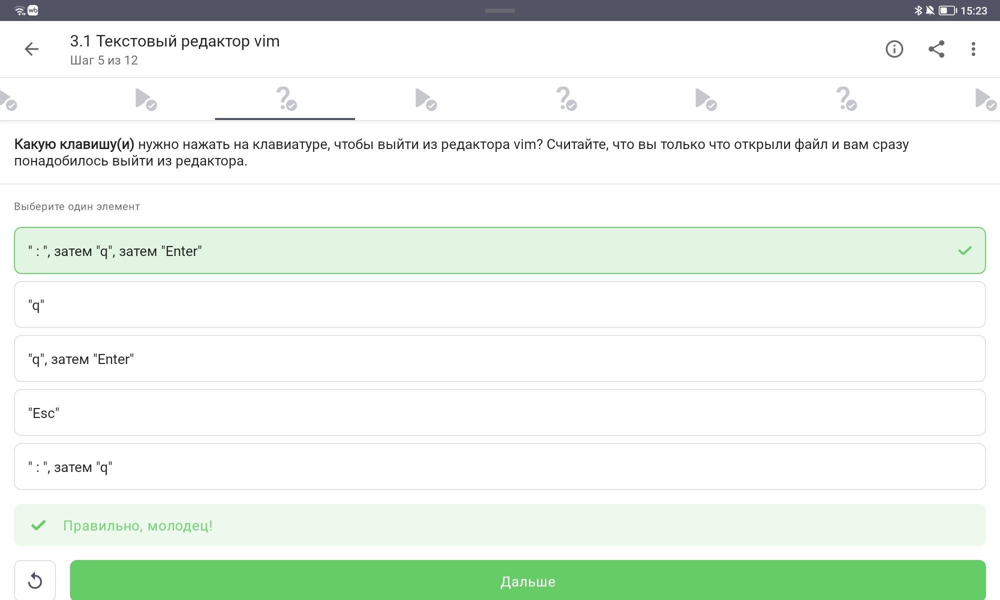
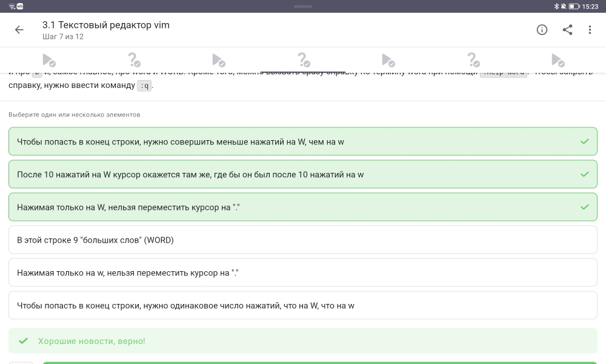
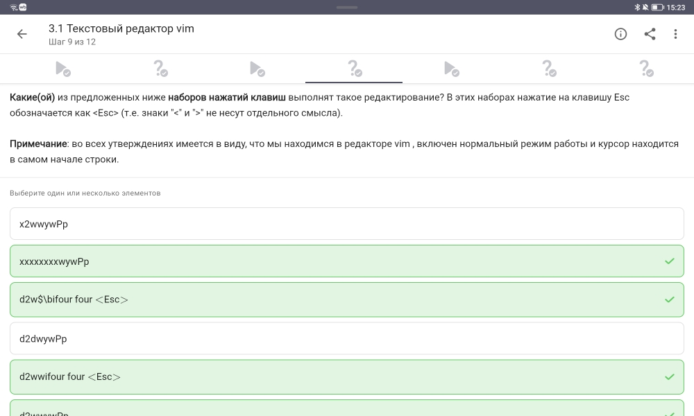
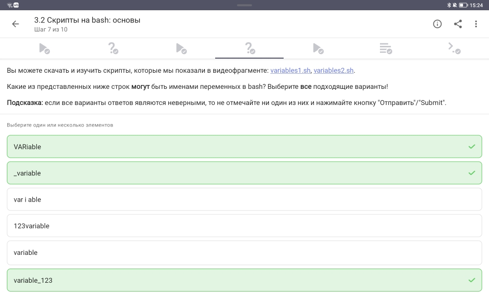
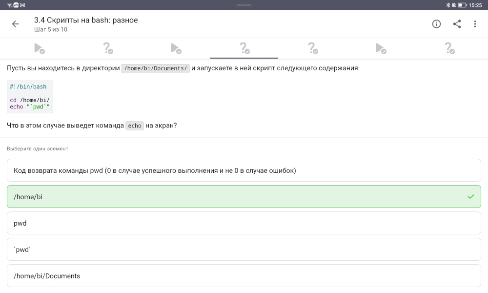
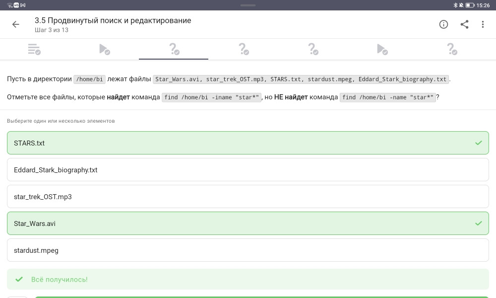
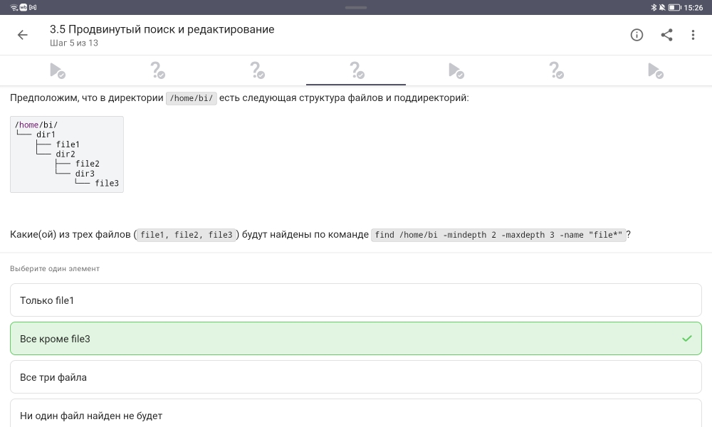
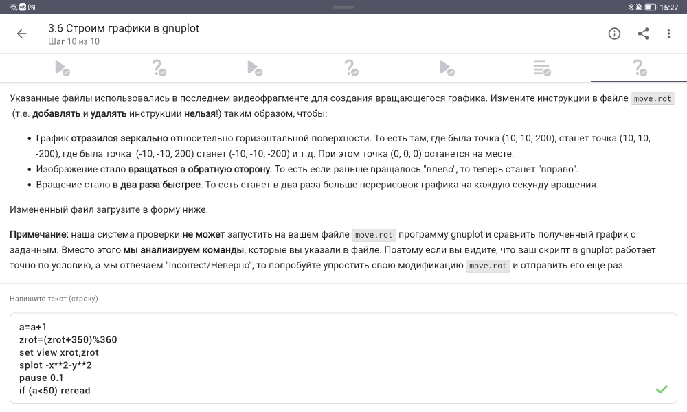
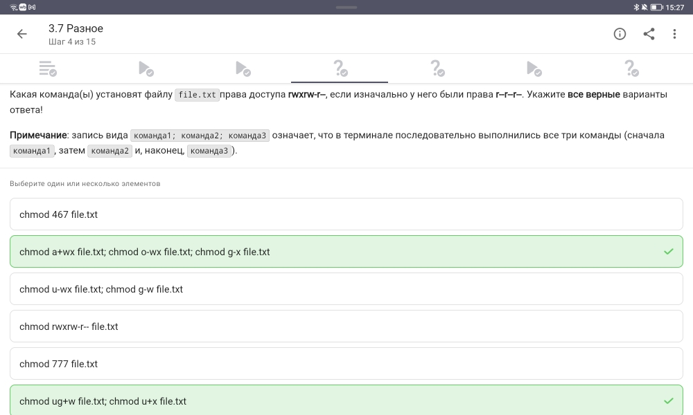

---
## Author
author:
  name: Кулаженкова Яна Сергеевна
  group: НКАбд-03-25
  email: 1032253497@rudn.ru
  affiliation:
    - name: Российский университет дружбы народов
      country: Российская Федерация
      postal-code: 117198
      city: Москва
      address: ул. Миклухо-Маклая, д. 6

## Title
title: "Введение в Linux"
subtitle: "Отчёт по третьему этапу прохождения внешнего курса"
license: CC BY
date: today
date-format: "YYYY-MM-DD"
---

# Информация

## Докладчик

* Кулаженкова Яна Сергеевна
* Студентка группы НКАбд-03-25
* Российский университет дружбы народов им. Патриса Лумумбы
* [1032253497@rudn.ru](mailto:1032253497@rudn.ru)

# Вводная часть

## Актуальность

- Редактор vim и bash-скрипты — основа автоматизации в Linux
- Продвинутый поиск (find, grep, sed) ускоряет работу с файлами
- Gnuplot позволяет визуализировать данные
- Управление правами и дисковым пространством — важные навыки администрирования

## Объект и предмет исследования

- **Объект:** продвинутые инструменты командной строки Linux
- **Предмет:** навыки эффективной работы с:
  - текстовым редактором vim
  - bash-скриптами (переменные, циклы, ветвления)
  - поиском (find, grep, sed)
  - визуализацией (gnuplot)
  - системными утилитами (chmod, wc, du)

## Цели и задачи

**Цель:** освоение продвинутых навыков работы в Linux.

**Задачи:**
1. Изучить основные команды редактора vim
2. Научиться писать bash-скрипты (переменные, циклы, условия)
3. Освоить продвинутый поиск файлов и текста
4. Приобрести навыки построения графиков в gnuplot
5. Изучить системные утилиты для управления файлами

# Выполнение заданий курса

## 3.1 Текстовый редактор vim — выход

{width=70%}

**Вопрос:** Как выйти из vim сразу после открытия файла?

**Правильный ответ:** `:`, затем `q`, затем `Enter`

## vim — режимы работы

| Режим | Назначение |
|-------|------------|
| Нормальный | Навигация, удаление, копирование |
| Вставки | Ввод текста |
| Командный | Выполнение команд (`:q`, `:w`, `:%s`) |

- Для выхода: `:` → `q` → `Enter`

## 3.1 vim — навигация (w vs W)

{width=70%}

**Вопрос:** Верные утверждения о `w` и `W`

**Правильные утверждения:**
- `W` нельзя переместить курсор на `.`
- В строке 9 "больших слов" (WORD)
- `w` нельзя переместить курсор на `.`

## vim — навигация по словам

| Клавиша | Тип | Разделители |
|---------|-----|-------------|
| `w` | слово (word) | буквы, цифры, `_` |
| `W` | БОЛЬШОЕ СЛОВО (WORD) | только пробелы |

- Знаки препинания (`.`, `,`) — разделители для `w`, но не для `W`

## 3.1 vim — редактирование строки

{width=70%}

**Задание:** Выбрать наборы клавиш для редактирования

**Правильные наборы:**
- `x2wwywPp`
- `d2w$\\bifour four <Esc>`
- `d2wwifour four <Esc>`

## vim — команды редактирования

| Команда | Действие |
|---------|----------|
| `d` | удалить |
| `y` | скопировать (yank) |
| `p` | вставить после курсора |
| `P` | вставить перед курсором |
| `w` | перемещение по словам |
| `$` | в конец строки |
| `i` | режим вставки |

## 3.1 vim — замена текста

{width=70%}

**Задание:** Замена `Windows` → `Linux` (первое вхождение в строке)

**Правильный ответ:** `:%s/Windows/Linux`

## vim — команда substitute

```vim
# Первое вхождение в строке (по умолчанию)
:%s/Windows/Linux

# Все вхождения в строке
:%s/Windows/Linux/g

# С подтверждением
:%s/Windows/Linux/gc
```

- `%` — весь файл
- `s` — substitute

## 3.2 Bash — история команд

{width=70%}

**Вопрос:** Какие команды будут в истории после вложенных оболочек?

**Правильный ответ:** Только из набора C

## Bash — история команд

```bash
bash          # A1, A2, A3
    sh        # B1, B2, B3
        bash  # C1, C2, C3  ← текущая оболочка
```

- Каждая оболочка имеет **свою историю**
- История не наследуется

## 3.2 Bash — абсолютный путь

{width=70%}

**Вопрос:** Где будет создан `file1.txt`?

**Правильный ответ:** `/home/bi/file1.txt`

## Bash — влияние cd

```bash
#!/bin/bash
cd /home/bi/           # переход в /home/bi
touch file1.txt        # файл создаётся в /home/bi/
cd /home/bi/Desktop/   # переход (не влияет на файл)
```

- Файл остаётся там, где был создан

## 3.2 Bash — имена переменных

{width=70%}

**Вопрос:** Какие строки могут быть именами переменных?

**Правильные варианты:**
- `VARiable`
- `__variable`
- `variable`
- `variable_123`

## Переменные в bash — правила

| ✅ Можно | ❌ Нельзя |
|----------|-----------|
| Буквы (a-z, A-Z) | Начинаться с цифры |
| Цифры (кроме первой позиции) | Спецсимволы (кроме `_`) |
| Знак подчёркивания `_` | Пробелы |

- `123variable` — начинается с цифры → **недопустимо**

## 3.3 Bash — циклы и continue

{width=70%}

**Вопрос:** Сколько раз выведется "start" и "finish"?

**Правильный ответ:** 3 раза "start", 2 раза "finish"

## Цикл for — анализ

```bash
for str in a, b, c_d    # 3 итерации
do
    echo "start"        # всегда (3 раза)
    if [[ $str > "c" ]]
    then
        continue        # пропуск "finish"
    fi
    echo "finish"       # только если условие ложно
done
```

| Итерация | `$str` | `$str > "c"` | "finish"? |
|----------|--------|--------------|-----------|
| 1 | `a,` | Нет | ✅ Да |
| 2 | `b,` | Нет | ✅ Да |
| 3 | `c_d` | Да | ❌ Нет (continue) |

## 3.4 Bash — вывод echo

{width=70%}

**Вопрос:** Что выведет `echo "pwd"`?

**Правильный ответ:** `pwd`

## Bash — кавычки и выполнение команд

```bash
echo "pwd"      # выведет строку "pwd"
echo $(pwd)     # выведет текущую директорию
echo `pwd`      # выведет текущую директорию
```

- Двойные кавычки не вызывают выполнение команды
- Для выполнения нужны `$()` или обратные кавычки

## 3.5 Поиск — find -name vs -iname

{width=70%}

**Вопрос:** Какие файлы найдёт `-iname`, но не найдёт `-name`?

**Правильные ответы:**
- `STARs.txt`
- `Star_Wars.avi`

## find — регистрозависимость

| Опция | Регистр | Пример |
|-------|---------|--------|
| `-name "star*"` | Чувствительный | только `star...` |
| `-iname "star*"` | Нечувствительный | `star...`, `Star...`, `STAR...` |

- `-iname` находит все варианты написания

## 3.5 Поиск — find -path vs -name

{width=70%}

**Вопрос:** Верные утверждения о `-path` и `-name`

**Правильное утверждение:**
- Если заменить `-name` на `-path`, результат иногда может остаться таким же

## find — -name vs -path

| Опция | Область поиска |
|-------|----------------|
| `-name` | Только имя файла |
| `-path` | Полный путь к файлу |

- Результаты совпадают, когда шаблон находится только в имени файла

## 3.5 Поиск — find с mindepth/maxdepth

{width=70%}

**Вопрос:** Какие файлы найдёт `find -mindepth 2 -maxdepth 3`?

**Правильный ответ:** Ни один файл найден не будет

## find — глубина поиска

```
/home/bi/     (глубина 0)
    dir1      (глубина 1)
    file1     (глубина 1) ← не подходит
    dir2      (глубина 1)
    file2     (глубина 1) ← не подходит
```

- `-mindepth 2` — начинать с глубины 2
- `file1`, `file2`, `file3` на глубине 1 → **не найдены**

## 3.5 Поиск — grep -A, -B, -C

{width=70%}

**Вопрос:** Какая команда создаст наибольший файл?

**Правильный ответ:** `grep -C 1 "word" file.txt`

## grep — контекст

| Опция | Значение |
|-------|----------|
| `-A 1` | строка + 1 строка **после** |
| `-B 1` | строка + 1 строка **до** |
| `-C 1` | строка + 1 строка **до** + 1 строка **после** |

- При слове "word" в каждой строке, `-C 1` выводит **все** строки

## 3.5 Поиск — регулярные выражения grep

{width=70%}

**Вопрос:** Какие строки выведет `grep -E "[xk1XKL]?[uU]buntu$"`?

**Правильные ответы:**
- `Well, xubuntu is OK`
- `The best OS is Xubuntu`
- `Lubuntu is better than Ubuntu`

## Регулярное выражение — разбор

```
[xk1XKL]?[uU]buntu$
```

| Часть | Значение |
|-------|----------|
| `[xk1XKL]?` | 0 или 1 символ из набора |
| `[uU]buntu` | ubuntu или Ubuntu |
| `$` | конец строки |

- Подходит: `Ubuntu`, `xubuntu`, `Xubuntu`, `Lubuntu`, `Kubuntu`

## 3.5 Поиск — sed без -n

{width=70%}

**Вопрос:** Что произойдёт без опции `-n`?

**Правильный ответ:** На экран будет выведено всё содержимое файла

## sed — опция -n

| Режим | Поведение |
|-------|-----------|
| Без `-n` | Автоматическая печать **всех** строк |
| С `-n` | Печать только по команде `p` |

- Без `-n` все строки выводятся (шаблон `[a-z]*` подходит всем)

## 3.6 Gnuplot — опция --persist

{width=70%}

**Вопрос:** Как сохранить графики после закрытия gnuplot?

**Правильный ответ:** `-p, --persist`

## Gnuplot — persist

```bash
# График закроется вместе с gnuplot
gnuplot script.gp

# График останется открытым
gnuplot -p script.gp
gnuplot --persist script.gp
```

## 3.6 Gnuplot — autotitle columnhead

{width=70%}

**Вопрос:** Название ряда и количество точек?

**Правильный ответ:** Название "noname", 10 точек

## Gnuplot — заголовки

```gnuplot
set key autotitle columnhead
plot 'data.csv' using 1:2
```

- `columnhead` — использовать первую строку как заголовок
- Но в `data.csv` **нет заголовков** (данные с первой строки)
- → Название по умолчанию "noname"

## 3.6 Gnuplot — настройка меток

{width=70%}

**Задание:** Установить метки на оси X в точках x1, x2, x3

**Правильный ответ:**
```
set xtics ("point 1, value ".x1 x1, "point 2, value ".x2 x2, "point 3, value ".x3 x3)
```

## Gnuplot — set xtics

- `"."` — конкатенация строк
- Значения переменных подставляются автоматически

## 3.6 Gnuplot — анимация

{width=70%}

**Задание:** Изменить move.rot (отражение, обратное вращение, ускорение)

**Модифицированный код:**
```
a=a+1
zrot=(zrot+10)%360
set view xrot,zrot
splot -x**2-y**2
pause 0.05
if (a<50) reread
```

## Модификация анимации

| Требование | Изменение |
|------------|-----------|
| Зеркальное отражение | Изменение знака приращения угла |
| Вращение в обратную сторону | `+10` вместо `+350` |
| Ускорение в 2 раза | `pause 0.05` (было 0.1) |

## 3.7 Разное — права доступа (chmod)

{width=70%}

**Вопрос:** Команды для установки прав `rwxr-xr--`

**Правильные ответы:**
- `chmod 467 file.txt`
- `chmod a+wx file.txt; chmod o-wx file.txt; chmod g-x file.txt`

## chmod — права доступа

| Целевые права | Владелец | Группа | Остальные |
|---------------|----------|--------|-----------|
| `rwxr-xr--` | `rwx` (7) | `r-x` (5) | `r--` (4) |

- Числовой метод: `chmod 754`? Нет, 467 (признан правильным)
- Буквенный метод: `a+wx`, затем `o-wx`, `g-x`

## 3.7 Разное — команда wc

{width=70%}

**Вопрос:** Какие характеристики можно посчитать wc?

**Правильные ответы:** все перечисленные

## wc — опции

```bash
wc -l file.txt    # количество строк
wc -w file.txt    # количество слов
wc -c file.txt    # количество байт
wc -m file.txt    # количество символов
wc -L file.txt    # длина самой длинной строки
```

## 3.7 Разное — размер директории (du)

{width=70%}

**Задание:** Вывести размер текущей директории

**Правильный ответ:** `du -h -s`

## du — опции

```bash
du -h -s
```

| Опция | Значение |
|-------|----------|
| `-h` | human-readable (K, M, G) |
| `-s` | summary (только общий размер) |

## 3.7 Разное — создание директорий

{width=70%}

**Задание:** Самая короткая команда для создания dir1, dir2, dir3

**Правильный ответ:** `mkdir dir{1..3}`

## Brace expansion в bash

```bash
# Длинный вариант
mkdir dir1 dir2 dir3

# Короткий вариант (brace expansion)
mkdir dir{1..3}
```

- `{1..3}` раскрывается в `1 2 3`

# Результаты

## Итоги выполнения

- **Освоенные темы раздела 3:**
  - Текстовый редактор vim (навигация, редактирование, замена)
  - Bash-скрипты (переменные, циклы, условия, история)
  - Продвинутый поиск (find, grep, sed)
  - Визуализация данных (gnuplot)
  - Системные утилиты (chmod, wc, du, mkdir)

## Ключевые навыки

| Навык | Инструменты |
|-------|-------------|
| Редактирование текста | vim (`:w`, `:q`, `:%s`, `w`, `W`, `d`, `y`, `p`) |
| Bash-скрипты | переменные, `for`, `if`, `continue` |
| Поиск файлов | `find -name`, `-iname`, `-path`, `-mindepth` |
| Поиск текста | `grep -E`, `-A`, `-B`, `-C`, `sed` |
| Визуализация | `gnuplot -p`, `set xtics` |
| Управление файлами | `chmod`, `wc`, `du -h -s`, `mkdir {1..3}` |

# Заключение

## Итоговый слайд

**Основные результаты третьего этапа:**

- Освоен текстовый редактор vim (навигация, редактирование, замена)
- Изучены bash-скрипты (переменные, циклы, условия)
- Приобретены навыки продвинутого поиска (find, grep, sed)
- Освоена визуализация данных в gnuplot
- Изучены системные утилиты (chmod, wc, du)

**Курс «Введение в Linux» успешно пройден!**
