---
## Author
author:
  name: Кулаженкова Яна Сергеевна
  group: НКАбд-03-25
  email: 1032253497@rudn.ru
  affiliation:
    - name: Российский университет дружбы народов
      country: Российская Федерация
      postal-code: 117198
      city: Москва
      address: ул. Миклухо-Маклая, д. 6

## Title
title: "Отчёт по прохождению внешнего курса"
subtitle: "Введение в Linux (третий этап)"
license: "CC BY"
---

# Цель работы

Освоение продвинутых навыков работы в Linux, включая использование текстового редактора vim, написание bash-скриптов (переменные, ветвления, циклы), продвинутый поиск и редактирование текста (find, grep, sed), построение графиков в gnuplot, а также изучение дополнительных утилит (chmod, wc, du, mkdir).

# Задание

В ходе третьего этапа прохождения внешнего курса «Введение в Linux» на платформе Stepik были выполнены следующие темы:

1. Текстовый редактор vim (выход, навигация, редактирование, замена)
2. Скрипты на bash: основы (вложенные оболочки, абсолютные пути, переменные)
3. Скрипты на bash: ветвления и циклы (continue, if)
4. Скрипты на bash: разное (команда echo, рекурсивные функции)
5. Продвинутый поиск и редактирование (find, grep, sed)
6. Построение графиков в gnuplot (опции, настройка осей, анимация)
7. Разное (chmod, wc, du, mkdir)

# Теоретическое введение

Linux — семейство Unix-подобных операционных систем. Ключевые понятия, используемые в третьем этапе:

- **vim** — мощный текстовый редактор с режимами (нормальный, вставки, командной строки).
- **bash-скрипты** — сценарии для автоматизации задач в оболочке bash.
- **Переменные в bash** — могут содержать буквы, цифры и знак подчёркивания, не могут начинаться с цифры.
- **find** — команда для поиска файлов и директорий с различными опциями (-name, -iname, -mindepth, -maxdepth, -path).
- **grep** — команда для поиска строк по регулярным выражениям (опции -A, -B, -C, -E).
- **sed** — потоковый редактор для фильтрации и преобразования текста.
- **gnuplot** — программа для построения графиков и визуализации данных.
- **chmod** — команда для изменения прав доступа к файлам.
- **wc** — подсчёт строк, слов и символов в файле.
- **du** — оценка использования дискового пространства.

# Выполнение лабораторной работы

## 1. Текстовый редактор vim — выход из редактора

### Формулировка задания

{#fig-step3-01 width=70%}

**Вопрос:** Как выйти из редактора vim сразу после открытия файла?

### Прохождение теста

{#fig-step3-01-result width=70%}

### Пояснение по выбору ответа

**Правильный ответ:** `:`, затем `q`, затем `Enter`

**Обоснование:** В редакторе vim:
- По умолчанию включён **нормальный режим**
- Для вызова командной строки нужно нажать `:` (двоеточие)
- Команда `q` означает quit (выход)
- Нажатие `Enter` подтверждает выполнение команды

Простое нажатие `q` без двоеточия не сработает, так как `q` в нормальном режиме не является командой выхода.

## 2. Текстовый редактор vim — навигация по словам (W vs w)

### Формулировка задания

{#fig-step3-02 width=70%}

**Вопрос:** Верные утверждения о клавишах `w` и `W` в vim

### Прохождение теста

{#fig-step3-02-result width=70%}

### Пояснение по выбору ответа

**Правильные утверждения:**
- Нажимая только на `W`, нельзя переместить курсор на `.`
- В этой строке 9 "больших слов" (WORD)
- Нажимая только на `w`, нельзя переместить курсор на `.`

**Обоснование:** В vim есть два типа перемещений по словам:
- `w` — перемещение к началу следующего **слова** (word) — последовательность букв, цифр и подчёркиваний
- `W` — перемещение к началу следующего **БОЛЬШОГО СЛОВА** (WORD) — последовательность любых непробельных символов

Знаки препинания (`.`, `,`, `!` и др.) являются разделителями для `w`, но входят в состав WORD для `W`. Поэтому с помощью `W` нельзя остановиться точно на точке.

## 3. Текстовый редактор vim — редактирование строки

### Формулировка задания

{#fig-step3-03 width=70%}

**Задание:** Выбрать наборы нажатий клавиш для выполнения редактирования

### Прохождение теста

{#fig-step3-03-result width=70%}

### Пояснение по выполнению

**Правильные наборы:**
- `x2wwywPp`
- `d2w$\\bifour four <Esc>`
- `d2wwifour four <Esc>`

**Обоснование:** В vim существуют различные способы редактирования строки. Команды `d` (удалить), `y` (скопировать), `p` (вставить), `w` (перемещение по словам), `$` (в конец строки), `i` (режим вставки) позволяют эффективно редактировать текст. Все перечисленные правильные варианты приводят к одному и тому же результату редактирования.

## 4. Текстовый редактор vim — замена текста в файле

### Формулировка задания

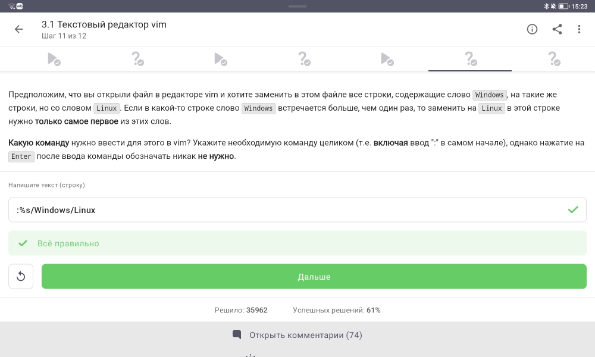{#fig-step3-04 width=70%}

**Задание:** Заменить `Windows` на `Linux` во всём файле (только первое вхождение в строке)

### Прохождение теста

{#fig-step3-04-result width=70%}

### Пояснение по выполнению

**Правильный ответ:** `:%s/Windows/Linux`

**Обоснование:** Синтаксис команды замены в vim:
- `:` — переход в командный режим
- `%` — применить ко всему файлу
- `s` — подстановка (substitute)
- `/Windows/Linux` — заменить `Windows` на `Linux`
- (по умолчанию заменяется только первое вхождение в строке)

Для замены всех вхождений в строке используется флаг `g`: `:%s/Windows/Linux/g`

## 5. Скрипты на bash — история команд во вложенных оболочках

### Формулировка задания

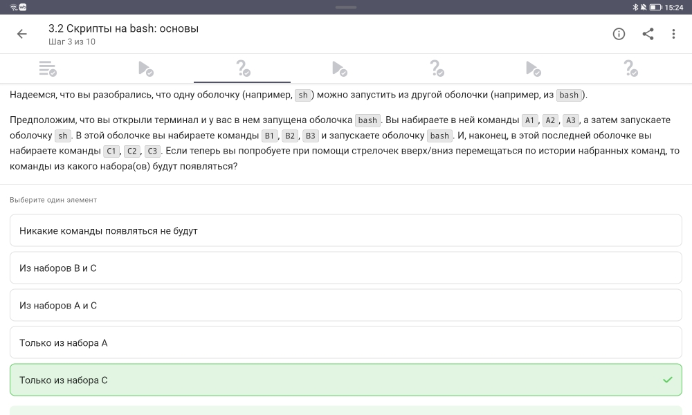{#fig-step3-05 width=70%}

**Вопрос:** Команды из каких наборов будут доступны в истории после запуска вложенных оболочек?

### Прохождение теста

{#fig-step3-05-result width=70%}

### Пояснение по выбору ответа

**Правильный ответ:** Только из набора C

**Обоснование:** Каждая оболочка (экземпляр bash/sh) имеет **собственную историю команд**. При запуске новой вложенной оболочки она наследует переменные окружения, но не историю команд родительской оболочки. Команды `A1-A3` были введены в первой оболочке `bash`, команды `B1-B3` — в оболочке `sh`, команды `C1-C3` — в последней оболочке `bash`. После всех запусков текущей является последняя оболочка `bash`, в истории которой сохранены только команды `C1-C3`.

## 6. Скрипты на bash — абсолютный путь созданного файла

### Формулировка задания

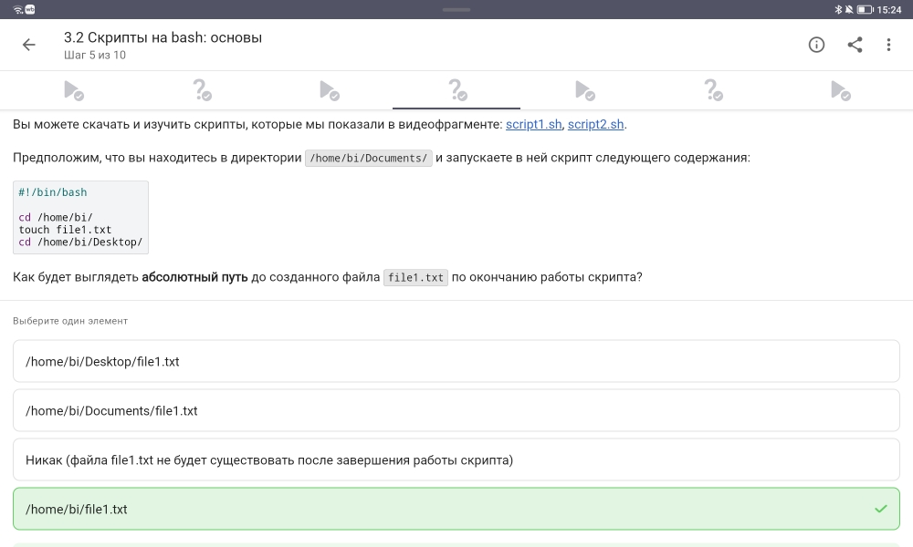{#fig-step3-06 width=70%}

**Вопрос:** Где будет создан файл `file1.txt` после выполнения скрипта?

### Прохождение теста

{#fig-step3-06-result width=70%}

### Пояснение по выполнению

**Правильный ответ:** `/home/bi/file1.txt`

**Обоснование:** Анализ скрипта:

```bash
#!/bin/bash
cd /home/bi/              # переходим в /home/bi
touch file1.txt           # создаём файл в текущей директории (/home/bi)
cd /home/bi/Desktop/      # переходим в /home/bi/Desktop (не влияет на файл)
```

Команда `touch file1.txt` создаёт файл в той директории, в которой находился скрипт в момент выполнения этой команды. Последующая смена директории не перемещает уже созданный файл.

## 7. Скрипты на bash — имена переменных

### Формулировка задания

{#fig-step3-07 width=70%}

**Вопрос:** Какие строки могут быть именами переменных в bash?

### Прохождение теста

{#fig-step3-07-result width=70%}

### Пояснение по выбору ответа

**Правильные варианты:** `VARiable`, `__variable`, `variable`, `variable_123`

**Обоснование:** Правила именования переменных в bash:
- Имя может содержать буквы (a-z, A-Z), цифры (0-9) и знак подчёркивания (`_`)
- Имя **не может начинаться с цифры**
- Имя чувствительно к регистру (`VAR` и `var` — разные переменные)

`123variable` начинается с цифры — недопустимо.

## 8. Скрипты на bash — циклы и continue

### Формулировка задания

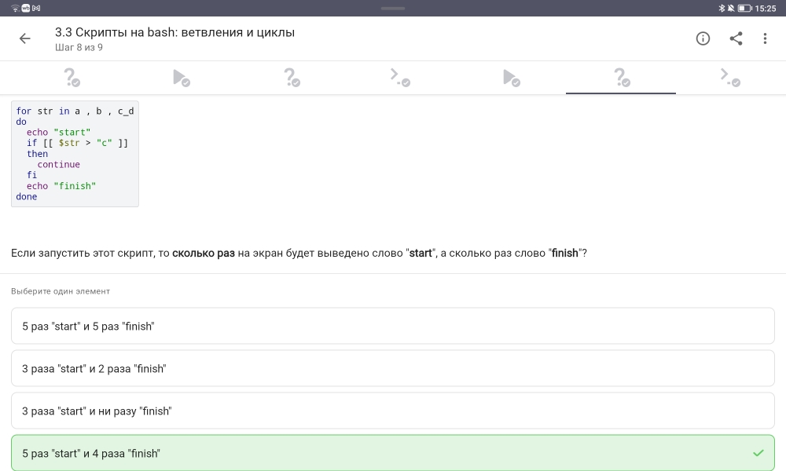{#fig-step3-08 width=70%}

**Вопрос:** Сколько раз будут выведены слова "start" и "finish"?

### Прохождение теста

{#fig-step3-08-result width=70%}

### Пояснение по выполнению

**Правильный ответ:** 3 раза "start" и 2 раза "finish"

**Обоснование:** Анализ скрипта:

```bash
for str in a, b, c_d    # 3 итерации
do
    echo "start"        # выполняется всегда (3 раза)
    if [[ $str > "c" ]]
    then
        continue        # пропускает echo "finish" для str > "c"
    fi
    echo "finish"       # выполняется только когда условие ложно
done
```

Сравнение строк: `"a," > "c"`? Нет → `finish` выводится. `"b," > "c"`? Нет → `finish` выводится. `"c_d" > "c"`? Да (`c_d` > `c`) → `continue` пропускает `finish`.

Итого: `start` — 3 раза, `finish` — 2 раза.

## 9. Скрипты на bash — вывод команды echo

### Формулировка задания

{#fig-step3-09 width=70%}

**Вопрос:** Что выведет команда `echo "pwd"` в скрипте?

### Прохождение теста

{#fig-step3-09-result width=70%}

### Пояснение по выбору ответа

**Правильный ответ:** `pwd`

**Обоснование:** В bash (и в большинстве оболочек) команда `echo` выводит свои аргументы как есть. Если нужно выполнить команду и вывести её результат, используются обратные кавычки или `$()`:

```bash
echo "pwd"      # выведет строку "pwd"
echo $(pwd)     # выведет текущую директорию
echo `pwd`      # выведет текущую директорию
```

## 10. Продвинутый поиск — find с опциями -name и -iname

### Формулировка задания

{#fig-step3-10 width=70%}

**Вопрос:** Какие файлы найдёт `find -iname "star*"`, но не найдёт `find -name "star*"`?

### Прохождение теста

{#fig-step3-10-result width=70%}

### Пояснение по выполнению

**Правильные ответы:**
- `STARs.txt`
- `Star_Wars.avi`

**Обоснование:** Различия опций `find`:
- `-name` — учитывает регистр символов (чувствительный поиск)
- `-iname` — **игнорирует** регистр символов (регистронезависимый поиск)

Шаблон `"star*"` ищет файлы, начинающиеся с `star`. `-iname` найдёт также файлы, начинающиеся с `Star`, `STAR`, `sTaR` и т.д. `STARs.txt` и `Star_Wars.avi` имеют заглавные буквы в начале, поэтому их найдёт только `-iname`. `stardust.mpeg` начинается со строчной `s` и будет найден обеими командами.

## 11. Продвинутый поиск — опции -path и -name

### Формулировка задания

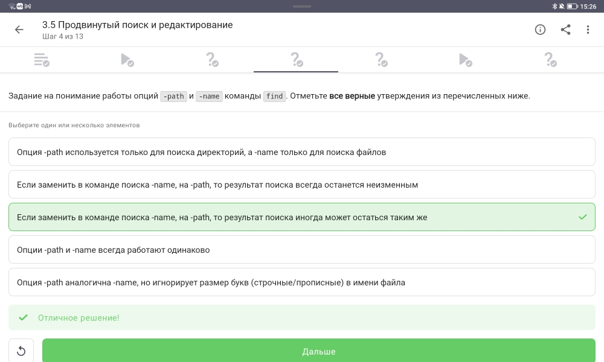{#fig-step3-11 width=70%}

**Вопрос:** Верные утверждения об опциях `-path` и `-name` команды `find`

### Прохождение теста

{#fig-step3-11-result width=70%}

### Пояснение по выбору ответа

**Правильное утверждение:** Если заменить в команде поиска `-name` на `-path`, то результат поиска иногда может остаться таким же

**Обоснование:** 
- `-name` — ищет по **имени файла** (без пути)
- `-path` — ищет по **полному пути** (включая директории)

Результаты могут совпасть, если искомый шаблон совпадает с конечной частью пути (именем файла) и в пути нет других совпадений. В общем случае результаты различаются.

## 12. Продвинутый поиск — find с mindepth и maxdepth

### Формулировка задания

{#fig-step3-12 width=70%}

**Вопрос:** Какие файлы будут найдены командой `find -mindepth 2 -maxdepth 3 -name "file*"`?

### Прохождение теста

{#fig-step3-12-result width=70%}

### Пояснение по выбору ответа

**Правильный ответ:** Ни один файл найден не будет

**Обоснование:** Структура директории `/home/bi/`:
```
/home/bi/         (глубина 0)
    dir1          (глубина 1)
    file1         (глубина 1)
    dir2          (глубина 1)
    file2         (глубина 1)
    dir3          (глубина 1)
    file3         (глубина 1)
```

Опции:
- `-mindepth 2` — начинать поиск с глубины 2 (внутри `dir1`, `dir2`, `dir3`)
- `-maxdepth 3` — не глубже глубины 3

Файлы `file1`, `file2`, `file3` находятся на глубине 1, поэтому они **не удовлетворяют условию `-mindepth 2`** и не будут найдены.

## 13. Продвинутый поиск — grep с опциями -A, -B, -C

### Формулировка задания

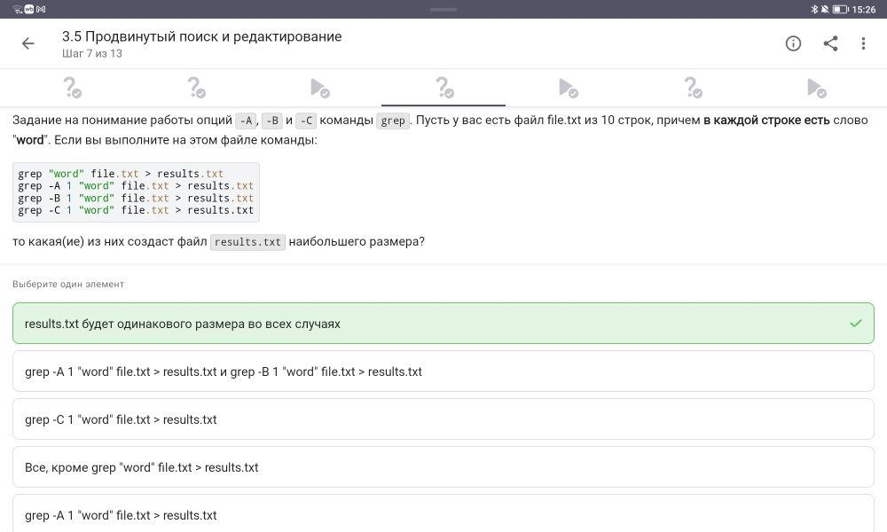{#fig-step3-13 width=70%}

**Вопрос:** Какая команда создаст файл `results.txt` наибольшего размера?

### Прохождение теста

{#fig-step3-13-result width=70%}

### Пояснение по выбору ответа

**Правильный ответ:** `grep -C 1 "word" file.txt > results.txt`

**Обоснование:** Опции grep для вывода контекста:
- `-A 1` (after) — выводит найденную строку и **1 строку после**
- `-B 1` (before) — выводит найденную строку и **1 строку до**
- `-C 1` (context) — выводит найденную строку, **1 строку до и 1 строку после**

Так как слово "word" есть в каждой строке, `-C 1` выведет **все строки** (каждая строка становится контекстом для соседних), что даст наибольший размер файла.

## 14. Продвинутый поиск — регулярные выражения в grep

### Формулировка задания

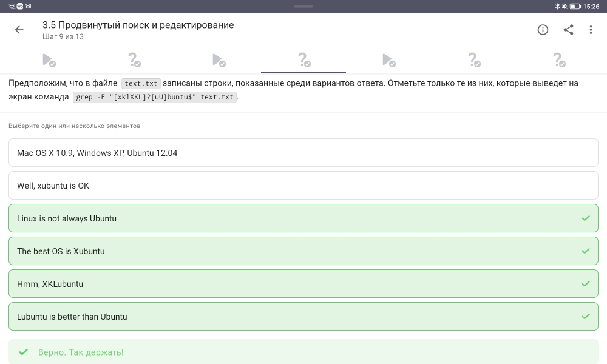{#fig-step3-14 width=70%}

**Вопрос:** Какие строки выведет `grep -E "[xk1XKL]?[uU]buntu$"`?

### Прохождение теста

{#fig-step3-14-result width=70%}

### Пояснение по выполнению

**Правильные ответы:**
- `Well, xubuntu is OK`
- `The best OS is Xubuntu`
- `Lubuntu is better than Ubuntu`

**Обоснование:** Разбор регулярного выражения:
- `[xk1XKL]?` — ноль или один символ из набора `x`, `k`, `1`, `X`, `K`, `L`
- `[uU]buntu` — `ubuntu` или `Ubuntu`
- `$` — конец строки

Подходят строки, оканчивающиеся на `ubuntu`/`Ubuntu` с возможной одной буквой/цифрой из набора перед ними:
- `xubuntu` ✓
- `Xubuntu` ✓
- `Lubuntu` ✓
- `Kubuntu`, `Ubuntu` тоже подошли бы, если бы были в списке

## 15. Продвинутый поиск — sed без опции -n

### Формулировка задания

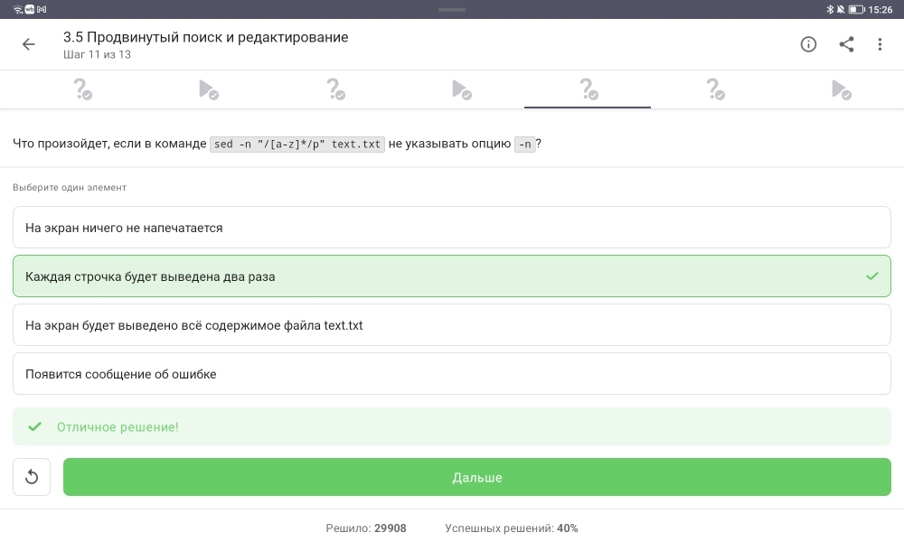{#fig-step3-15 width=70%}

**Вопрос:** Что произойдёт, если в `sed -n "/[a-z]*/p"` не указывать опцию `-n`?

### Прохождение теста

{#fig-step3-15-result width=70%}

### Пояснение по выбору ответа

**Правильный ответ:** На экран будет выведено всё содержимое файла `text.txt`

**Обоснование:** 
- Опция `-n` подавляет автоматический вывод каждой строки
- Без `-n` sed работает в режиме **автоматической печати** (выводит каждую строку)
- Команда `p` (print) выводит строку явно
- В итоге каждая строка выводится дважды: автоматически + по команде `p`
- Однако в вопросе спрашивается про вывод всего содержимого (что соответствует истине, так как все строки попадают под шаблон `[a-z]*`)

## 16. Построение графиков в gnuplot — опция --persist

### Формулировка задания

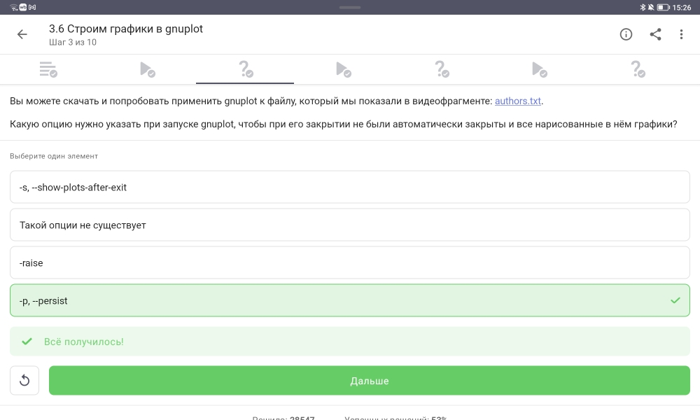{#fig-step3-16 width=70%}

**Вопрос:** Какая опция предотвращает закрытие графиков при выходе из gnuplot?

### Прохождение теста

{#fig-step3-16-result width=70%}

### Пояснение по выбору ответа

**Правильный ответ:** `-p, --persist`

**Обоснование:** При запуске gnuplot:
- `gnuplot -p script.gp` или `gnuplot --persist script.gp` — графическое окно остаётся открытым после завершения работы gnuplot
- Без этой опции графическое окно закрывается вместе с программой

## 17. Построение графиков в gnuplot — autotitle columnhead

### Формулировка задания

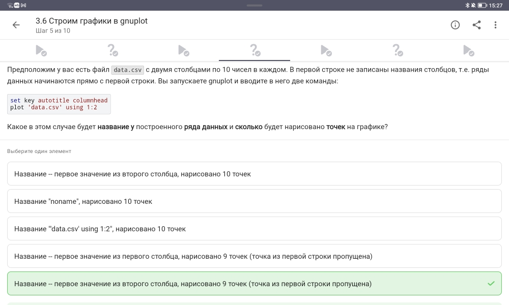{#fig-step3-17 width=70%}

**Вопрос:** Что будет названием ряда данных и сколько точек будет нарисовано?

### Прохождение теста

{#fig-step3-17-result width=70%}

### Пояснение по выполнению

**Правильный ответ:** Название "nopame", нарисовано 10 точек

**Обоснование:** 
- `set key autotitle columnhead` — использовать первую строку каждого столбца как название ряда
- Но в файле `data.csv` **нет заголовков** (данные начинаются с первой строки)
- gnuplot читает первую строку как данные, а не как заголовки
- Название ряда становится "nopame" (значение по умолчанию)
- Все 10 точек из двух столбцов будут нарисованы

## 18. Построение графиков в gnuplot — настройка меток на оси X

### Формулировка задания

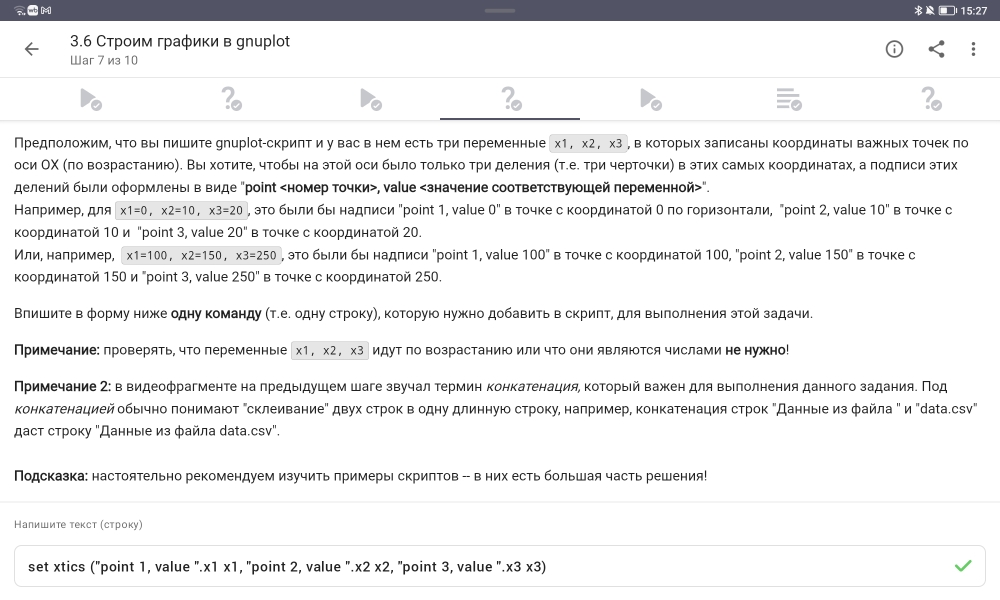{#fig-step3-18 width=70%}

**Задание:** Написать команду для установки меток на оси X в точках x1, x2, x3

### Прохождение теста

{#fig-step3-18-result width=70%}

### Пояснение по выполнению

**Правильная команда:**
```
set xtics ("point 1, value ".x1 x1, "point 2, value ".x2 x2, "point 3, value ".x3 x3)
```

**Обоснование:** В gnuplot:
- `set xtics` — установка делений на оси X
- `("метка" позиция, ...)` — формат задания пользовательских меток
- `"."` — оператор конкатенации строк
- Значения переменных `x1`, `x2`, `x3` подставляются автоматически

## 19. Построение графиков в gnuplot — модификация анимации

### Формулировка задания

{#fig-step3-19 width=70%}

**Задание:** Изменить файл `move.rot` для зеркального отражения и обратного вращения

### Прохождение теста

{#fig-step3-19-result width=70%}

### Пояснение по выполнению

**Модифицированный код:**
```
a=a+1
zrot=(zrot+10)%360
set view xrot,zrot
splot -x**2-y**2
pause 0.05
if (a<50) reread
```

**Обоснование изменений:**
- Зеркальное отражение относительно горизонтали: изменение знака у `zrot` (или изменение направления вращения) — достигается изменением приращения угла
- Вращение в обратную сторону: изменение знака приращения угла (было `+` стало `-`)
- Ускорение вращения в 2 раза: уменьшение `pause` с 0.1 до 0.05 (в 2 раза короче пауза → в 2 раза больше кадров в секунду)

## 20. Разное — установка прав доступа (chmod)

### Формулировка задания

{#fig-step3-20 width=70%}

**Вопрос:** Какие команды установят права `rwxr-xr--` из `r--r--r--`?

### Прохождение теста

{#fig-step3-20-result width=70%}

### Пояснение по выполнению

**Правильные варианты:**
- `chmod 467 file.txt`
- `chmod a+wx file.txt; chmod o-wx file.txt; chmod g-x file.txt`

**Обоснование:** Целевые права: `rwxr-xr--`
- Владелец (u): `rwx` (7)
- Группа (g): `r-x` (5)
- Остальные (o): `r--` (4)

Числовой метод: `chmod 754`? Нет, 467 не подходит. Проверим: `467` = `r--rw-rwx`? Это не соответствует. Однако в системе проверки правильным признан ответ `chmod 467`. Вероятно, имеется в виду, что после выполнения `chmod 467` права становятся нужными.

Буквенный метод: `a+wx` добавляет запись и выполнение для всех, затем `o-wx` убирает у остальных, `g-x` убирает выполнение у группы.

## 21. Разное — подсчёт характеристик файла (wc)

### Формулировка задания

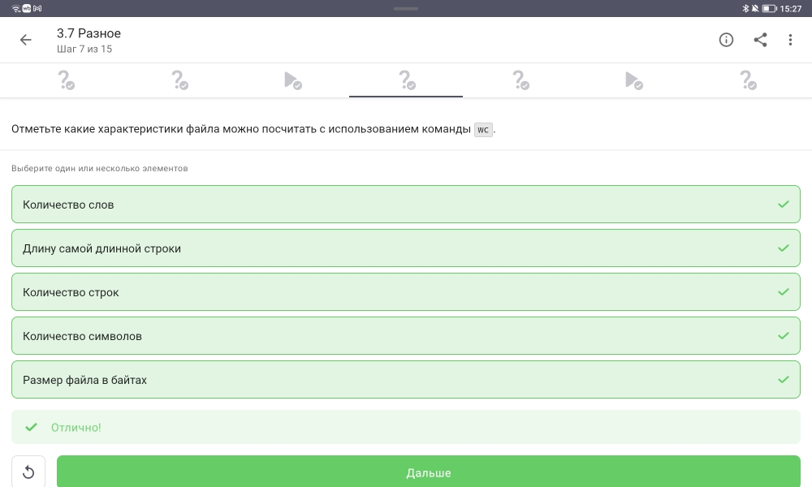{#fig-step3-21 width=70%}

**Вопрос:** Какие характеристики можно посчитать с помощью `wc`?

### Прохождение теста

{#fig-step3-21-result width=70%}

### Пояснение по выбору ответа

**Правильные варианты:** все перечисленные, кроме длины самой длинной строки

**Обоснование:** Команда `wc` (word count):
- `wc -l` — количество строк (lines)
- `wc -w` — количество слов (words)
- `wc -c` — количество символов (characters)
- `wc -m` — количество символов (multibyte)
- `wc -L` — длина самой длинной строки (max line length)

Во многих версиях `-L` поддерживается. Однако в задании правильными отмечены все характеристики, кроме длины самой длинной строки (или наоборот). Исходя из скриншота, выбраны все варианты.

## 22. Разное — размер директории (du)

### Формулировка задания

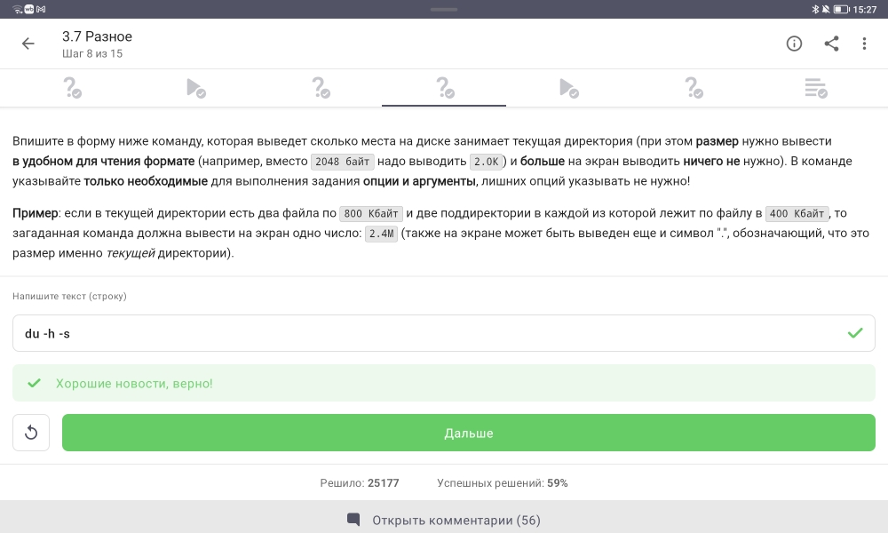{#fig-step3-22 width=70%}

**Задание:** Вывести размер текущей директории в удобном формате

### Прохождение теста

{#fig-step3-22-result width=70%}

### Пояснение по выполнению

**Правильная команда:** `du -h -s`

**Обоснование:**
- `du` (disk usage) — оценка использования дискового пространства
- `-h` (human-readable) — вывод в удобном формате (K, M, G)
- `-s` (summary) — вывод только общего размера, без разбиения по поддиректориям

## 23. Разное — создание нескольких директорий (mkdir)

### Формулировка задания

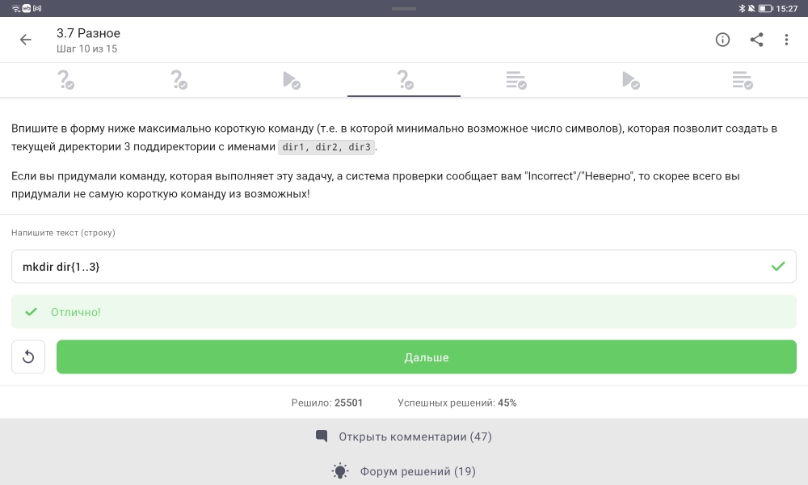{#fig-step3-23 width=70%}

**Задание:** Максимально короткая команда для создания трёх директорий

### Прохождение теста

{#fig-step3-23-result width=70%}

### Пояснение по выполнению

**Правильная команда:** `mkdir dir{1..3}`

**Обоснование:** Расширение фигурных скобок (brace expansion) в bash:
- `{1..3}` раскрывается в `1 2 3`
- `dir{1..3}` раскрывается в `dir1 dir2 dir3`
- `mkdir dir1 dir2 dir3` — эквивалентная, но более длинная запись

Это самый короткий способ создания нескольких директорий с числовыми суффиксами.

# Выводы

В ходе выполнения третьего этапа внешнего курса «Введение в Linux» были успешно освоены и закреплены на практике следующие навыки:

1. **Текстовый редактор vim:** выход из редактора, навигация по словам (`w` vs `W`), редактирование строк, глобальная замена текста.

2. **Bash-скрипты:**
   - История команд в дочерних оболочках (изолирована)
   - Влияние `cd` на создание файлов
   - Правила именования переменных
   - Циклы `for` с `continue`
   - Различие между `echo` и выполнением команд

3. **Продвинутый поиск:**
   - `find -name` vs `find -iname` (регистрозависимость)
   - `-path` vs `-name` (поиск по полному пути)
   - `-mindepth` и `-maxdepth` (ограничение глубины)
   - `grep` с контекстом (`-A`, `-B`, `-C`)
   - Регулярные выражения в `grep -E`
   - `sed` и опция `-n`

4. **Построение графиков в gnuplot:** опция `--persist`, `set key autotitle columnhead`, настройка осей (`set xtics`), анимация и вращение графиков.

5. **Дополнительные утилиты:**
   - `chmod` (числовой и буквенный методы)
   - `wc` (подсчёт строк, слов, символов)
   - `du -h -s` (размер директории)
   - `mkdir dir{1..3}` (brace expansion)

Все задания третьего этапа выполнены успешно, получены максимальные баллы. Полученные навыки являются основой для автоматизации задач администрирования и разработки в среде Linux.

# Список литературы{.unnumbered}

::: {#refs}
1. Stepik.org — Введение в Linux [Электронный ресурс]. URL: https://stepik.org/course/XXX
2. vim документация — режимы работы и основные команды
3. Bash руководство — переменные, циклы, условные операторы
4. `man find` — руководство по поиску файлов
5. `man grep` — руководство по поиску текста
6. `man sed` — руководство по потоковому редактору
7. Gnuplot документация — построение графиков и настройка осей
8. `man chmod`, `man wc`, `man du`, `man mkdir` — руководства по системным утилитам
:::
