---
## Author
author:
  name: Кулаженкова Яна Сергеевна
  group: НКАбд-03-25
  email: 1032253497@rudn.ru
  affiliation:
    - name: Российский университет дружбы народов
      country: Российская Федерация
      postal-code: 117198
      city: Москва
      address: ул. Миклухо-Маклая, д. 6

## Title
title: "Введение в Linux"
subtitle: "Отчёт по второму этапу прохождения внешнего курса"
license: CC BY
date: today
date-format: "YYYY-MM-DD"
---

# Информация

## Докладчик

* Кулаженкова Яна Сергеевна
* Студентка группы НКАбд-03-25
* Российский университет дружбы народов им. Патриса Лумумбы
* [1032253497@rudn.ru](mailto:1032253497@rudn.ru)

# Вводная часть

## Актуальность

- Удалённые серверы являются основой современной IT-инфраструктуры
- Навыки работы с серверами необходимы для:
  - администрирования
  - разработки и развертывания приложений
  - выполнения ресурсоёмких вычислений
  - обеспечения безопасности данных

## Объект и предмет исследования

- **Объект:** удалённые серверы и инструменты для работы с ними в Linux
- **Предмет:** базовые навыки удалённой работы:
  - знакомство с серверами и SSH-ключами
  - обмен файлами (scp, Filezilla)
  - управление процессами (jobs, fg, bg, kill)
  - многопоточные приложения
  - менеджер терминалов tmux

## Цели и задачи

**Цель:** освоение навыков работы с удалёнными серверами в Linux.

**Задачи:**
1. Изучить назначение удалённых серверов и принципы SSH-аутентификации
2. Освоить инструменты обмена файлами (scp, Filezilla)
3. Научиться управлять процессами в терминале
4. Изучить особенности многопоточных приложений
5. Приобрести навыки работы с терминальным мультиплексором tmux

## Материалы и методы

- Платформа: Stepik (онлайн-курс «Введение в Linux»)
- Инструменты:
  - SSH-клиент, ssh-keygen
  - scp, Filezilla
  - bash (jobs, fg, bg, kill, top, ps)
  - tmux
  - bowtie2, Clustal
- Формат представления: презентация Quarto (pdf/html)

# Выполнение заданий курса

## 2.1 Знакомство с сервером — назначение

{width=70%}

**Вопрос:** Для каких задач можно использовать удалённый сервер?

**Правильные ответы (все варианты):**
- Хранение конфиденциальных данных
- Хранение общедоступных данных
- Выполнение сложных вычислений
- Хранение больших объёмов данных

## Знакомство с сервером — пояснение

- Удалённый сервер — универсальный инструмент
- Применение зависит от потребностей пользователя:
  - безопасное хранение и доступ к данным
  - масштабируемые вычисления
  - централизованное управление ресурсами

## 2.1 Знакомство с сервером — SSH-ключи

{width=70%}

**Вопрос:** Какой ключ можно безопасно пересылать по интернету?

**Правильный ответ:** `id_rsa.pub`

## SSH-ключи — пояснение

| Ключ | Назначение | Можно передавать |
|------|------------|------------------|
| `id_rsa` | Приватный ключ | ❌ Никогда |
| `id_rsa.pub` | Публичный ключ | ✅ Да |

- Приватный ключ остаётся на локальной машине
- Публичный ключ размещается на сервере

## 2.2 Обмен файлами — копирование папки (scp)

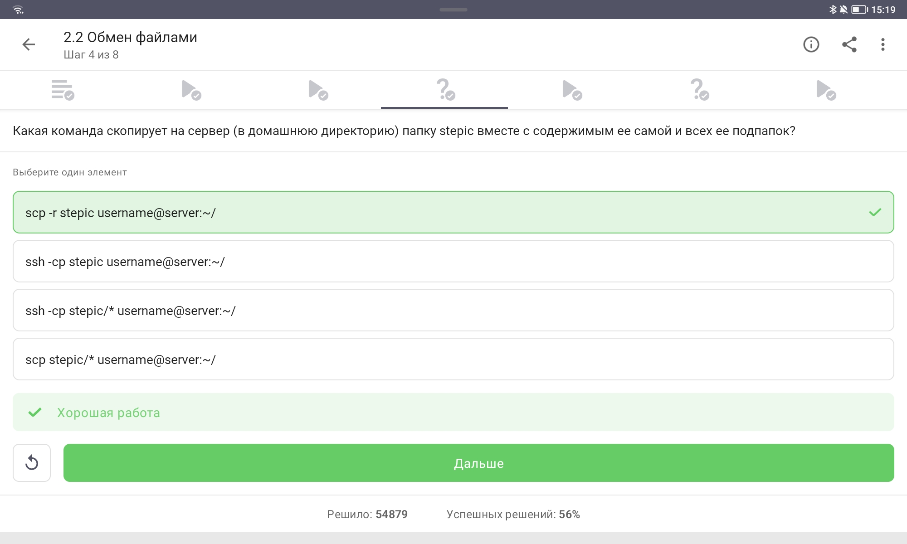{width=70%}

**Вопрос:** Команда для копирования папки `stepic` на сервер

**Правильный ответ:** `scp -r stepic username@server:~/`

## scp — пояснение

```bash
scp -r stepic username@server:~/
```

- `scp` — Secure Copy (копирование по SSH)
- `-r` — рекурсивно (включая подпапки)
- `stepic` — исходная папка
- `username@server:~/` — целевой сервер, домашняя директория

## 2.2 Обмен файлами — устранение проблем apt-get

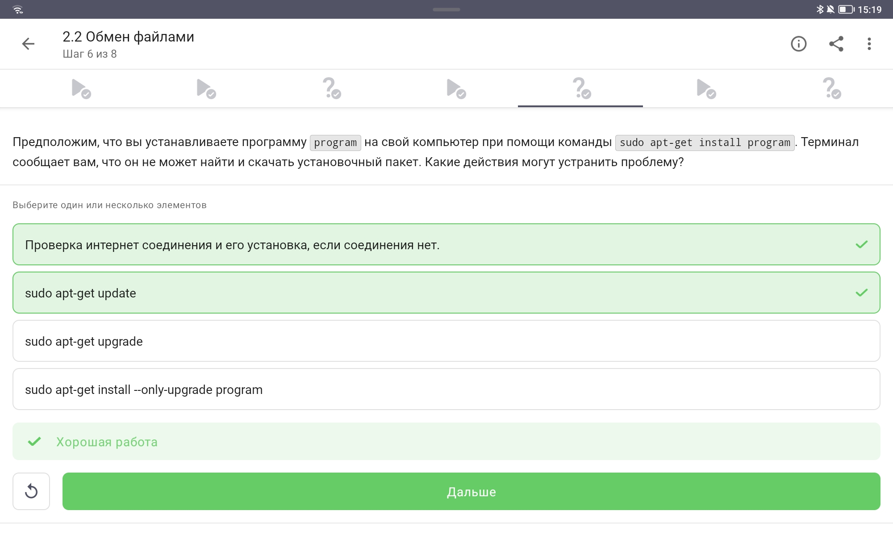{width=70%}

**Вопрос:** Действия при ошибке `apt-get install`

**Правильные ответы:**
- Проверка интернет-соединения
- `sudo apt-get update`

## apt-get — пояснение

```bash
# Обновление кэша пакетов
sudo apt-get update

# Установка пакета
sudo apt-get install program
```

- `update` — обновляет список доступных пакетов
- `upgrade` — обновляет установленные пакеты
- `--only-upgrade` — обновляет уже установленный пакет

## 2.2 Обмен файлами — назначение Filezilla

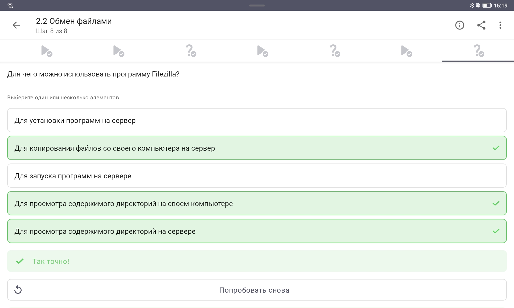{width=70%}

**Вопрос:** Для чего используется Filezilla?

**Правильные ответы:**
- Копирование файлов компьютер ↔ сервер
- Просмотр содержимого директорий на компьютере
- Просмотр содержимого директорий на сервере

## Filezilla — пояснение

- Filezilla — FTP/SFTP клиент
- **Что умеет:**
  - просмотр локальной файловой системы
  - просмотр удалённой файловой системы
  - передача файлов в обе стороны
- **Что не умеет:**
  - устанавливать программы
  - запускать программы на сервере

## 2.3 Запуск приложений — графические программы на сервере

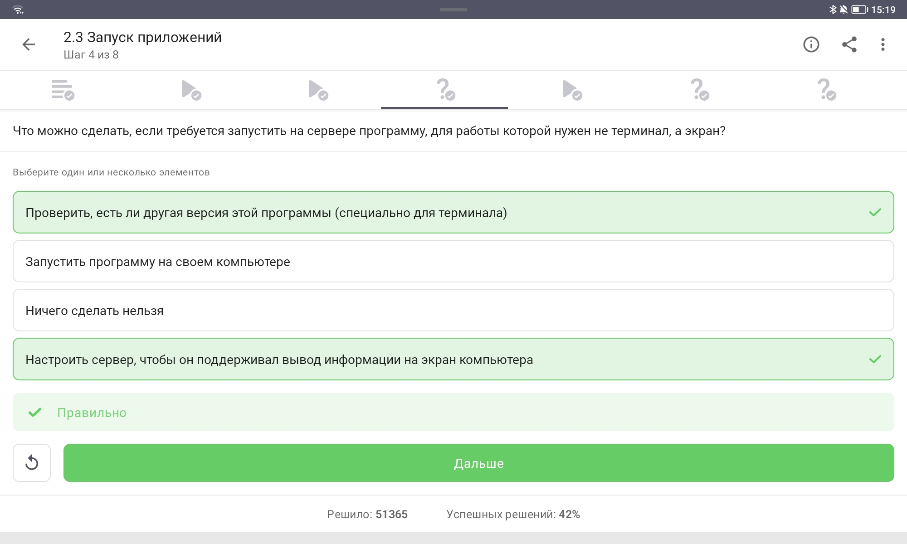{width=70%}

**Вопрос:** Что делать, если программе нужен экран?

**Правильные ответы:**
- Найти терминальную версию программы
- Настроить X11 forwarding

## Запуск приложений — пояснение

**Варианты решения:**

1. **Терминальная версия** — многие программы имеют консольный аналог
2. **X11 forwarding** — вывод графики на локальный компьютер:
   ```bash
   ssh -X username@server
   ```

## 2.3 Запуск приложений — вызов справки

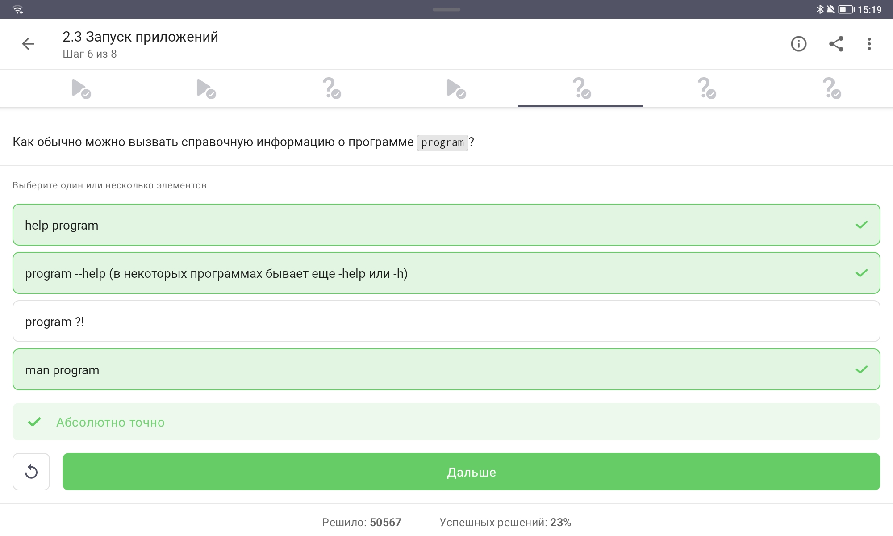{width=70%}

**Вопрос:** Как вызвать справочную информацию?

**Правильные ответы:**
- `program --help` (или `-h`)
- `man program`

## Справка — пояснение

```bash
# Краткая справка
program --help
program -h

# Полное руководство
man program
```

- `help program` — работает только для встроенных команд оболочки
- `man` — manual pages (стандарт в Unix-системах)

## 2.3 Запуск приложений — Clustal

{width=70%}

**Задание:** Команда для множественного выравнивания в Clustal

**Правильный ответ:** `clustalw -INFILE=test.fasta -ALIGN`

## Clustal — пояснение

```bash
clustalw -INFILE=test.fasta -ALIGN
```

- `-INFILE=test.fasta` — входной файл в формате FASTA
- `-ALIGN` — явное указание выполнить множественное выравнивание

## 2.4 Контроль программ — вывод jobs

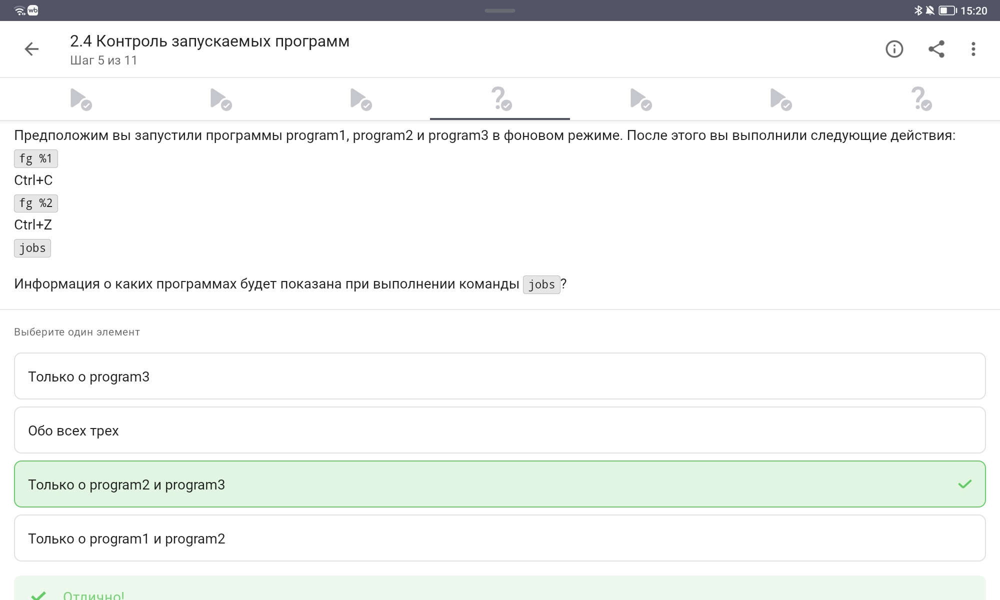{width=70%}

**Задание:** Какие программы покажет `jobs` после последовательности действий

**Правильный ответ:** Только о program2 и program3

## jobs — пояснение

| Действие | Результат |
|----------|-----------|
| `fg %1` | program1 на передний план |
| `Ctrl+C` | program1 завершена |
| `fg %2` | program2 на передний план |
| `Ctrl+Z` | program2 приостановлена |
| `jobs` | показывает program2 и program3 |

## 2.4 Контроль программ — идентификаторы

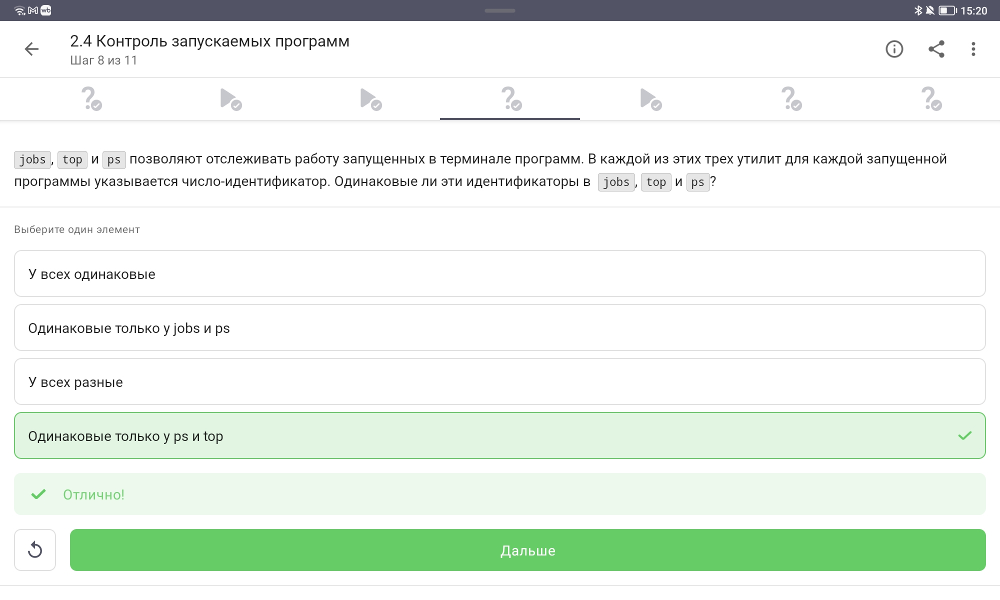{width=70%}

**Вопрос:** Одинаковые ли идентификаторы в jobs, top, ps?

**Правильный ответ:** У всех разные

## Идентификаторы — пояснение

| Команда | Тип идентификатора | Пример |
|---------|-------------------|--------|
| `jobs` | Номер задания (job ID) | 1, 2, 3 |
| `ps` | PID процесса | 12345 |
| `top` | PID процесса | 12345 |

- Номера заданий уникальны в рамках оболочки
- PID уникальны в рамках системы

## 2.4 Контроль программ — завершение процесса

{width=70%}

**Вопрос:** Команда для мгновенного завершения процесса

**Правильный ответ:** `kill -9`

## kill — пояснение

```bash
# Вежливый запрос на завершение
kill PID

# Принудительное немедленное завершение
kill -9 PID

# Продолжение остановленного процесса
kill -18 PID
```

- SIGTERM (15) — стандартный сигнал
- SIGKILL (9) — не может быть перехвачен процессом

## 2.5 Многопоточные приложения — CPU после остановки

{width=70%}

**Вопрос:** % CPU остановленного приложения

**Правильный ответ:** 0% CPU

## CPU остановленного процесса — пояснение

- `Ctrl+Z` отправляет сигнал SIGTSTP
- Процесс **не выполняется**
- Процессорное время не потребляется
- Данные сохраняются в памяти

## 2.5 Многопоточные приложения — память после остановки

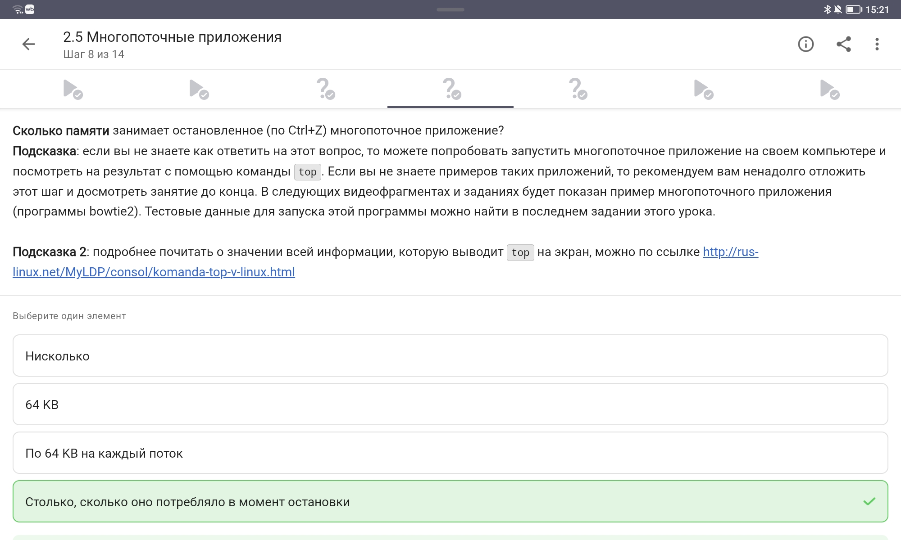{width=70%}

**Вопрос:** Сколько памяти занимает остановленное приложение?

**Правильный ответ:** Столько, сколько потребляло в момент остановки

## Память остановленного процесса — пояснение

- Память **не освобождается**
- Состояние процесса сохраняется
- Возможно возобновление работы (`fg`)

## 2.5 Многопоточные приложения — bowtie2

{width=70%}

**Вопрос:** Какие шаги bowtie2 можно выполнить в несколько потоков?

**Правильный ответ:** Только bowtie2

## bowtie2 — пояснение

| Подпрограмма | Назначение | Многопоточность |
|--------------|------------|-----------------|
| `bowtie2-build` | Построение индекса | ❌ Однопоточно |
| `bowtie2` | Выравнивание чтений | ✅ `-p N` потоков |

## 2.6 Менеджер терминалов tmux — переключение вкладок

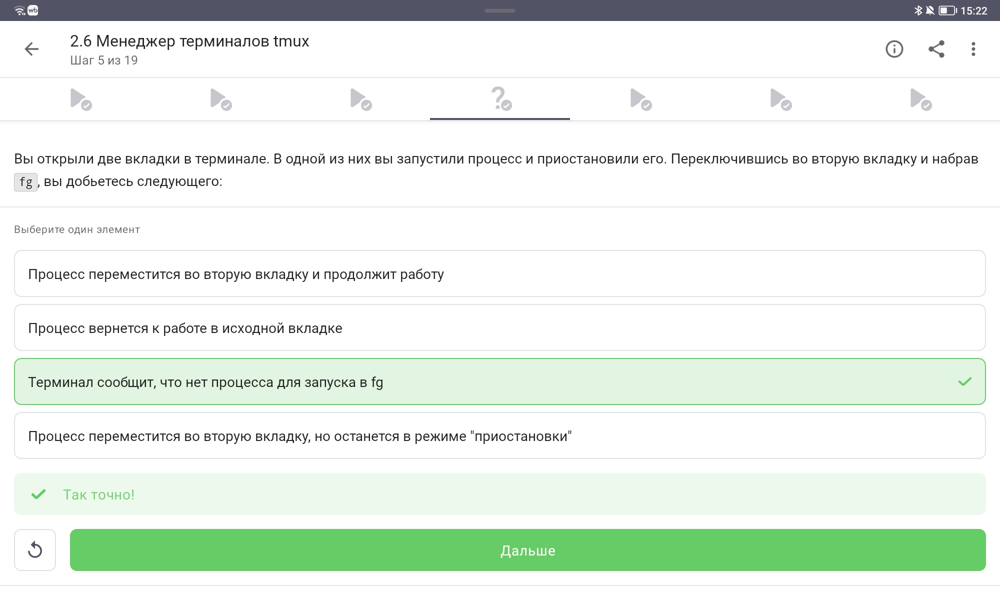{width=70%}

**Вопрос:** Что произойдёт при `fg` во второй вкладке?

**Правильный ответ:** Терминал сообщит, что нет процесса для запуска в fg

## tmux — управление процессами

- Каждая вкладка tmux — независимая оболочка
- `fg`, `bg`, `jobs` работают только в пределах **текущей вкладки**
- Процессы не перемещаются между вкладками

## 2.6 tmux — закрытие последней вкладки

{width=70%}

**Вопрос:** Что произойдёт при `exit` в последней вкладке?

**Правильный ответ:** tmux завершит работу

## tmux — жизненный цикл

- tmux не может существовать без окон
- При закрытии последнего окна сессия завершается

## 2.6 tmux — закрытие терминала на сервере

{width=70%}

**Вопрос:** Что произойдёт при закрытии терминала с tmux на сервере?

**Правильный ответ:** Соединение прервётся, но работа tmux продолжится

## tmux — ключевое преимущество

```bash
# Открыть сессию на сервере
tmux

# Отключиться от сессии (Ctrl+B, D)

# Закрыть терминал — tmux продолжает работу!

# Позже — подключиться снова
tmux attach
```

## 2.6 tmux — закрытие вкладки с фоновым процессом

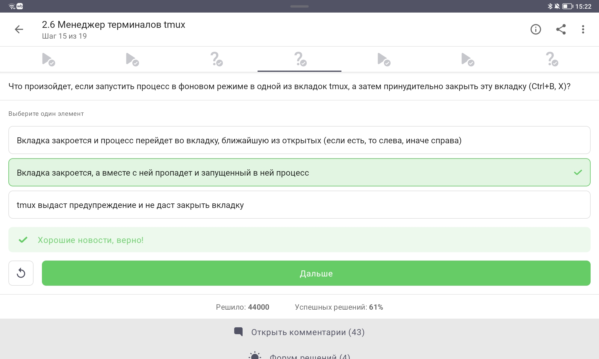{width=70%}

**Вопрос:** Что произойдёт при закрытии вкладки с фоновым процессом?

**Правильный ответ:** Вкладка закроется, процесс завершится

## tmux — завершение процессов

- При закрытии вкладки завершаются **все** процессы
- Неважно, foreground или background
- Нет автоматического перемещения процессов

## 2.6 tmux — переименование вкладки

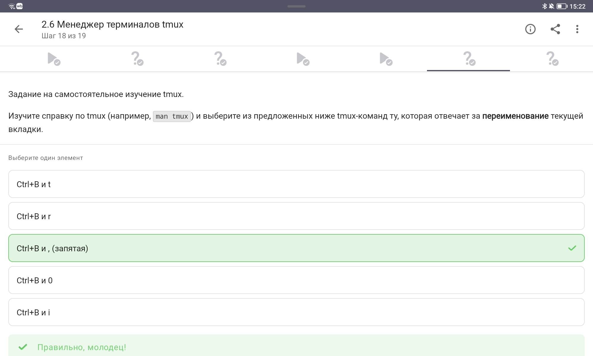{width=70%}

**Вопрос:** Комбинация для переименования текущей вкладки

**Правильный ответ:** `Ctrl+B` и `,` (запятая)

## tmux — основные комбинации

| Комбинация | Действие |
|------------|----------|
| `Ctrl+B` `,` | Переименовать окно |
| `Ctrl+B` `c` | Создать новое окно |
| `Ctrl+B` `n` | Следующее окно |
| `Ctrl+B` `p` | Предыдущее окно |
| `Ctrl+B` `d` | Отключиться от сессии |
| `Ctrl+B` `x` | Закрыть текущую панель |

# Результаты

## Итоги выполнения

- **Освоенные темы раздела 2:**
  - Знакомство с сервером (SSH-ключи)
  - Обмен файлами (scp, Filezilla, apt-get)
  - Запуск приложений (справка, Clustal)
  - Контроль программ (jobs, fg, bg, kill)
  - Многопоточные приложения (bowtie2, top)
  - Менеджер терминалов tmux

## Ключевые навыки

| Навык | Инструменты |
|-------|-------------|
| SSH-аутентификация | `ssh-keygen`, `id_rsa.pub` |
| Копирование файлов | `scp -r`, Filezilla |
| Управление пакетами | `sudo apt-get update` |
| Управление процессами | `jobs`, `fg`, `bg`, `kill -9` |
| Мониторинг | `top`, `ps` |
| Мультиплексор | `tmux` (`Ctrl+B`) |

# Заключение

## Итоговый слайд

**Основные результаты второго этапа:**

- Освоены принципы работы с удалёнными серверами
- Изучены инструменты обмена файлами (scp, Filezilla)
- Приобретены навыки управления процессами
- Изучены особенности многопоточных приложений
- Освоен терминальный мультиплексор tmux

**Следующий этап:** продвинутая работа в Linux (раздел 3 курса)
