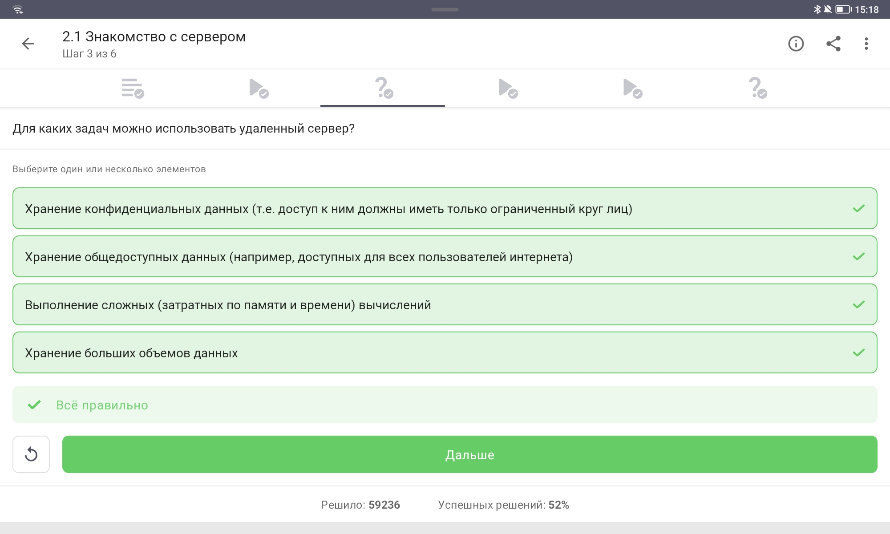
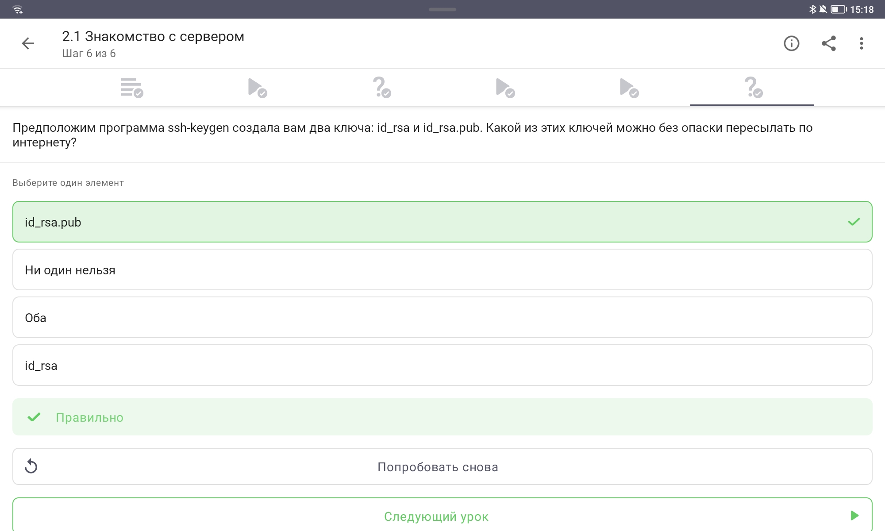
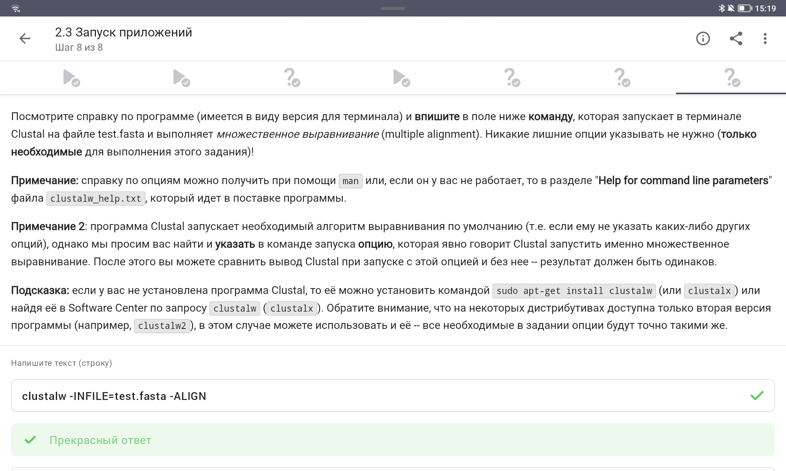
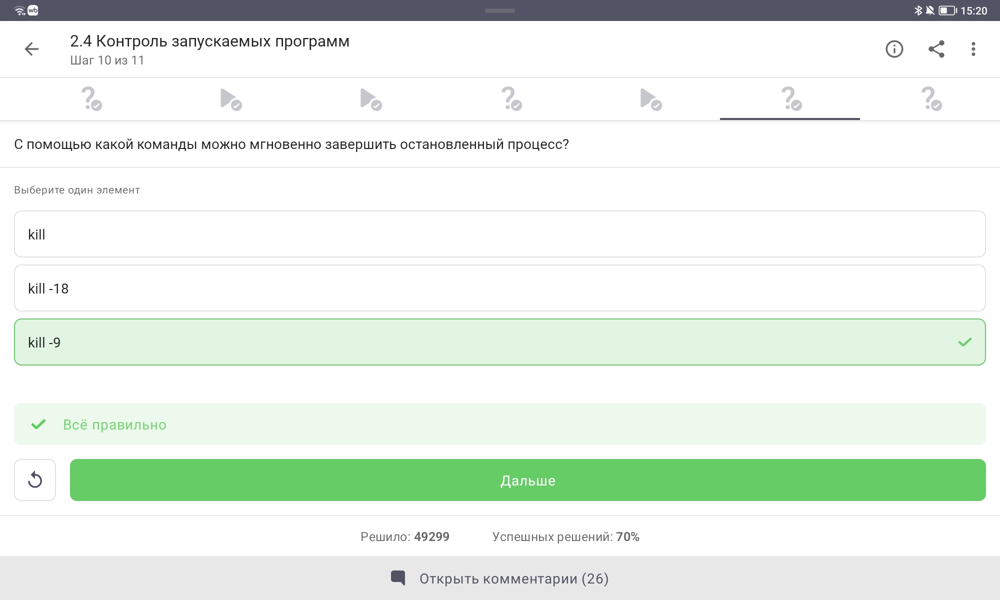
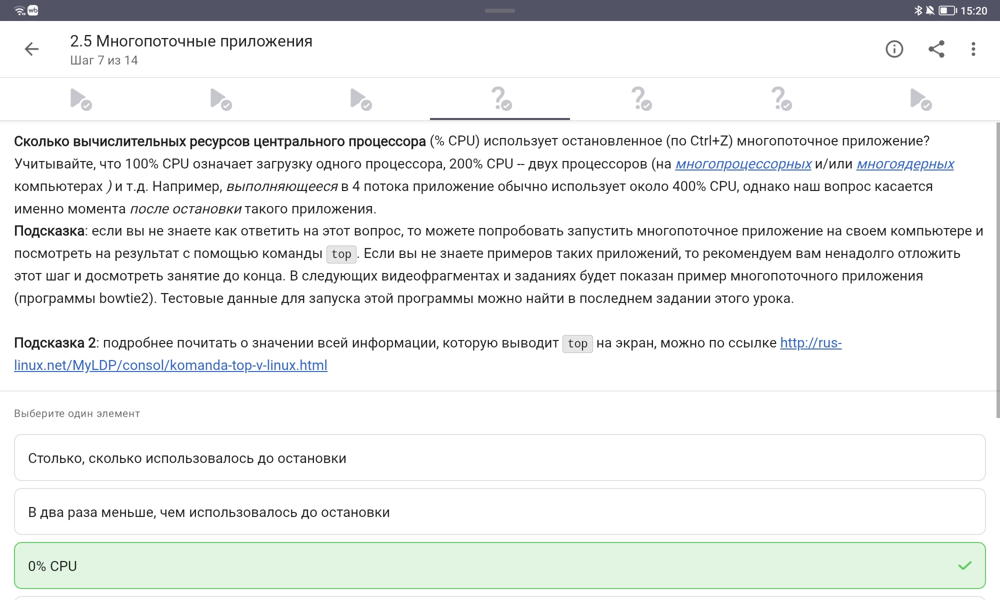
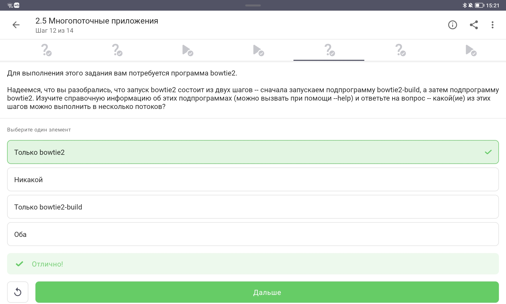
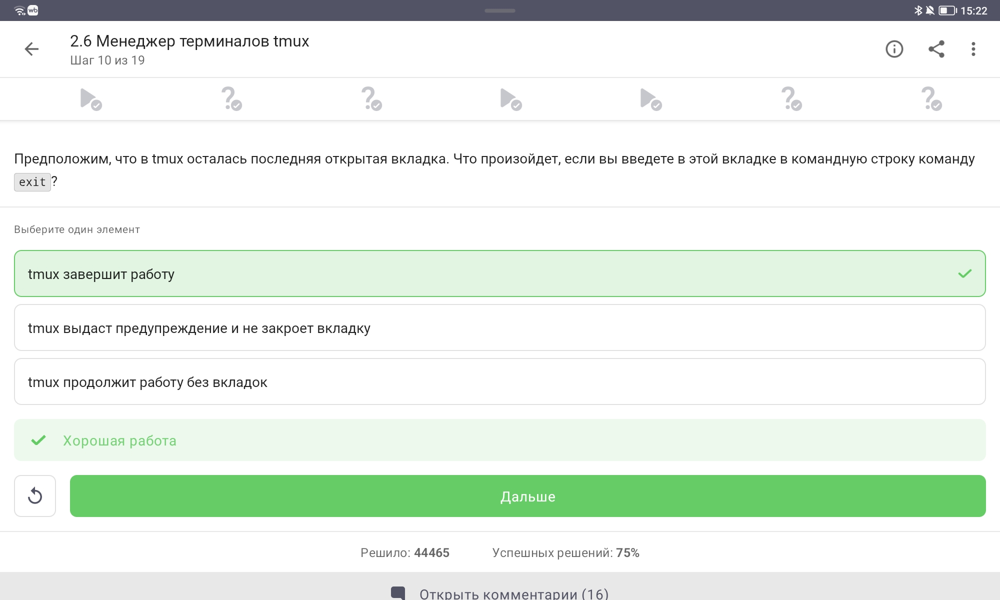
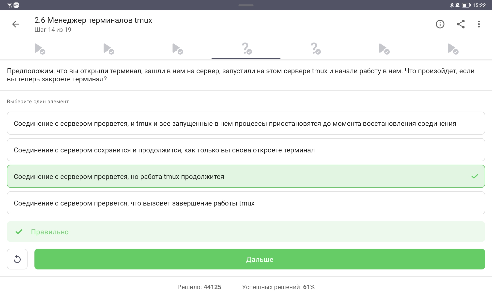

---
## Author
author:
  name: Кулаженкова Яна Сергеевна
  group: НКАбд-03-25
  email: 1032253497@rudn.ru
  affiliation:
    - name: Российский университет дружбы народов
      country: Российская Федерация
      postal-code: 117198
      city: Москва
      address: ул. Миклухо-Маклая, д. 6

## Title
title: "Отчёт по прохождению внешнего курса"
subtitle: "Введение в Linux (второй этап)"
license: "CC BY"
---

# Цель работы

Освоение навыков работы с удалёнными серверами, обмена файлами, управления процессами, работы с многопоточными приложениями и использования менеджера терминалов tmux в операционной системе Linux.

# Задание

В ходе второго этапа прохождения внешнего курса «Введение в Linux» на платформе Stepik были выполнены следующие темы:

1. Знакомство с сервером (назначение, SSH-ключи)
2. Обмен файлами (команда `scp`, `apt-get`, Filezilla)
3. Запуск приложений (справка `man`, `--help`, Clustal)
4. Контроль запускаемых программ (`jobs`, `fg`, `bg`, `kill`)
5. Многопоточные приложения (`top`, `bowtie2`)
6. Менеджер терминалов tmux

# Теоретическое введение

Linux — семейство Unix-подобных операционных систем. Ключевые понятия, используемые во втором этапе:

- **Удалённый сервер** — компьютер, предоставляющий ресурсы для удалённого доступа и выполнения задач.
- **SSH-ключи** — пара ключей (приватный `id_rsa` и публичный `id_rsa.pub`) для безопасного подключения к серверу.
- **SCP (Secure Copy Protocol)** — протокол для безопасного копирования файлов между компьютерами.
- **APT (Advanced Package Tool)** — система управления пакетами в Ubuntu.
- **Управление процессами** — `jobs` (список фоновых задач), `fg` (возврат на передний план), `bg` (запуск в фоне), `kill` (завершение процесса).
- **Многопоточные приложения** — программы, использующие несколько потоков для параллельных вычислений.
- **tmux** — терминальный мультиплексор, позволяющий управлять несколькими сессиями, окнами и панелями в одном терминале.

# Выполнение лабораторной работы

## 1. Знакомство с сервером — назначение удалённого сервера

### Формулировка задания

{#fig-step2-01 width=70%}

**Вопрос:** Для каких задач можно использовать удалённый сервер?

### Прохождение теста

{#fig-step2-01-result width=70%}

### Пояснение по выбору ответа

**Правильные ответы (все варианты):**
- Хранение конфиденциальных данных (доступ ограниченному кругу лиц)
- Хранение общедоступных данных (доступ для всех пользователей интернета)
- Выполнение сложных (затратных по памяти и времени) вычислений
- Хранение больших объемов данных

**Обоснование:** Удалённый сервер является универсальным инструментом, который может использоваться для любых задач, связанных с хранением данных, вычислениями и обеспечением доступа к информации. Все перечисленные варианты являются корректными сценариями использования удалённых серверов.

## 2. Знакомство с сервером — SSH-ключи

### Формулировка задания

{#fig-step2-02 width=70%}

**Вопрос:** Какой из ключей (`id_rsa` и `id_rsa.pub`) можно без опаски пересылать по интернету?

### Прохождение теста

{#fig-step2-02-result width=70%}

### Пояснение по выбору ответа

**Правильный ответ:** `id_rsa.pub`

**Обоснование:** SSH использует асимметричное шифрование:
- **Приватный ключ (`id_rsa`)** — должен храниться в секрете на локальной машине, никогда не передаваться по сети.
- **Публичный ключ (`id_rsa.pub`)** — можно свободно распространять; он размещается на сервере для аутентификации.

## 3. Обмен файлами — копирование папки на сервер

### Формулировка задания

{#fig-step2-03 width=70%}

**Вопрос:** Какая команда скопирует на сервер папку `stepic` вместе с содержимым и подпапками?

### Прохождение теста

{#fig-step2-03-result width=70%}

### Пояснение по выбору ответа

**Правильный ответ:** `scp -r stepic username@server:~/`

**Обоснование:** Команда `scp` (Secure Copy) используется для копирования файлов по SSH:
- `-r` — рекурсивное копирование (включает подпапки)
- `stepic` — исходная папка
- `username@server:~/` — целевой сервер и домашняя директория

Остальные варианты неверны: `ssh` не предназначен для копирования файлов, а `scp stepic/*` скопирует только содержимое без самой папки.

## 4. Обмен файлами — устранение проблем с apt-get

### Формулировка задания

{#fig-step2-04 width=70%}

**Вопрос:** Какие действия могут устранить проблему с установкой пакета?

### Прохождение теста

{#fig-step2-04-result width=70%}

### Пояснение по выбору ответа

**Правильные ответы:**
- Проверка интернет соединения
- `sudo apt-get update`

**Обоснование:** Если `apt-get install` не может найти пакет, причины могут быть:
1. Отсутствие интернет-соединения
2. Устаревший список пакетов (кэш) — `sudo apt-get update` обновляет информацию о доступных пакетах

`upgrade` обновляет установленные пакеты, `--only-upgrade` обновляет уже установленный пакет — эти команды не помогут при проблеме с поиском пакета.

## 5. Обмен файлами — назначение Filezilla

### Формулировка задания

{#fig-step2-05 width=70%}

**Вопрос:** Для чего можно использовать программу Filezilla?

### Прохождение теста

{#fig-step2-05-result width=70%}

### Пояснение по выбору ответа

**Правильные ответы:**
- Для копирования файлов со своего компьютера на сервер
- Для просмотра содержимого директорий на своем компьютере
- Для просмотра содержимого директорий на сервере

**Обоснование:** Filezilla — это FTP/SFTP клиент, предназначенный для:
- Просмотра файловой системы локального компьютера
- Просмотра файловой системы удалённого сервера
- Копирования файлов между локальным компьютером и сервером

Filezilla не предназначена для установки или запуска программ на сервере.

## 6. Запуск приложений — запуск графических программ на сервере

### Формулировка задания

{#fig-step2-06 width=70%}

**Вопрос:** Что можно сделать, если требуется запустить на сервере программу, для работы которой нужен не терминал, а экран?

### Прохождение теста

{#fig-step2-06-result width=70%}

### Пояснение по выбору ответа

**Правильные ответы:**
- Проверить, есть ли другая версия этой программы (специально для терминала)
- Настроить сервер, чтобы он поддерживал вывод информации на экран компьютера

**Обоснование:** Для графических приложений на сервере есть два подхода:
1. Найти терминальную (консольную) версию программы
2. Настроить X11 forwarding для вывода графики на локальный компьютер

Вариант «Ничего сделать нельзя» неверен — решения существуют. Запуск на своём компьютере не решает задачу работы на сервере.

## 7. Запуск приложений — вызов справочной информации

### Формулировка задания

{#fig-step2-07 width=70%}

**Вопрос:** Как обычно можно вызвать справочную информацию о программе `program`?

### Прохождение теста

{#fig-step2-07-result width=70%}

### Пояснение по выбору ответа

**Правильные ответы:**
- `program --help` (в некоторых программах `-help` или `-h`)
- `man program`

**Обоснование:** В Linux существуют стандартные способы получения справки:
- `man program` — полноценное руководство (manual page)
- `program --help` или `-h` — краткая справка о ключах запуска

Вариант `help program` работает только для встроенных команд оболочки, `program ?!` не является стандартным.

## 8. Запуск приложений — множественное выравнивание в Clustal

### Формулировка задания

{#fig-step2-08 width=70%}

**Задание:** Найти команду для запуска множественного выравнивания в Clustal на файле `test.fasta`.

### Прохождение задания

{#fig-step2-08-result width=70%}

### Пояснение по выполнению

**Правильный ответ:** `clustalw -INFILE=test.fasta -ALIGN`

**Обоснование:** ClustalW — программа для множественного выравнивания последовательностей:
- `-INFILE=test.fasta` — указывает входной файл в формате FASTA
- `-ALIGN` — явно указывает выполнение множественного выравнивания

## 9. Контроль запускаемых программ — вывод команды jobs

### Формулировка задания

{#fig-step2-09 width=70%}

**Задание:** Определить, какие программы будут показаны командой `jobs` после последовательности действий.

### Прохождение теста

{#fig-step2-09-result width=70%}

### Пояснение по выбору ответа

**Правильный ответ:** Только о program2 и program3

**Обоснование:** Анализ последовательности действий:
1. `fg %1` — program1 выводится на передний план
2. `Ctrl+C` — program1 завершается
3. `fg %2` — program2 выводится на передний план
4. `Ctrl+Z` — program2 приостанавливается (остаётся в jobs)
5. `jobs` — показывает приостановленные (program2) и фоновые (program3) задачи

Program1 завершена и не отображается в `jobs`.

## 10. Контроль запускаемых программ — идентификаторы в jobs, top, ps

### Формулировка задания

{#fig-step2-10 width=70%}

**Вопрос:** Одинаковые ли идентификаторы в `jobs`, `top` и `ps`?

### Прохождение теста

{#fig-step2-10-result width=70%}

### Пояснение по выбору ответа

**Правильный ответ:** У всех разные

**Обоснование:**
- `jobs` — показывает **номера заданий** в рамках текущей оболочки (1, 2, 3...)
- `ps` и `top` — показывают **PID (Process ID)** — системные идентификаторы процессов

Номера заданий `jobs` и PID — это разные идентификаторы.

## 11. Контроль запускаемых программ — завершение остановленного процесса

### Формулировка задания

{#fig-step2-11 width=70%}

**Вопрос:** С помощью какой команды можно мгновенно завершить остановленный процесс?

### Прохождение теста

{#fig-step2-11-result width=70%}

### Пояснение по выбору ответа

**Правильный ответ:** `kill -9`

**Обоснование:** Команда `kill` отправляет сигналы процессам:
- `kill` (без опций) — отправляет SIGTERM (15) — вежливый запрос на завершение
- `kill -9` — отправляет SIGKILL (9) — немедленное принудительное завершение
- `kill -18` — отправляет SIGCONT (18) — продолжение остановленного процесса

Для мгновенного принудительного завершения используется `kill -9`.

## 12. Многопоточные приложения — использование CPU остановленным приложением

### Формулировка задания

{#fig-step2-12 width=70%}

**Вопрос:** Сколько CPU использует остановленное (Ctrl+Z) многопоточное приложение?

### Прохождение теста

{#fig-step2-12-result width=70%}

### Пояснение по выбору ответа

**Правильный ответ:** `0% CPU`

**Обоснование:** При остановке процесса с помощью `Ctrl+Z` (сигнал SIGTSTP) процесс:
- Не выполняется (не потребляет процессорное время)
- Остаётся в памяти
- Может быть возобновлён командой `fg` или `bg`

Статистика CPU для остановленного процесса показывает 0%.

## 13. Многопоточные приложения — использование памяти остановленным приложением

### Формулировка задания

{#fig-step2-13 width=70%}

**Вопрос:** Сколько памяти занимает остановленное многопоточное приложение?

### Прохождение теста

{#fig-step2-13-result width=70%}

### Пояснение по выбору ответа

**Правильный ответ:** Столько, сколько оно потребляло в момент остановки

**Обоснование:** При остановке процесса (Ctrl+Z):
- Процесс не завершается
- Выделенная память не освобождается
- Данные сохраняются для возможности возобновления работы

Память продолжает заниматься в том же объёме, что и до остановки.

## 14. Многопоточные приложения — многопоточность в bowtie2

### Формулировка задания

{#fig-step2-14 width=70%}

**Вопрос:** Какой из шагов bowtie2 можно выполнить в несколько потоков?

### Прохождение теста

{#fig-step2-14-result width=70%}

### Пояснение по выбору ответа

**Правильный ответ:** Только bowtie2

**Обоснование:** Bowtie2 состоит из двух подпрограмм:
- `bowtie2-build` — построение индекса (выполняется однопоточно)
- `bowtie2` — выравнивание чтений (поддерживает многопоточность через опцию `-p`)

Самый ресурсоёмкий этап (выравнивание) может выполняться в несколько потоков.

## 15. Менеджер терминалов tmux — переключение между вкладками

### Формулировка задания

{#fig-step2-15 width=70%}

**Вопрос:** Что произойдёт при вводе `fg` во второй вкладке после приостановки процесса в первой?

### Прохождение теста

{#fig-step2-15-result width=70%}

### Пояснение по выбору ответа

**Правильный ответ:** Терминал сообщит, что нет процесса для запуска в fg

**Обоснование:** Управление заданиями (`fg`, `bg`, `jobs`) работает только в пределах текущей оболочки/сессии. При переключении вкладки tmux процесс остаётся привязан к исходной вкладке и не виден из другой вкладки.

## 16. Менеджер терминалов tmux — закрытие последней вкладки

### Формулировка задания

{#fig-step2-16 width=70%}

**Вопрос:** Что произойдёт, если ввести `exit` в последней открытой вкладке tmux?

### Прохождение теста

{#fig-step2-16-result width=70%}

### Пояснение по выбору ответа

**Правильный ответ:** tmux завершит работу

**Обоснование:** Когда в tmux закрывается последняя вкладка (окно), сессия tmux завершается. Это стандартное поведение — tmux не может существовать без окон.

## 17. Менеджер терминалов tmux — закрытие терминала с запущенным tmux на сервере

### Формулировка задания

{#fig-step2-17 width=70%}

**Вопрос:** Что произойдёт, если закрыть терминал после запуска tmux на сервере?

### Прохождение теста

{#fig-step2-17-result width=70%}

### Пояснение по выбору ответа

**Правильный ответ:** Соединение с сервером прервётся, но работа tmux продолжится

**Обоснование:** Это ключевое преимущество tmux:
- tmux работает на сервере независимо от терминального соединения
- При обрыве SSH-соединения tmux и все процессы продолжают работу
- Можно переподключиться к сессии командой `tmux attach`

## 18. Менеджер терминалов tmux — закрытие вкладки с фоновым процессом

### Формулировка задания

{#fig-step2-18 width=70%}

**Вопрос:** Что произойдёт, если закрыть вкладку tmux с запущенным в ней фоновым процессом?

### Прохождение теста

{#fig-step2-18-result width=70%}

### Пояснение по выбору ответа

**Правильный ответ:** Вкладка закроется, а вместе с ней пропадёт и запущенный в ней процесс

**Обоснование:** При закрытии вкладки tmux завершаются все процессы, запущенные в этой вкладке, независимо от того, находятся они в фоне или на переднем плане.

## 19. Менеджер терминалов tmux — переименование вкладки

### Формулировка задания

{#fig-step2-19 width=70%}

**Вопрос:** Какая команда отвечает за переименование текущей вкладки в tmux?

### Прохождение теста

{#fig-step2-19-result width=70%}

### Пояснение по выбору ответа

**Правильный ответ:** `Ctrl+B` и `,` (запятая)

**Обоснование:** Основные комбинации клавиш tmux (префикс `Ctrl+B`):
- `Ctrl+B` `,` — переименовать текущее окно
- `Ctrl+B` `t` — показать время
- `Ctrl+B` `r` — перезагрузить конфигурацию
- `Ctrl+B` `0-9` — переключиться на окно с указанным номером
- `Ctrl+B` `i` — информация о текущем окне

# Выводы

В ходе выполнения второго этапа внешнего курса «Введение в Linux» были успешно освоены и закреплены на практике следующие навыки:

1. **Работа с удалёнными серверами:** понимание назначения серверов, использование SSH-ключей (приватный и публичный), безопасное подключение.

2. **Обмен файлами:** использование команды `scp` с опцией `-r` для рекурсивного копирования, работа с `apt-get` (обновление кэша пакетов), использование Filezilla как SFTP-клиента.

3. **Запуск приложений:** получение справочной информации через `man` и `--help`, работа с Clustal для биоинформатических задач.

4. **Управление процессами:** использование `jobs`, `fg`, `bg`, `kill` (включая `kill -9` для принудительного завершения), понимание различий между номерами заданий и PID.

5. **Многопоточные приложения:** анализ использования CPU и памяти остановленными процессами, работа с bowtie2 и поддержкой многопоточности.

6. **Менеджер терминалов tmux:** создание сессий, управление вкладками, понимание поведения процессов при закрытии вкладок и обрыве соединения, переименование окон.

Общий прогресс по курсу на момент завершения второго этапа: **дальнейшее продвижение по разделам 2.1–2.6**. Все задания выполнены успешно, получены максимальные баллы.

# Список литературы{.unnumbered}

::: {#refs}
1. Stepik.org — Введение в Linux [Электронный ресурс]. URL: https://stepik.org/course/XXX
2. SSH key management — GitHub Docs [Электронный ресурс]. URL: https://docs.github.com/en/authentication/connecting-to-github-with-ssh
3. `man scp` — руководство по команде безопасного копирования
4. `man tmux` — руководство по терминальному мультиплексору
5. Документация ClustalW — множественное выравнивание последовательностей
6. Документация Bowtie2 — выравнивание ридов с поддержкой многопоточности
:::
