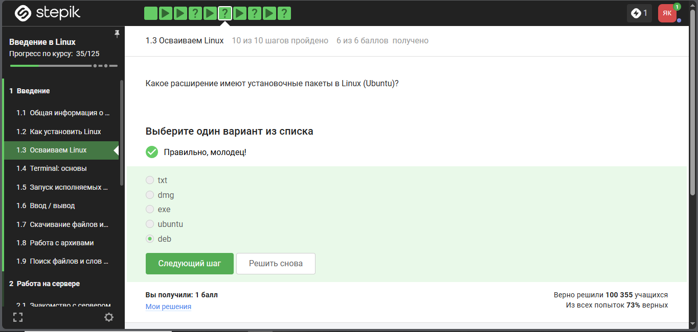
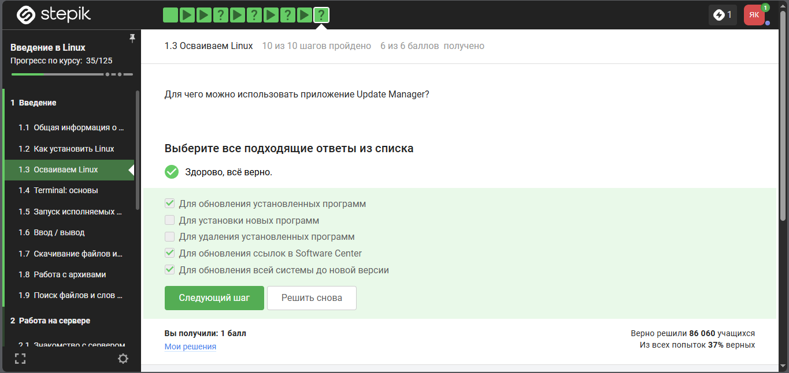
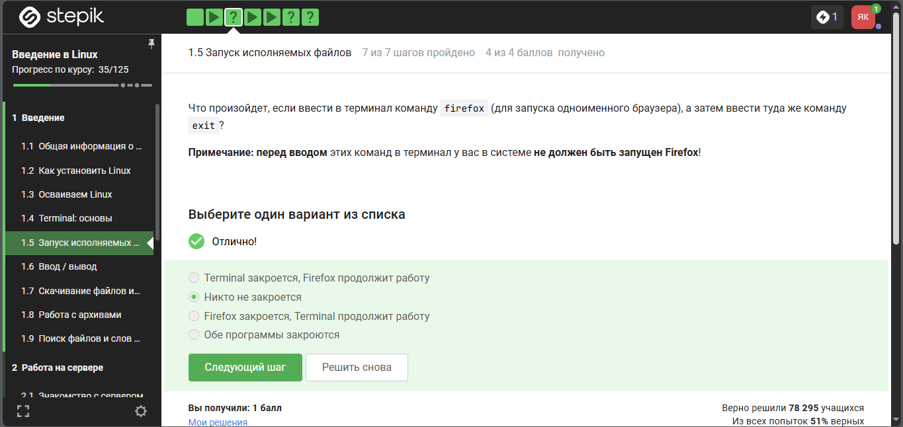
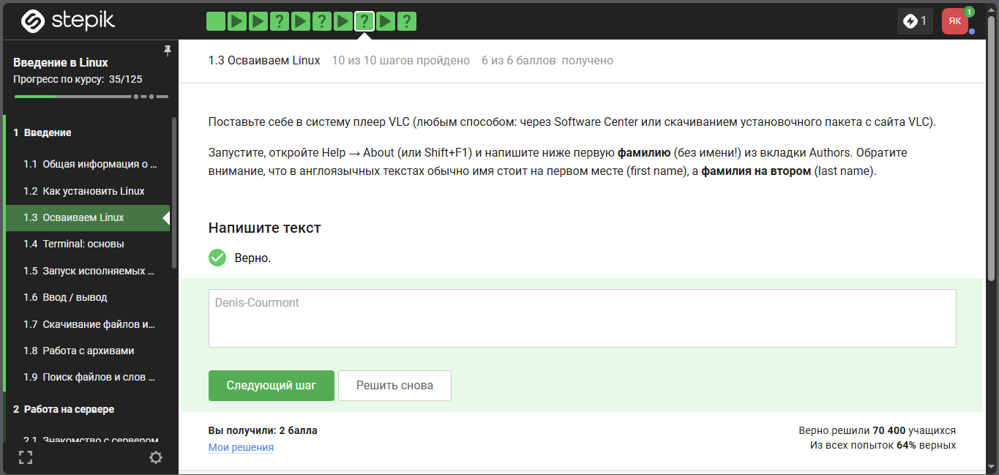
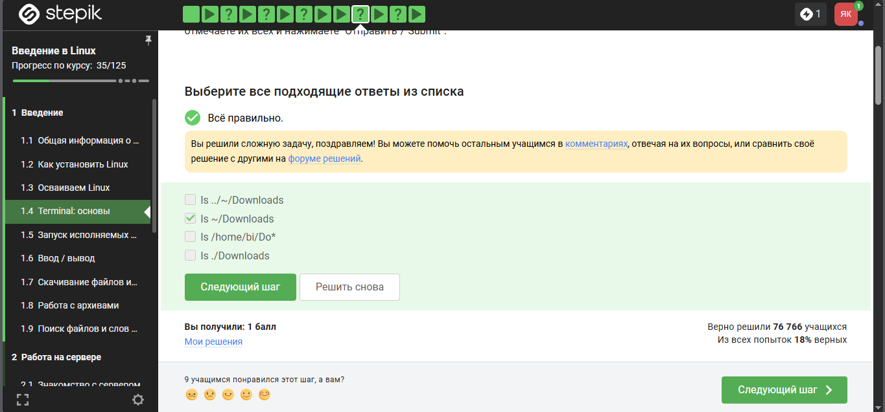
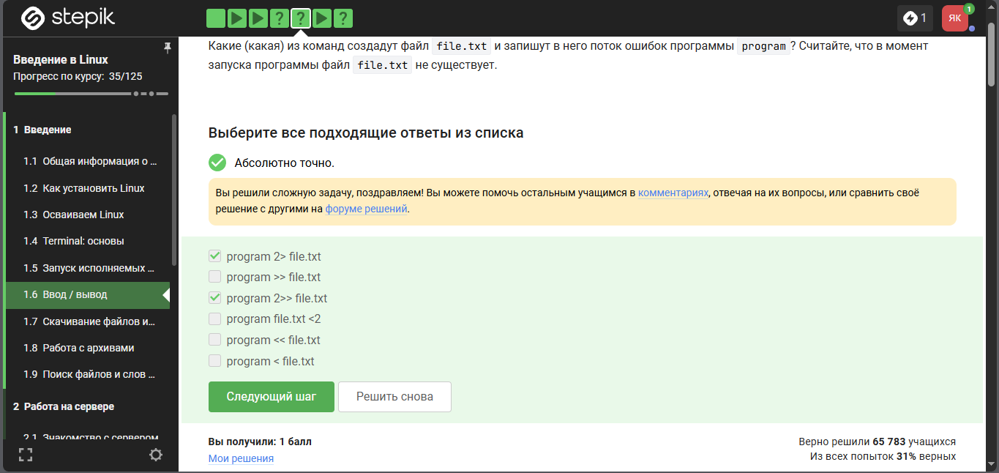

---
## Author
author:
  name: Кулаженкова Яна Сергеевна
  group: НКАбд-03-25
  email: 1032253497@rudn.ru
  affiliation:
    - name: Российский университет дружбы народов
      country: Российская Федерация
      postal-code: 117198
      city: Москва
      address: ул. Миклухо-Маклая, д. 6

## Title
title: "Введение в Linux"
subtitle: "Отчёт по первому этапу прохождения внешнего курса"
license: CC BY
date: today
date-format: "YYYY-MM-DD"
---

# Информация

## Докладчик

* Кулаженкова Яна Сергеевна
* Студентка группы НКАбд-03-25
* Российский университет дружбы народов им. Патриса Лумумбы
* [1032253497@rudn.ru](mailto:1032253497@rudn.ru)

# Вводная часть

## Актуальность

- Linux является одной из наиболее востребованных операционных систем в IT-индустрии
- Навыки работы с Linux необходимы для:
  - разработки программного обеспечения
  - администрирования серверов
  - работы с DevOps-инструментами
  - выполнения научных вычислений

## Объект и предмет исследования

- **Объект:** операционная система Linux (семейство Ubuntu)
- **Предмет:** базовые навыки работы в терминале Linux:
  - управление файлами и процессами
  - перенаправление ввода-вывода
  - работа с архивами
  - поиск информации в файлах

## Цели и задачи

**Цель:** освоение базовых навыков работы с операционной системой Linux.

**Задачи:**

1. Понять концепцию виртуальных машин
2. Изучить основы работы в терминале
3. Освоить перенаправление потоков ввода-вывода
4. Научиться работать с архиваторами
5. Приобрести навыки поиска файлов и строк в файлах

## Материалы и методы

- Платформа: Stepik (онлайн-курс «Введение в Linux»)
- Операционная система: Ubuntu Linux
- Инструменты:
  - терминал (bash)
  - архиваторы (gzip, zip)
  - утилиты поиска (grep)
- Формат представления: презентация Quarto (pdf/html)

# Выполнение заданий курса

## 1. Виртуальные машины

{width=70%}

**Вопрос:** Что такое виртуальная машина?

**Правильный ответ:** Специальная программа для запуска одной ОС на другой ОС

## Виртуальные машины — пояснение

- Виртуальная машина (VM) эмулирует аппаратное обеспечение компьютера
- Позволяет запускать гостевую ОС внутри хостовой
- Примеры: VirtualBox, VMware, QEMU
- Используется для тестирования, разработки, изоляции сред

## 2. Установочные пакеты Ubuntu

{width=70%}

**Вопрос:** Какое расширение имеют установочные пакеты в Linux (Ubuntu)?

**Правильный ответ:** `deb`

## Установочные пакеты — пояснение

- `.deb` — формат пакетов Debian и Ubuntu
- Управление пакетами: `apt`, `dpkg`
- Альтернативные форматы: `.rpm` (Red Hat, Fedora)
- В Windows используется `.exe`, в macOS — `.dmg`

## 3. Обновление программ — Update Manager

{width=70%}

**Вопрос:** Для чего можно использовать Update Manager?

**Правильные ответы:**

- Для обновления установленных программ
- Для обновления всей системы до новой версии

## Update Manager — пояснение

- Update Manager — графический инструмент для управления обновлениями
- Выполняет функции:
  - обновление существующих пакетов
  - обновление версии ОС (release upgrade)
- Не предназначен для установки или удаления программ (это задача Software Center / `apt`)

## 4. Запуск исполняемых файлов — Firefox

{width=70%}

**Вопрос:** Что произойдет после `firefox`, затем `exit`?

**Правильный ответ:** Никто не закроется

## Firefox и exit — пояснение

- Команда `firefox` запускает браузер как **фоновый процесс**
- Терминал не блокируется (или блокируется временно)
- `exit` закрывает только терминальную сессию
- Запущенные фоновые процессы продолжают работу

## 5. Плеер VLC — авторы

{width=70%}

**Задание:** Установить VLC, найти первую фамилию из вкладки Authors

**Правильный ответ:** `Denis-Courmont`

## VLC — пояснение

- VLC — кроссплатформенный медиаплеер с открытым исходным кодом
- Первая фамилия в списке авторов (английский порядок: имя → фамилия)
- Способ установки: Software Center или `sudo apt install vlc`
- Проверка: Help → About → Authors (или `Shift+F1`)

## 6. Навигация по файловой системе

{width=70%}

**Задание:** Выбрать корректные команды `ls` для просмотра Downloads

**Правильные ответы:**

- `ls ~/Downloads`
- `ls /home/bi/Do*`
- `ls ./Downloads`

## Навигация — пояснение

**Обозначения в Linux:**

- `~` — домашняя директория пользователя
- `./` — текущая директория
- `*` — маска (любое количество символов)

## 7. Перенаправление потока ошибок

{width=70%}

**Задание:** Выбрать команды, перенаправляющие поток ошибок

**Правильные ответы:**

- `program 2> file.txt`
- `program 2>> file.txt`

## Перенаправление потоков — пояснение

**Дескрипторы файлов в Unix:**

- `0` — stdin (стандартный ввод)
- `1` — stdout (стандартный вывод)
- `2` — stderr (стандартный вывод ошибок)

**Операторы:**

- `>` — перенаправление с перезаписью
- `>>` — перенаправление с добавлением в конец

## 8. Архиваторы gzip и zip

{width=70%}

**Вопрос:** Чем отличаются gzip и zip?

**Правильный ответ:** `gzip удаляет архив после его распаковки`

## gzip vs zip — пояснение

| Характеристика | gzip | zip |
|----------------|------|-----|
| Удаление архива после распаковки | Да | Нет |
| Работа с группой файлов | Требует tar | Да |
| Тип | Однопоточный | Мультиархив |
| Расширение | `.gz` | `.zip` |

## 9. Поиск строк в файлах — grep

{width=70%}

**Задание:** Найти все строки с "love" в произведениях Шекспира

**Результат:** строки из произведений, содержащие слово "love"

## Поиск с grep — пояснение

**Выполненные команды:**

```bash
# Распаковка архива
unzip shakespeare.zip

# Поиск и сохранение результата
grep "love" *.txt > love_lines.txt
```

**Результат (фрагмент):**

```
Whom whilst I laboured of a love to see,
LUCIANA. Ere I learn love, I'll practise to obey.
Would that alone a love he would detain,
...
```

# Результаты

## Итоги выполнения

- **Пройдено шагов:** 35 из 125
- **Получено баллов:** максимальное количество по каждому заданию
- **Освоенные темы:**
  - Виртуальные машины
  - Установка пакетов (`.deb`, Update Manager)
  - Навигация в терминале (команда `ls`)
  - Запуск и управление процессами
  - Перенаправление ввода-вывода (`>`, `>>`, `2>`)
  - Архивация (`gzip`, `zip`)
  - Поиск строк (`grep`)

## Ключевые навыки

| Навык | Освоенные команды/понятия |
|-------|---------------------------|
| Навигация | `ls`, `~`, `./`, маски |
| Управление процессами | фоновый запуск, `exit` |
| Перенаправление | `>`, `>>`, `2>`, `2>>` |
| Архивация | `gzip`, `gunzip`, `zip`, `unzip` |
| Поиск | `grep`, перенаправление вывода |

# Заключение

## Итоговый слайд

**Основные результаты первого этапа:**

- Освоены базовые навыки работы с Linux
- Закреплена теория на практических заданиях
- Получены максимальные баллы по всем темам
- Сформирована основа для дальнейшего изучения курса

**Следующий этап:** работа на сервере (раздел 2 курса)
