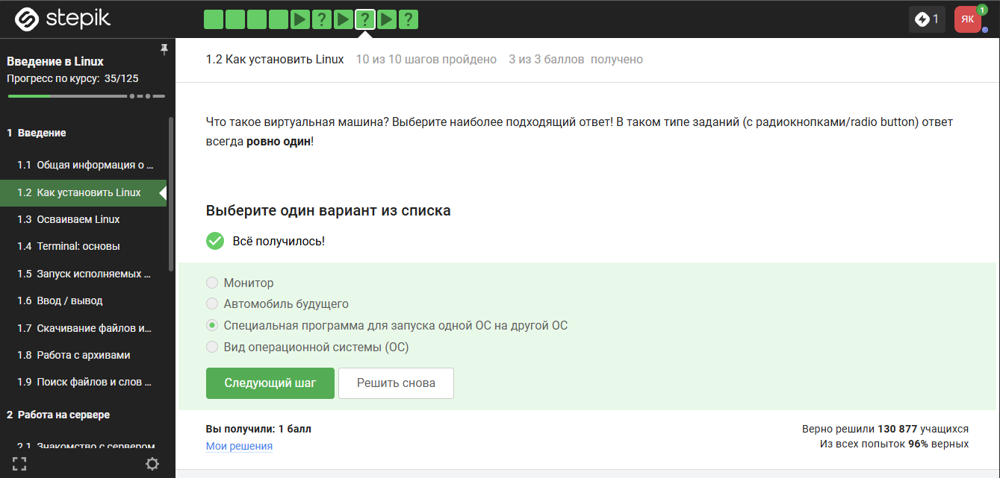
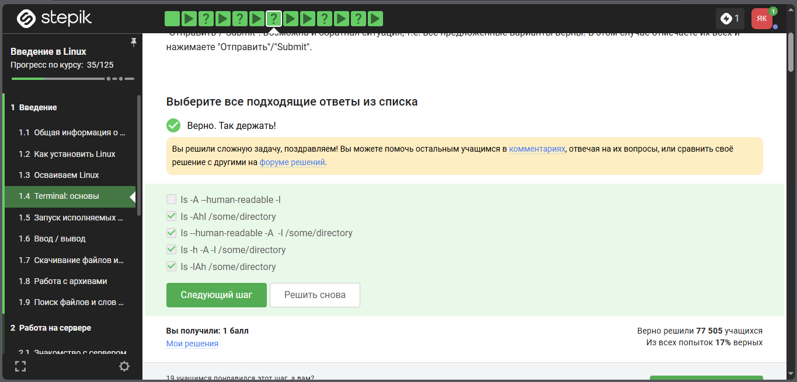
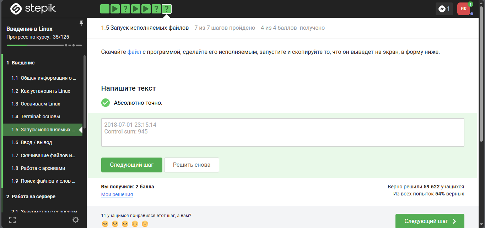
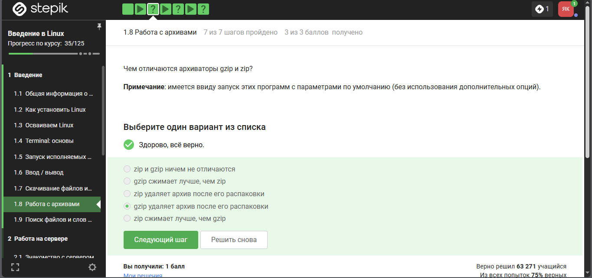
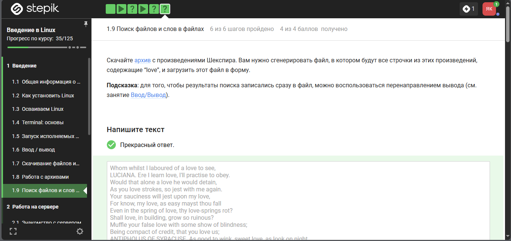

---
## Author
author:
  name: Кулаженкова Яна Сергеевна
  group: НКАбд-03-25
  email: 1032253497@rudn.ru
  affiliation:
    - name: Российский университет дружбы народов
      country: Российская Федерация
      postal-code: 117198
      city: Москва
      address: ул. Миклухо-Маклая, д. 6

## Title
title: "Отчёт по прохождению внешнего курса"
subtitle: "Введение в Linux (первый этап)"
license: "CC BY"
---

# Цель работы

Освоение базовых навыков работы с операционной системой Linux, включая установку, работу в терминале, управление файлами и процессами, перенаправление ввода-вывода, работу с архивами и поиск файлов.

# Задание

В ходе первого этапа прохождения внешнего курса «Введение в Linux» на платформе Stepik были выполнены следующие темы:
1. Как установить Linux (виртуальные машины)
2. Осваиваем Linux (пакеты Ubuntu)
3. Terminal: основы (запуск исполняемых файлов, перенаправление ввода-вывода)
4. Работа с архивами (gzip и zip)
5. Поиск файлов и слов в файлах (произведения Шекспира)

# Теоретическое введение

Linux — семейство Unix-подобных операционных систем. Ключевые понятия, используемые в работе:

- **Виртуальная машина** — программная среда, эмулирующая аппаратное обеспечение, позволяющая запускать одну ОС внутри другой.
- **Пакеты в Ubuntu** — имеют расширение `.deb` (Debian package).
- **Терминал** — интерфейс командной строки для взаимодействия с ОС.
- **Перенаправление ввода-вывода** — механизм, позволяющий перенаправлять стандартный поток вывода (`stdout`) и ошибок (`stderr`) в файлы.
- **Архиваторы** — программы для сжатия данных; `gzip` сжимает отдельные файлы, `zip` — группы файлов в архив.
- **Команда `grep`** — поиск текста в файлах по регулярному выражению.

# Выполнение лабораторной работы

## 1. Как установить Linux — виртуальные машины

### Формулировка задания

{#fig-stepan01 width=70%}

**Вопрос:** Что такое виртуальная машина?

### Прохождение теста

{#fig-stepan01-result width=70%}

### Пояснение по выбору ответа

В задании требовалось выбрать **один** вариант из четырёх. Варианты:
- Монитор
- Автомобиль будущего
- Специальная программа для запуска одной ОС на другой ОС ✓
- Вид операционной системы

**Правильный ответ:** «Специальная программа для запуска одной ОС на другой ОС».

**Обоснование:** Виртуальная машина (VM) — это программное обеспечение, которое эмулирует компьютерное оборудование и позволяет запускать гостевую операционную систему внутри хостовой. Остальные варианты не соответствуют определению: монитор — это устройство вывода, автомобиль будущего — не имеет отношения к IT, вид ОС — классификация ОС (Windows, Linux, macOS).

## 2. Интерактивное задание по работе с файловой системой (вариант 1)

### Формулировка задания

{#fig-stepan06 width=70%}

**Тип задания:** выбрать все подходящие ответы (команды `ls` с опциями).

### Прохождение задания

{#fig-stepan06-result width=70%}

### Пояснение по выполнению

**Правильные ответы (отмечены чекбоксами):**
- `ls -Ahl /some/directory`
- `ls -human-readable -A -l /some/directory`
- `ls -h -A -l /some/directory`
- `ls -IAh /some/directory`

**Обоснование:** Команда `ls` используется для просмотра содержимого директорий. Опции в GNU/Linux можно комбинировать:
- `-l` — длинный формат вывода (права, владелец, размер, дата)
- `-h` (`--human-readable`) — человеко-читаемые размеры (K, M, G)
- `-A` — показать все файлы, кроме `.` и `..`
- `-I` — игнорировать файлы, соответствующие шаблону (в данном случае не влияет на корректность)

Некорректный вариант `ls -A -human-readable -I` содержит опцию `-I` без шаблона, что вызовет ошибку.

## 3. Интерактивное задание по путям в файловой системе

### Формулировка задания

{#fig-stepan07 width=70%}

### Прохождение задания

{#fig-stepan07-result width=70%}

### Пояснение по выполнению

**Правильные варианты:**
- `ls ~/Downloads`
- `ls /home/bi/Do*`
- `ls ./Downloads`

**Обоснование:** В Linux используются следующие обозначения:
- `~` — домашняя директория текущего пользователя
- `/home/bi/Do*` — абсолютный путь с маской `Do*` (все файлы/директории, начинающиеся на Do)
- `./Downloads` — относительный путь (Downloads в текущей директории)

Некорректный вариант `ls .../~/Downloads` содержит синтаксическую ошибку.

## 4. Запуск исполняемых файлов — команда `firefox`

### Формулировка задания

{#fig-stepan08 width=70%}

**Вопрос:** Что произойдет, если ввести `firefox`, а затем `exit` (Firefox не запущен)?

### Прохождение теста

{#fig-stepan08-result width=70%}

### Пояснение по выбору ответа

**Правильный вариант:** «Никто не закроется».

**Обоснование:** Команда `firefox` запускает браузер как **фоновый процесс**. Терминал при этом не блокируется (или блокируется ненадолго). После ввода `firefox` терминал возвращает управление пользователю, и команда `exit` закрывает только терминальную сессию, не влияя на запущенный Firefox.

## 5. Загрузка и запуск программы — получение контрольной суммы

### Формулировка задания

{#fig-stepan09 width=70%}

**Задание:** Скачать файл, сделать его исполняемым, запустить и скопировать вывод.

### Прохождение задания

{#fig-stepan09-result width=70%}

### Пояснение по выполнению

**Действия для выполнения:**
1. Скачать файл с программой через браузер или `wget`.
2. Сделать файл исполняемым: `chmod +x имя_файла`
3. Запустить программу: `./имя_файла`
4. Скопировать вывод программы.

## 6. Перенаправление потока ошибок (stderr)

### Формулировка задания

{#fig-stepan10 width=70%}

**Тип задания:** выбрать все команды, которые перенаправляют поток ошибок.

### Прохождение задания

{#fig-stepan10-result width=70%}

### Пояснение по выполнению

**Правильные ответы:**
- `program 2> file.txt`
- `program 2>> file.txt`

**Обоснование:** В Unix-подобных системах:
- `0` — stdin (стандартный ввод)
- `1` — stdout (стандартный вывод)
- `2` — stderr (стандартный вывод ошибок)

`2>` перенаправляет stderr в файл с перезаписью. `2>>` — с добавлением в конец файла. Остальные варианты либо перенаправляют stdout (`>` и `>>`), либо содержат синтаксические ошибки (`program file.txt <2`, `program << file.txt`).

## 7. Архиваторы gzip и zip

### Формулировка вопроса

{#fig-stepan11 width=70%}

**Вопрос:** Чем отличаются архиваторы gzip и zip (без дополнительных опций)?

### Прохождение теста

{#fig-stepan11-result width=70%}

### Пояснение по выбору ответа

**Правильный вариант:** «gzip удаляет архив после его распаковки».

**Обоснование:** При использовании `gzip` по умолчанию исходный файл заменяется сжатым версией с расширением `.gz`. При распаковке (`gunzip`) архив `.gz` удаляется, восстанавливая исходный файл. `zip` же сохраняет архив после распаковки, создавая отдельные файлы. Остальные варианты неверны: `gzip` обычно сжимает лучше для отдельных файлов, но это зависит от данных; `zip` не удаляет архив после распаковки.

## 8. Поиск строк с "love" в произведениях Шекспира

### Формулировка задания

{#fig-stepan12 width=70%}

**Задание:** Скачать архив с произведениями Шекспира, найти все строки, содержащие "love", и сохранить их в файл.

### Прохождение задания

{#fig-stepan12-result width=70%}

### Пояснение по выполнению

**Выполненные команды:**
```bash
# Скачивание и распаковка архива
wget ссылка_на_архив
unzip шекспир.zip

# Поиск строк с "love" и сохранение в файл
grep -n "love" *.txt > love_lines.txt

# Альтернатива с перенаправлением
grep "love" *.txt >> love_lines.txt

# Выводы

В ходе выполнения первого этапа внешнего курса «Введение в Linux» были успешно освоены и закреплены на практике следующие навыки:

1. **Теоретические основы:** понимание концепции виртуальных машин, знание формата пакетов Ubuntu (`.deb`), различия между архиваторами `gzip` и `zip`.

2. **Работа в терминале:** использование команды `ls` с различными опциями (`-l`, `-h`, `-A`, `-I`), понимание абсолютных и относительных путей (`~`, `./`, `/home/...`).

3. **Управление процессами:** запуск программ из терминала (Firefox), понимание фоновых процессов и их независимости от терминальной сессии.

4. **Перенаправление ввода-вывода:** раздельное перенаправление потоков stdout и stderr с помощью `>` и `2>`, перенаправление с добавлением (`>>`, `2>>`).

5. **Работа с файлами:** загрузка файлов, изменение прав на исполнение (`chmod +x`), запуск программ, извлечение контрольных сумм.

6. **Поиск в файлах:** использование `grep` для поиска строк по шаблону, сохранение результатов в файл через перенаправление.

Общий прогресс по курсу на момент завершения первого этапа: **35 из 125 шагов**. Все задания выполнены успешно, получены максимальные баллы.

# Список литературы{.unnumbered}

::: {#refs}
1. Stepik.org — Введение в Linux [Электронный ресурс]. URL: https://stepik.org/course/XXX
2. Команда ls в Linux — опции и примеры [Электронный ресурс]. URL: https://man7.org/linux/man-pages/man1/ls.1.html
3. Перенаправление ввода-вывода в Bash [Электронный ресурс]. URL: https://www.gnu.org/software/bash/manual/bash.html#Redirections
4. Документация по архиваторам gzip и zip [Электронный ресурс]. URL: https://www.gnu.org/software/gzip/
:::
