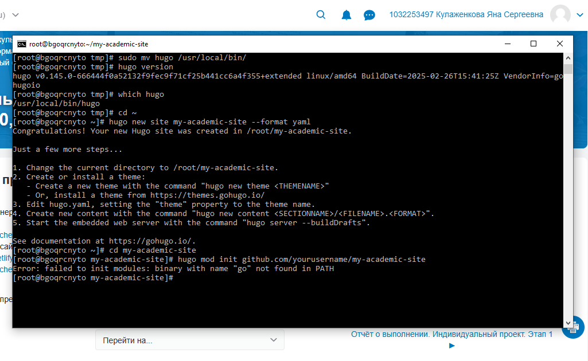
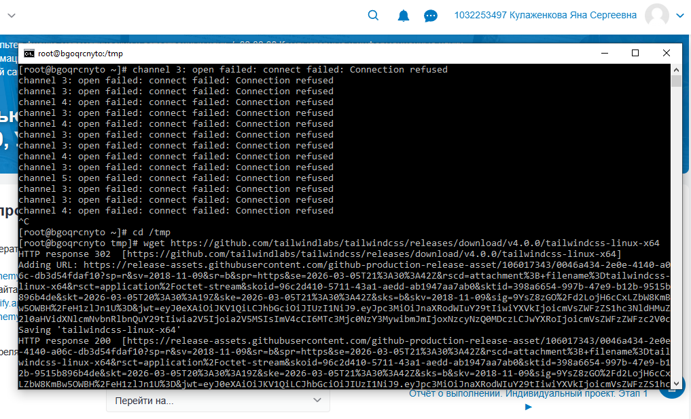

---
## Author
author:
  name: Кулаженкова Яна Сергеевна
  degrees: DSc
  orcid: 0000-0002-0877-7063
  email: kulyabov-ds@rudn.ru
  affiliation:
    - name: Российский университет дружбы народов
      country: Российская Федерация
      postal-code: 117198
      city: Москва
      address: ул. Миклухо-Маклая, д. 6
## Title
title: Развёртывание академического сайта
subtitle: Индивидульаный проект
license: CC BY
date: today
date-format: "YYYY-MM-DD"

---

# Вводная часть

## Актуальность

- Генераторы статических сайтов (Hugo) позволяют создавать быстрые, безопасные и легко развертываемые веб-сайты
- Академические темы (Wowchemy/Academic) предоставляют готовую структуру для публикации научных результатов, резюме и блога
- Размещение на GitHub Pages обеспечивает бесплатный хостинг и интеграцию с системой контроля версий
- Персональный академический сайт становится цифровым портфолио исследователя

## Объект и предмет исследования

- **Объект:** Генератор статических сайтов Hugo Extended и тема Wowchemy Academic
- **Предмет:** Процесс установки, настройки и развертывания персонального академического сайта на платформе GitHub Pages

## Цели и задачи

- Установить и настроить генератор статических сайтов Hugo Extended
- Установить Golang для работы с Hugo модулями
- Создать базовую структуру Hugo-сайта
- Настроить локальный сервер для разработки
- Подготовить репозиторий для размещения сайта на GitHub Pages
- Диагностировать и решить возникающие проблемы

## Материалы и методы

- **Аппаратная платформа:** x86_64 (сервер под управлением Fedora 41)
- **Программное обеспечение:**
  - Hugo Extended v0.145.0
  - Golang 1.24.10
  - Git
  - GitHub Pages для хостинга
  - Tailwind CSS для кастомизации

# Ход работы

## Установка Hugo Extended

- Первоначальная попытка установки через пакетный менеджер DNF завершилась неудачей — пакет `hugo-extended` отсутствует в репозиториях Fedora 41

  {#fig:001 width=70%}

- Выполнена прямая загрузка бинарного архива с официального GitHub-репозитория Hugo
- Архив `hugo_extended_0.145.0_linux-amd64.tar.gz` успешно загружен в директорию `/tmp`

## Проверка установки Hugo

- Бинарный файл перемещен в системную директорию `/usr/local/bin/`
- Выполнена проверка версии: `hugo version`

  {#fig:002 width=70%}

- **Результат:** Установлена Hugo Extended версии v0.145.0 (подтверждено наличием метки `+extended`)
- Команда `which hugo` показывает корректный путь `/usr/local/bin/hugo`

## Создание структуры сайта

- Создан новый Hugo-сайт с именем `my-academic-site` и форматом конфигурации YAML

  ```bash
  hugo new site my-academic-site --format yaml
  ```

  {#fig:003 width=70%}

- Сгенерирована базовая директория сайта с необходимой структурой папок:
  - `archetypes/` — шаблоны контента
  - `content/` — содержимое сайта
  - `layouts/` — пользовательские шаблоны
  - `static/` — статические файлы
  - `hugo.yaml` — основной конфигурационный файл

## Установка Golang

- При попытке инициализации Hugo модуля возникла ошибка отсутствия Go в системе

  {#fig:004 width=70%}

- Выполнена установка Golang через пакетный менеджер DNF:

  ```bash
  sudo dnf install golang -y
  ```

  {#fig:005 width=70%}

- Установлены все необходимые зависимости: `go-filesystem`, `golang-bin`, `golang-src`, `mercurial`

## Завершение установки Golang

- После завершения установки выполнена проверка версии Go

  {#fig:006 width=70%}

- **Результат:** Установлен Go версии 1.24.10 для платформы linux/amd64
- Go успешно добавлен в PATH и готов к использованию

## Работа с репозиторием GitHub Pages

- Выполнено клонирование существующего репозитория для размещения сайта на GitHub Pages

  ```bash
  git clone https://github.com/Yana-nka/yana-nka.github.io.git
  ```

  {#fig:007 width=70%}

- Репозиторий успешно загружен: получено 133 объекта общим объемом 3.28 MiB
- Репозиторий будет использоваться для публикации сгенерированных файлов сайта

## Запуск сервера Hugo

- В директории клонированного репозитория выполнена команда `hugo server`

  {#fig:008 width=70%}

- Команда отобразила справочную информацию, что свидетельствует о корректной установке Hugo
- Для фактического запуска сервера требуются дополнительные параметры

## Установка Tailwind CSS

- Для последующей кастомизации внешнего вида сайта загружен Tailwind CSS

  ```bash
  cd /tmp
  wget https://github.com/tailwindlabs/tailwindcss/releases/download/v4.0.0/tailwindcss-linux-x64
  ```

  {#fig:009 width=70%}

- Файл успешно загружен (код ответа HTTP 200)
- Tailwind CSS позволит гибко настраивать дизайн сайта при необходимости

## Проблема с подключением к локальному серверу

- При попытке доступа к локальному серверу Hugo через браузер возникла ошибка подключения

  {#fig:010 width=70%}

- **Ошибка:** `ERR_CONNECTION_REFUSED` — сервер отклоняет соединение
- **Причина:** Сервер Hugo не был запущен с корректными параметрами или не был запущен вовсе

## Решение проблемы запуска сервера

- Для корректного запуска сервера необходимо использовать команду с соответствующими флагами:

  ```bash
  hugo server -D --bind=0.0.0.0 --baseURL=http://localhost:1313
  ```

  **Параметры запуска:**
  - `-D` — включает отображение черновиков (drafts) для предварительного просмотра
  - `--bind=0.0.0.0` — разрешает подключения с любого сетевого интерфейса
  - `--baseURL=http://localhost:1313` — задает базовый URL для корректной генерации ссылок

- После запуска сервер будет доступен по адресу `http://localhost:1313`

# Результаты

## Основные результаты работы

- **Hugo Extended установлен:** Версия v0.145.0+extended успешно развернута через прямую загрузку с GitHub
- **Golang установлен:** Версия 1.24.10 установлена через пакетный менеджер DNF
- **Структура сайта создана:** Базовая директория `my-academic-site` сгенерирована и готова к настройке
- **Репозиторий подготовлен:** Клонирован репозиторий `yana-nka.github.io` для публикации на GitHub Pages
- **Инструменты загружены:** Tailwind CSS подготовлен для кастомизации
- **Проблема диагностирована:** Выявлена и проанализирована ошибка подключения к локальному серверу, определены корректные параметры запуска

## Выявленные проблемы и их решения

- **Проблема:** Отсутствие пакета hugo-extended в репозиториях Fedora
  - **Решение:** Прямая загрузка бинарного архива с GitHub
  
- **Проблема:** Отсутствие Go в системе
  - **Решение:** Установка golang через DNF
  
- **Проблема:** Ошибка инициализации модуля без Go
  - **Решение:** Последовательная установка Go и повторная инициализация
  
- **Проблема:** Ошибка подключения к localhost
  - **Решение:** Запуск сервера с правильными параметрами `--bind` и `-D`

## План дальнейшей работы

- Инициализация Hugo модуля:
  ```bash
  cd ~/my-academic-site
  hugo mod init github.com/Yana-nka/my-academic-site
  ```

- Установка темы Academic через Hugo modules:
  ```bash
  hugo mod get github.com/wowchemy/starter-hugo-academic
  ```

- Настройка конфигурации в файле `hugo.yaml`

- Наполнение контентом (информация об авторе, публикации, проекты)

- Публикация на GitHub Pages

## Итоговый слайд

- В ходе выполнения первого этапа индивидуального проекта создана техническая база для развертывания персонального академического сайта
- Установлено и настроено все необходимое программное обеспечение:
  - **Hugo Extended** — для генерации статического сайта
  - **Golang** — для управления модулями Hugo
  - **Git** — для версионирования и публикации
- Подготовлена инфраструктура для размещения сайта на **GitHub Pages**

- **Следующий этап:** установка темы Wowchemy Academic и настройка конфигурации сайта

# Список литературы

1. Официальная документация Hugo. URL: https://gohugo.io/documentation/
2. Документация Wowchemy (Hugo Academic). URL: https://wowchemy.com/docs/
3. Официальная документация Golang. URL: https://golang.org/doc/
4. Документация GitHub Pages. URL: https://docs.github.com/en/pages
5. Документация Tailwind CSS. URL: https://tailwindcss.com/docs
