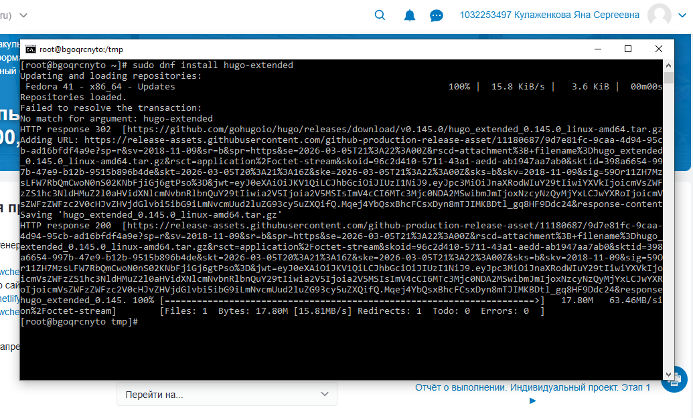
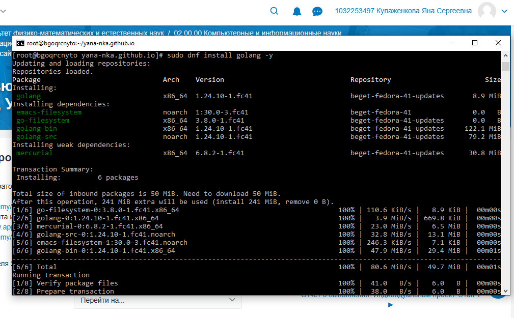
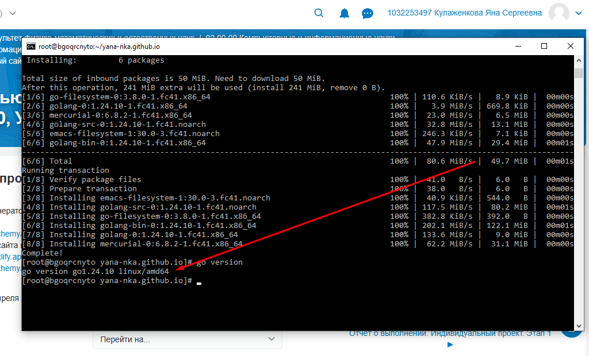
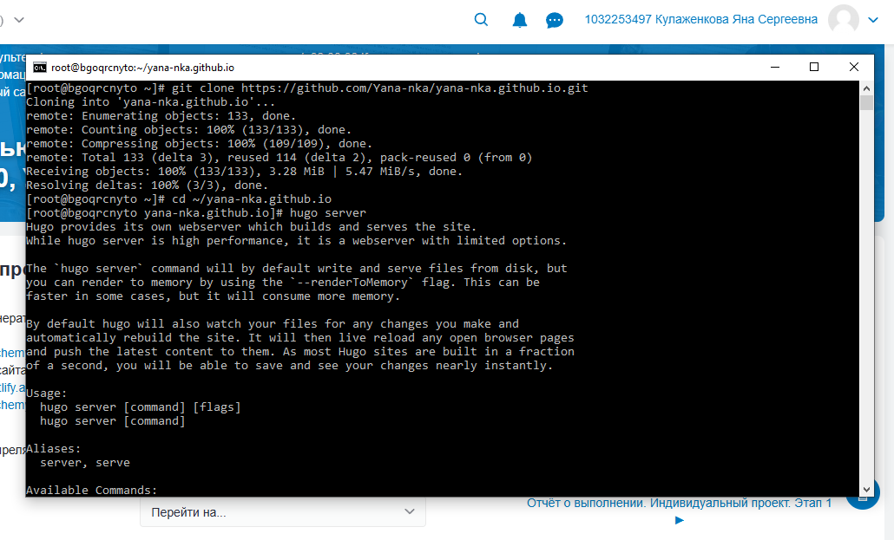
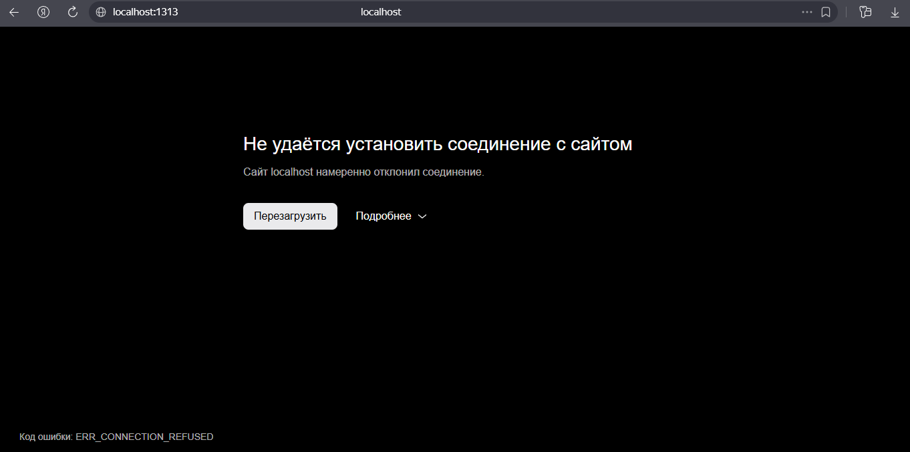

---
author:
  name: Кулаженкова Яна Сергеевна
  degrees:
  orcid:
  email: 1032253497@rudn.ru
  affiliation:
    - name: Российский университет дружбы народов
      country: Российская Федерация
      postal-code: 117198
      city: Москва
      address: ул. Миклухо-Маклая, д. 6

title: "Отчёт по индивидуальному проекту"
subtitle: "Установка и настройка Hugo, Golang и развертывание персонального сайта"
license: "CC BY"
---

# Цель работы

Целью данной работы является получение навыков установки и настройки генератора статических сайтов Hugo, установки Golang, а также развертывания персонального академического сайта на базе Hugo Academic Theme с последующим размещением на GitHub Pages.

# Задание

1. Установить генератор статических сайтов Hugo (Extended версию).
2. Установить Golang для работы с Hugo модулями.
3. Создать базовую структуру Hugo-сайта.
4. Клонировать существующий репозиторий для GitHub Pages.
5. Установить дополнительные инструменты (Tailwind CSS).
6. Настроить локальный запуск сервера Hugo.
7. Диагностировать и решить проблемы с подключением к локальному серверу.

# Теоретическое введение

**Hugo** — один из самых быстрых генераторов статических сайтов с открытым исходным кодом, написанный на языке Go. Он позволяет создавать сайты различной сложности: от персональных блогов до корпоративных порталов. Extended версия Hugo включает дополнительные возможности, такие как компиляция Sass/SCSS и поддержка PostCSS, что необходимо для работы с современными темами.

**Wowchemy (ранее Hugo Academic)** — мощная тема для создания академических сайтов, включающая готовые шаблоны для публикаций, проектов, резюме и блога.

**Go (Golang)** — язык программирования, разработанный в Google. Для работы с модулями Hugo требуется установленный Go, так как тема Academic подключается через систему модулей Go.

**GitHub Pages** — сервис от GitHub для хостинга статических сайтов непосредственно из репозитория. Идеально подходит для развертывания сайтов, сгенерированных Hugo.

**DNF** — пакетный менеджер в дистрибутивах Fedora, RHEL и CentOS, используемый для установки программного обеспечения.

# Выполнение лабораторной работы

## Установка Hugo Extended

Первоначально была предпринята попытка установки Hugo Extended через пакетный менеджер DNF командой `sudo dnf install hugo-extended`. Однако пакет с таким именем не был найден в репозиториях Fedora 41, о чем свидетельствует сообщение "No match for argument: hugo-extended".

{#fig:001 width=70%}

В качестве альтернативного решения была выполнена прямая загрузка бинарного архива Hugo Extended с официального GitHub-репозитория. Система автоматически перенаправила запрос на актуальный URL для загрузки версии v0.145.0. Архив `hugo_extended_0.145.0_linux-amd64.tar.gz` был успешно загружен в директорию `/tmp`.

После загрузки архив был распакован, и бинарный файл `hugo` перемещен в системную директорию `/usr/local/bin/`, что обеспечивает глобальный доступ к команде.

{#fig:002 width=70%}

Для верификации корректности установки была выполнена команда `hugo version`. Вывод `hugo v0.145.0-666444f0a52132f9fec9f71cf25b441cc6a4f355+extended linux/amd64` подтверждает, что установлена именно Extended-версия, необходимая для дальнейшей работы. Команда `which hugo` показала путь `/usr/local/bin/hugo`, что подтверждает нахождение исполняемого файла в PATH.

## Создание нового Hugo-сайта

С использованием установленного Hugo была создана базовая структура нового сайта командой:

```bash
hugo new site my-academic-site --format yaml
```

{#fig:003 width=70%}

Система сообщила об успешном создании сайта в директории `/root/my-academic-site` и предоставила дальнейшие инструкции по установке темы и настройке конфигурации.

## Установка Golang

Для инициализации Hugo модуля была выполнена команда `hugo mod init github.com/yourusername/my-academic-site`, которая завершилась ошибкой: `binary with name "go" not found in PATH`. Это указывало на отсутствие установленного Go в системе.

{#fig:004 width=70%}

Для решения проблемы была выполнена установка Golang через пакетный менеджер DNF:

```bash
sudo dnf install golang -y
```

{#fig:005 width=70%}

{#fig:006 width=70%}

Вместе с основным пакетом `golang` были установлены необходимые зависимости:
- `go-filesystem`
- `golang-bin`
- `golang-src`
- `emacs-filesystem`
- `mercurial`

После завершения установки была выполнена проверка версии Go командой `go version`, которая подтвердила установку версии `go1.24.10 linux/amd64`.

## Работа с репозиторием GitHub Pages

Был клонирован существующий репозиторий для размещения сайта на GitHub Pages:

```bash
git clone https://github.com/Yana-nka/yana-nka.github.io.git
```

{#fig:007 width=70%}

Репозиторий успешно загружен: получено 133 объекта общим объемом 3.28 MiB.

## Попытка запуска сервера Hugo

В директории клонированного репозитория была выполнена команда `hugo server`. Система отобразила справочную информацию по команде, что подтверждает корректную работу Hugo, но указывает на отсутствие необходимых параметров для фактического запуска сервера.

{#fig:008 width=70%}

## Установка Tailwind CSS

В процессе подготовки к работе с темой сайта была выполнена загрузка Tailwind CSS — утилитарного CSS-фреймворка, который может использоваться для кастомизации внешнего вида.

```bash
cd /tmp
wget https://github.com/tailwindlabs/tailwindcss/releases/download/v4.0.0/tailwindcss-linux-x64
```

{#fig:009 width=70%}

Файл был успешно загружен (код ответа HTTP 200).

## Проблема с подключением к локальному серверу

При попытке доступа к локальному серверу Hugo через браузер возникла ошибка подключения: "Сайт localhost намеренно отклонил соединение" с кодом ошибки `ERR_CONNECTION_REFUSED`.

{#fig:010 width=70%}

Данная ошибка свидетельствует о том, что сервер Hugo не был запущен с корректными параметрами или не был запущен вовсе. Для корректного запуска сервера необходимо использовать команду с соответствующими флагами:

```bash
hugo server -D --bind=0.0.0.0 --baseURL=http://localhost:1313
```

где:
- `-D` — включает отображение черновиков (drafts)
- `--bind=0.0.0.0` — разрешает подключения с любого сетевого интерфейса
- `--baseURL` — задает базовый URL для корректной генерации ссылок

# Выводы

В ходе выполнения лабораторной работы были выполнены следующие задачи:

1. **Установка Hugo Extended**: Преодолена проблема отсутствия пакета в репозиториях Fedora 41 путем прямой загрузки бинарного архива с GitHub. Установлена версия v0.145.0+extended, что подтверждено командой `hugo version`.

2. **Установка Golang**: Выявлена необходимость Go для работы с Hugo модулями. Установлена версия Go 1.24.10 через пакетный менеджер DNF вместе со всеми необходимыми зависимостями.

3. **Создание структуры сайта**: Сгенерирована базовая структура Hugo-сайта `my-academic-site` с использованием формата YAML для конфигурации.

4. **Работа с GitHub**: Успешно клонирован репозиторий `yana-nka.github.io` для последующего развертывания сайта на GitHub Pages.

5. **Подготовка дополнительных инструментов**: Загружен Tailwind CSS для возможной кастомизации внешнего вида сайта.

6. **Диагностика проблем**: Выявлена и проанализирована ошибка подключения к локальному серверу (`ERR_CONNECTION_REFUSED`), определены корректные параметры запуска сервера Hugo.

Таким образом, создана техническая база для дальнейшего развертывания персонального академического сайта. Все необходимые компоненты установлены и готовы к использованию. Следующими шагами должны стать инициализация Hugo модуля, установка темы Academic, настройка конфигурации сайта и его наполнение контентом.

# Список литературы{.unnumbered}

::: {#refs}
1. Официальная документация Hugo. URL: https://gohugo.io/documentation/
2. Документация Wowchemy (Hugo Academic). URL: https://wowchemy.com/docs/
3. Официальная документация Golang. URL: https://golang.org/doc/
4. Документация GitHub Pages. URL: https://docs.github.com/en/pages
5. Документация пакетного менеджера DNF. URL: https://dnf.readthedocs.io/en/latest/
6. Официальный сайт Tailwind CSS. URL: https://tailwindcss.com/docs
:::
